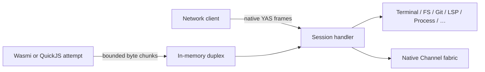
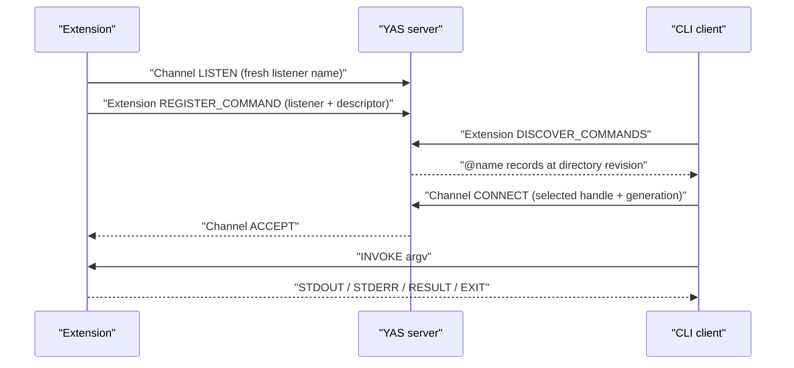

# RFC: Wasmi and QuickJS extensions and native channels

- **Status:** Implemented as native YAS Extension and Channel families v1
- **Date:** 2026-08-05
- **Companion to:** [yas.md](yas.md), [../protocol.md](../protocol.md),
  [kv.md](kv.md), [net.md](net.md)

The Extension and Channel family schemas, framing, HELLO selection,
`ATTEMPT_CONTEXT`, Transfer use, and State semantics in [yas.md](yas.md) are
normative. Bundled extensions use those native families directly; there is no
retired wire adapter, alternate listener, or second external protocol.

## Summary

YAS executes WebAssembly and JavaScript extensions inside the server:

```bash
yas ext run --on prod builder extension.wasm arg1 arg2
yas ext run --on prod builder extension.js arg1 arg2
```

Objects beginning with the WebAssembly magic bytes execute in Wasmi. Other
objects are UTF-8 ECMAScript modules and execute in native QuickJS; JavaScript
is not compiled to a nested Wasm runtime.

The client addresses the object by its full BLAKE3 digest. The server admits it
without an upload when that digest is cached and asks for the object bytes only
on a cache miss. Uploaded objects are verified, validated, and stored in an
immutable persistent content-addressed cache; execution remains subject to the
server-wide running cap.

An extension may have a restart policy. The server supervises successive
runtime attempts with bounded exponential backoff. With `--persist`, the desired
extension definition is durable and an attempt which was meant to be running
is launched again after a yas server restart.

An extension is an **in-process logical YAS client**. It sends the YAS preface
and HELLO over a bounded in-memory byte stream, receives sensitive
`ATTEMPT_CONTEXT` as its first application frame, and uses the same selected
families as an equivalent network client. It does not open a socket. The host
ABI consists of bounded byte-chunk send and receive, frame-or-monotonic-deadline
wait for efficient timers, and direct clock and entropy reads. Host chunk
boundaries are never YAS frame boundaries.

This RFC also adds native **channels**: named connection points carrying
reliable bidirectional messages without terminal semantics.

A named persistent extension may advertise a discoverable command tree. The
CLI exposes it under an unambiguous `@name` namespace and carries each command
invocation over a normal channel.

These are YAS families, not Wasm-specific host functions. Browser,
CLI, native, Wasmi, and QuickJS clients all see the same semantics. RPC, streamed
results, notifications, and actor mailboxes are libraries over channels.

## Motivation

YAS exposes terminals, compositor surfaces, filesystem sync, Git,
LSP, KV, and network relay through one version-stable protocol. Recreating
those operations as a large runtime-specific host API would produce two public
interfaces and two dispatch implementations. They would inevitably differ
in validation, cancellation, resource ownership, and new feature coverage.

Putting a real or loopback socket between the server and an embedded runtime
would avoid that duplication but preserve overhead and failure modes which
have no purpose in one process: socket buffers, connection setup,
authentication, and kernel scheduling. An in-memory duplex stream reuses the
normal YAS session handler without a system call.

The bounded byte chunk is the useful host-ABI boundary. YAS framing above it
gives exact client parity and reuses all existing codecs. The ordinary session
handler dispatches it without a socket.

Terminals are not a suitable coordination primitive for extensions. Their byte
stream has presentation state, escape sequences, process semantics, and no
message boundaries. Extensions need named discovery, bidirectional messages,
cancellation, and backpressure without pretending to be processes attached to
PTYs.

## Goals

- Run core Wasm modules using Wasmi and ECMAScript modules using native
  QuickJS in the yas server.
- Upload a module only when the selected server lacks its BLAKE3 object.
- Supervise failed or completed attempts under an explicit restart policy.
- Optionally persist desired extension state across yas server restarts.
- Give an extension the same protocol surface as an equivalent remote client.
- Add server-native bidirectional channels.
- Let named persistent extensions contribute discoverable, namespaced CLI
  commands.
- Keep the Wasm host ABI very small and versioned.
- Give each running extension attempt its own named OS thread.
- Bound extension-owned threads, guest memory, supervisor records, object
  storage, and in-process transport buffers at server scope.
- Make extension disconnect cleanup identical to client disconnect cleanup.
- Preserve YAS's static family/kind registry and versioning rules.

## Non-goals

- **No conventional guest operating-system environment.** Wasm targets
  `wasm32-unknown-unknown` and exposes only `yas_v1`; QuickJS receives native
  bindings over the same byte-stream endpoint. Neither runtime receives
  filesystem preopens, sockets, or standard streams. Arguments arrive in
  `ATTEMPT_CONTEXT`; output and channels use the Extension, Transfer, and
  Channel families. Pipe-oriented process execution uses the Process family.
- **No Component Model requirement.** The first Rust SDK targets a small core
  Wasm ABI. A future component adapter may wrap the same YAS endpoint.
- **No live-instance checkpointing.** Persistent extensions start a fresh
  runtime instance after a server restart. Runtime memory, stacks, open handles,
  channels, and in-flight requests are not snapshotted.
- **No server-native state or pubsub.** Retained shared data remains KV's job;
  live protocols and fan-out are libraries over channels.
- **No new durable message broker.** Channel streams have explicit windows.
  The connection handler retains its existing production-side
  backpressure behavior; extension-only transport buffers have explicit byte
  ceilings and a slow-consumer timeout.
- **No requirement that channel payloads use JSON.** Payloads are opaque
  bytes with descriptive metadata.
- **No client-side extension code.** Extension commands execute on the selected
  server. Their descriptors provide discovery and help, not a local executable
  or client-side argument validator.

Extension and Channel are independently selected. Channels are useful to
ordinary clients without Wasm; extension-provided CLI commands require both
families.

## Example extensions

These examples are intentionally more ambitious than "run a cron script." They
use only the small host ABI and ordinary native YAS families; none requires a
new Wasm-specific import.

### `@ship`: a server-resident release conductor

```bash
yas --on prod @ship plan main
yas --on prod @ship deploy --environment eu-prod --revision 8c4f2d1
```

`ship` stays warm as a persistent extension. It inspects Git, coordinates
existing deployment terminals and services through ordinary YAS Requests, streams a
structured plan and live output over the invocation channel, and records
idempotency keys and the release ledger in KV. Disconnecting cancels only the
command; the supervised release policy can decide whether the underlying
operation should stop or continue. This is a small, inspectable deployment
service distributed as one Wasm object.

### `@workspace`: one query surface over Git, FS, and LSP

```bash
yas --on dev @workspace changed-symbols origin/main
yas --on dev @workspace impact crates/git/src/requests.rs
yas --on dev @workspace references ClientEndpoint
```

The extension keeps repository and language-server views warm, joins them with
filesystem search, and exposes higher-level questions as commands. The answer
can contain human-readable progress on stdout and a machine-readable JSON
`RESULT`. A browser UI can ask the same questions over channels without going
through the CLI grammar.

### `@session`: a terminal concierge which is not itself a terminal

```bash
yas --on lab @session start api -- cargo run -p api
yas --on lab @session wait api --for "listening on" --timeout 30s
yas --on lab @session send api "reload"
```

`session` creates and observes real YAS terminals when a program needs terminal
semantics, but its own control plane is typed channel messages. It can name
sessions, wait on output conditions, report cwd and exit state, and coordinate
several terminals without forcing non-interactive clients to parse an
interactive terminal protocol. Lightweight session metadata survives attempts
in KV; Terminal handles do not.

### `testgrid`: many isolated instances from one hash

```bash
yas ext run --on ci --restart always --persist test-unit testgrid.wasm unit
yas ext run --on ci --restart always --persist test-integration testgrid.wasm integration
yas ext run --on ci --restart always --persist test-web testgrid.wasm web
```

The module uploads once, but each extension gets its own handle/generation,
arguments, thread, endpoint, and restart history. Shards claim work through KV and send
live results to an aggregator over channels. An operator can restart one shard,
update a canary to a new hash, or compare revisions without disturbing the
others. This is the concrete reason module identity and extension identity must
be separate.

### `@switchboard`: application pubsub without a core topic service

```bash
yas --on prod @switchboard routes
yas --json --on prod @switchboard tap build.finished
```

Producers and consumers open channels to `switchboard`; payload-defined subjects,
filters, request IDs, and delivery acknowledgements are an SDK-level protocol.
The extension fans live messages out, while durable cursors or retained values
go to KV. A second implementation can choose different wildcard, replay, or
dead-letter semantics without adding core operation kinds or committing YAS to one pubsub
model.

### `@fleet`: extensions managing extensions

```bash
yas --on prod @fleet diff builder builder-canary
yas --on prod @fleet promote builder-canary --to builder
yas --on prod @fleet restart --revision-mismatch
```

Because an extension is a full logical client, `fleet` can list and control
other extensions. Promotion reads the canary's exact hash, combines it with
arguments supplied to the promotion command or stored in its own KV record,
then performs a revision-checked cache-hit update of the durable `builder`
record. Lifecycle discovery deliberately does not expose another extension's
stored arguments.
It can roll through a set of named instances, stop on health failure, and emit
one progress stream to the operator. The server still owns atomic definition
updates and lifecycle cleanup; the rollout strategy remains replaceable guest
code.

### `@incident`: a reproducible diagnostics bundle

```bash
yas --on prod @incident capture api --since 10m
```

The extension snapshots relevant Git identity, terminal cwd and screen state,
output from diagnostic terminals and services, server-visible task metadata, and
selected files, then streams a content-typed result. The same command can
simultaneously feed a browser over a second channel. Since the descriptor is
only presentation metadata, a newer definition can add richer collection logic
without requiring a new CLI release.

## Architecture



Every attempt gets a normal YAS session over a bounded in-memory duplex. It
sends the standard preface and HELLO, selects exact family versions, and receives
a sensitive `ATTEMPT_CONTEXT` Event after HELLO. The session handler, family
validation, ownership, cancellation, State, Transfer credit, and cleanup are the
same implementations used by a network client. No socket, authentication pass,
kernel buffer, or runtime-specific dispatch table sits in between.

The guest host ABI moves byte chunks, not logical family messages. The normal
YAS frame codec handles partial and combined chunks. Reader and writer tasks are
independent, and the extension origin has bounded ingress, egress, pending-job,
and active-job reservations. A guest which stops receiving cannot create
unbounded server memory; it is cancelled as a slow consumer and its normal
session cleanup runs.

Attempt cancellation is cooperative through the connection loop. The supervisor
waits for the reader, writer, family resources, and tracked jobs before starting
a replacement attempt. A non-cancellable blocking OS/library call may keep an
attempt visibly `STOPPING`; YAS never overlaps a replacement and pretends the old
resources disappeared. Restarting the server remains the recovery for a
permanently stuck in-process call.

Spawn-capable native Requests reserve endpoint/global job counts and bytes
before launch. ACK, credit, cancellation, and shutdown paths stay outside that
admission queue so backpressure cannot deadlock cleanup. Request ordering is
preserved at admission; independent asynchronous Results may complete in either
order exactly as their family contracts specify.

### Native family parity

An extension may use every family selected in its HELLO. `ATTEMPT_CONTEXT` is
the only extension-specific bootstrap: immutable definition/attempt identity and
raw argv. `ATTEMPT_OUTPUT` is the attempt's authenticated native output seam.
Terminal, filesystem, Git, LSP, KV, Process, Net, Channel, and other
operations remain their ordinary native Requests, Results, Events, State, and
Transfers. The guest SDK applies State before ACKing and reserves aggregate
receive credit before accepting a Transfer descriptor.

## Lifecycle model

An **extension definition** is desired state: object hash, runtime, name,
arguments, runtime limits, restart policy, persistence, enabled state, detached
ownership, and whether it should be running. An **attempt** is one execution of
that definition. Updating a definition never changes the identity of a live
attempt in place; it stops the old attempt through its cleanup barrier and starts
a new attempt with a monotonically increasing attempt number.

Every definition has a nonzero boot-scoped `extension_handle`, generation, and
definition revision. Human and JSON output render the handle as exactly 16
lowercase hexadecimal digits. Mutations name the exact handle/generation/revision
tuple plus a nonzero 128-bit operation ID. Creation uses an all-zero expected
identity; replacement requires every expected field to match atomically.

Complete State uses these phases:

| Phase         | Meaning                                                            |
| ------------- | ------------------------------------------------------------------ |
| `NEED_OBJECT` | the definition is known but its content-addressed object is absent |
| `VALIDATING`  | runtime validation or translation is in progress                   |
| `QUEUED`      | desired-running but waiting for a global running permit            |
| `RUNNING`     | one attempt owns its runtime thread and native YAS session         |
| `BACKOFF`     | restart policy applies at the published wall-clock deadline        |
| `STOPPING`    | cancellation is set; cleanup still owns resources                  |
| `STOPPED`     | no attempt is running and no automatic restart is pending          |
| `BLOCKED`     | deterministic repair or operator action is required                |

Attempt output enters the server as a sensitive client-to-server
`ATTEMPT_OUTPUT` Event. Its kind is stdout, stderr, or log; stdout and stderr
are raw bytes, log data is UTF-8, and each record is bounded by
`MAX_OUTPUT_RECORD_BYTES`. The server accepts it only from the authenticated
active attempt named by that session's `ATTEMPT_CONTEXT`, assigns the retained
sequence, and fans it out to followers. Followers request a sequence and
receive a sensitive MESSAGE Transfer. Eviction happens only at record
boundaries; an explicit gap record makes loss visible. A slow follower is
cancelled rather than growing an unbounded queue.

An attached transient definition belongs to its creating session and is stopped
when that session disappears. A detached transient definition is server-owned
until its terminal replay lease expires or an operator stops it. Persistent
definitions, including disabled ones, survive server restart and pin their
objects. Restart policy is `NEVER`, `ON_FAILURE`, or `ALWAYS`; automatic
restarts use bounded full-jitter exponential backoff. Missing/corrupt objects,
unsupported ABI, and deterministic validation failures enter `BLOCKED` instead
of looping.

## Guest runtime contract

### Runtime shapes

Wasm modules use core `wasm32`, export memory, the `yas_wire_v1` marker, and
one entry point. They may not use a start section, additional memories/tables,
threads, WASI, sockets, ambient filesystem access, or arbitrary imports.
Validation applies explicit memory, table, value-stack, call-depth, native-stack,
and fuel-slice limits before the attempt can become `RUNNING`.

QuickJS objects are UTF-8 ECMAScript selected by runtime policy. They run with
the same definition/attempt lifecycle, native session, output accounting,
cancellation, and memory/stack ceilings. QuickJS is in the server process and is
part of its trusted computing base; it is not a privilege boundary.

### Five-import host ABI

The `yas_v1` Wasm import module provides bounded byte-stream send/receive,
wait-until-frame-or-deadline, realtime/monotonic clocks, and entropy. Individual
host reads and writes are arbitrary stream chunks, never YAS frame boundaries.
The guest SDK owns preface, framing, HELLO, request correlation, family
selection, Transfer, and State exactly as a network client does.

The host sends the native preface and Core HELLO, requires Extension and its
dependency closure to be selected, then sends sensitive `ATTEMPT_CONTEXT` as
the first application frame. That record carries the immutable extension
identity, definition revision, attempt, task ID, runtime, object hash, name,
flags, and raw argument vector.

A Rust guest uses `yas-guest`; QuickJS exposes the bootstrapped client and
context through its `yas` global. Runtime-specific convenience wrappers may
sit above the native families but do not change the ABI.

### Dedicated attempt thread

Each running attempt owns one named background-priority native thread. The
suffix is its fixed-width lowercase 16-digit extension handle without a prefix;
the readable name portion is sanitized and compacted to platform limits.
Blocked receives and deadline waits park the thread. Fuel slices bound
cancellation latency for compute-bound Wasm; QuickJS uses its interrupt hook.
The running permit is released only after the endpoint, tracked jobs, writer,
runtime, and thread have crossed their cleanup barrier.

## Content-addressed execution

Objects are identified by BLAKE3-256 of the exact Wasm or UTF-8 JavaScript
bytes. A local pathname is never identity. The client computes the hash and
length, asks to begin an object stage, writes the returned sensitive BYTE
Transfer, then commits the sealed stage. Commit rechecks hash, length, runtime
shape, and storage admission before atomically publishing the object.

The raw-object CAS is persistent and bounded by byte and entry limits. Persistent
definitions and live supervisors pin objects; unpinned objects are LRU
candidates. Startup reconstructs pins from durable definitions before garbage
collection, removes orphaned temporary/quarantine entries, and never deletes a
pinned object merely because an operator lowered a budget.

Stages are session-owned, count/byte reserved before publication, and expire
after bounded idle time. RESET, session loss, hash mismatch, invalid runtime
shape, or failed commit deletes the temporary file and releases every
reservation. Concurrent stages for one hash are single-flight: a committed hit
returns the `OBJECT_ALREADY_PRESENT` disposition; an in-progress owner makes later begins conflict
without duplicating bytes.

`DEPLOY` is the cache probe and definition mutation. A missing object yields
complete State in `NEED_OBJECT`; after the object is committed, the caller
retries the same idempotent mutation. Replacement always retains its original
expected handle/generation/revision tuple, so a slow upload can populate the
cache but cannot overwrite a concurrent definition update.

Version 1 has no cross-attempt translated-module cache. Each Wasmi attempt owns a
fresh Engine and Module and drops both at terminal cleanup. The persistent raw
CAS avoids network uploads without relying on runtime-internal executable-code
reclamation.

## Native Extension family

Extension is family `0x0043`, version 1. The canonical Requests, State records,
limits, output records, object staging, `ATTEMPT_CONTEXT`, and
`ATTEMPT_OUTPUT` layouts are
generated from
[`protocol/yas/families/extension.toml`](../../protocol/yas/families/extension.toml);
the family contract is in [yas.md](yas.md#extension-family).

`OBJECT_BEGIN` returns the `OBJECT_ALREADY_PRESENT` disposition or a staging
handle plus sensitive BYTE Transfer. Closing the Transfer only seals it;
`OBJECT_COMMIT` verifies BLAKE3,
size, runtime validity, and atomically installs it. RESET, expiry, or session
loss discards an unpublished stage.

`DEPLOY` creates or replaces a named desired definition under a nonzero
operation ID and exact expected handle/generation/definition-revision tuple. It
selects runtime, object hash, raw argv, restart/persistence policy, and limits.
`CONTROL` provides start, stop, restart, enable, disable, and remove under the
same revision discipline. Persistent committed mutations and their exact
deduplicated Results survive server restart within the advertised replay
horizon.

`WATCH` publishes complete definition State: stable handle/generation, revision,
desired state, phase, attempt identities, object hash, runtime, backoff deadline,
last exit, limits, and command-directory revision. Raw argv are deliberately
absent from catalogue State and are delivered only to the owning attempt in
`ATTEMPT_CONTEXT`.

`ATTEMPT_OUTPUT` accepts one bounded stdout, stderr, or UTF-8 log record only
from the authenticated active attempt context. The server, not the guest,
assigns its retained sequence.

`FOLLOW` returns a sensitive MESSAGE Transfer of sequenced stdout, stderr, log,
and explicit gap records from the requested output sequence. Closing/resetting
the Transfer performs native unfollow without changing lifecycle.
`DISCOVER_COMMANDS` pages a stable command directory whose invocations use
native Channel listeners.

The advertised mutation-replay limit is an exact boot/durable retry horizon.
After an operation outcome expires, callers reconcile through `WATCH` and use a
fresh operation ID; they never retry against a guessed definition identity.

### Attached lifecycle

Without `DETACH`, the initiating connection owns the extension. Disconnecting
or issuing `CONTROL(STOP)` stops the supervisor, suppresses any pending restart,
and cancels its current attempt. Ctrl-C in `yas ext run` requests stop, waits a
short grace period for terminal State, and then closes.

With `DETACH`, phase `RUNNING` in complete State is sufficient for the command
to return successfully. The extension remains server-owned until its restart
policy stops it, it is explicitly stopped, or the server exits. Its output log
is a bounded byte ring across attempts, so a later `FOLLOW` receives a retained
suffix and live records while the supervisor remains active. Retention evicts
only whole oldest records. Output sequence numbers and explicit gap records let
a follower detect any lost interval.
Extension attempts have no wall-clock deadline; attached and detached execution
differ only in ownership and event following.

Every attempt has a 32-bit process-local `task_id`. Task IDs are not durable;
`extension_handle`, generation, and attempt are the stable coordinates followed
by clients.

### Restart backoff

Automatic restarts use full-jitter exponential backoff: 250 ms base, doubling
through a 30 second cap. The successful-return and 60-second stability resets
defined above both set the consecutive-failure counter to zero. `RESTART` is an explicit operator
action: it bypasses backoff and becomes eligible immediately, then starts when
a running permit is available. It does not erase historical attempt records. A
persistent supervisor stores its failure count and next eligible wall-clock
start time, so restarting yas cannot be used to bypass crash-loop backoff.

Failures which cannot improve by retrying transition to `BLOCKED` rather than
looping: missing or corrupt pinned object, unsupported host ABI, or a
deterministic instantiation/import error. An object repair followed by explicit
`RESTART`, a definition update, or explicit `ENABLE` causes revalidation.
Persistent definitions remain visible in `BLOCKED` until one of those actions
or removal. A transient `BLOCKED` supervisor is terminal but remains
addressable while its attached owner remains connected, and a detached one for
the **full** terminal replay lease even after every follower has received its
final status, so explicit `RESTART` has a real recovery window. Attached-owner
disconnect still performs ordinary recursive ownership cleanup and destroys it
immediately; terminal state never transfers ownership to the server. A
successful restart leaves the terminal state. Otherwise owner loss, explicit
cancellation, or detached lease expiry destroys it and releases its ID,
arguments, object pin, follower cursors, and transient slot. Running the module
again after that creates a new transient extension.

### Persistence across server restarts

Persistent definitions are durable desired state, separate from the Wasmi
instance. The server transactionally stores:

- stable extension handle/generation and unique name;
- definition revision, object hash, arguments, and restart policy;
- separate enabled and desired-running bits;
- attempt counter, last-running attempt, consecutive-failure count, and next
  eligible start time.

Definitions live in `$YAS_EXTENSION_PATH`, otherwise the platform state
directory followed by `yas/instances/NAME/extensions.redb` (`NAME` defaults
to `default`). This is authoritative state, not an evictable cache. The raw
Wasm object remains in the separate
content-addressed cache and is pinned by every persistent definition, including
a disabled one.

The module object is made durable before the definition can commit. The server
persists an incremented attempt number before instantiation; a crash may leave
a gap, but must never reuse `(extension_handle, generation, attempt)`.

Startup ordering is safety-critical: load all definitions, reconstruct their
complete raw-object pin set, apply the persistent-execution gate, and run GC
only against unpinned objects. With the gate off, startup does not open, hash,
validate, translate, or instantiate any stored module; definitions become
immediately visible for recovery management. With the gate on, only enabled,
desired-running definitions admitted by the fair running queue proceed to
bounded CAS/hash/structural/import validation and per-attempt translation.
Disabled, stopped, and not-yet-admitted definitions remain cheap catalog
records until an action makes them eligible. A missing or corrupt referenced
object then leaves its definition visible in `BLOCKED`; it is neither deleted
nor retried in a loop.
If the definition database cannot be read, core YAS still starts, but
persistent execution, raw-CAS eviction, and new uploads fail closed because the
server cannot prove which objects are pinned.

`CONTROL(STOP)` and `CONTROL(DISABLE)` commit durable desired state before
cancelling an attempt, so a crash cannot resurrect something the operator just
stopped or disabled. `CONTROL(REMOVE)` is admitted only after the complete
cleanup barrier defined above.
Normal server shutdown preserves enabled and desired-running without
recording an attempt failure. Abrupt server death is treated the same at the
next boot because an attempt has no durable successful exit record.

Cross-restart execution is consequently **at least once**, not exactly once.
The server can die after an extension performs an external side effect but before
it durably records the attempt's exit. Persistent extensions must make side
effects idempotent or store their own progress transactionally, for example in
KV. YAS does not checkpoint Wasm memory or try to infer whether a side effect
committed.

Arguments are stored verbatim. They should not contain secrets unless the
extension store gains an explicit encrypted-secret mechanism; references through
a separate secret facility are preferable. Retained output records are not
durable in the first version.

## Instances and module versions

Three identifiers answer different questions:

| Identifier                                | Identifies                                     | Lifetime                  |
| ----------------------------------------- | ---------------------------------------------- | ------------------------- |
| module hash                               | exact Wasm or ECMAScript bytes                 | immutable CAS object      |
| `(extension_handle, generation)`          | one supervised extension and its configuration | stable for the definition |
| `(extension_handle, generation, attempt)` | one runtime instance                           | one execution attempt     |

Every creation-form `DEPLOY` creates a distinct extension identity, even when
the hash, arguments, and descriptive name are identical. The same module object
can therefore back any number of isolated extensions without another upload.
Each extension has at most one running attempt; v1 has no replica-count setting.
Operators create replicas as separate definitions, for example `worker-1`,
`worker-2`, and `worker-3`, and manage them independently.

```bash
yas ext run --on prod --restart always --persist worker-1 worker.wasm queue-a
yas ext run --on prod --restart always --persist worker-2 worker.wasm queue-b
yas ext list --on prod
yas ext restart --on prod worker-1
```

Transient names are descriptive and need not be unique, so transient instances
are controlled by handle and generation. Persistent names are unique durable
operator-facing identities. Extensions which derive Channel names or KV
prefixes per instance should include their extension handle; replicas must not
assume that a shared module hash implies shared identity.

YAS assigns no semantic version to a module and reads no version manifest.
The full module hash is its exact version identity. Different hashes coexist in
the CAS, and `yas ext list` and `yas ext status` show the full current hash and
`definition_revision`. Revision starts at 1, survives server restarts, and
increments whenever a persistent extension's hash, arguments, or restart
policy changes. Attempts report the revision they execute, so State and output
records remain attributable when an update overlaps observation of the old
attempt. `WATCH` names the current committed definition; an old attempt still in
`STOPPING` remains distinguishable through its attempt identity and revision.

To run two versions concurrently, create two persistent extensions with
different names, such as `builder` and `builder-canary`. To replace one durable
extension in place, use:

```bash
yas ext update --on prod builder ./builder-v2.wasm arg1 arg2
```

This sends replacement-form `DEPLOY` with the name and exact handle, generation,
and definition revision observed by the CLI. The expected identity prevents an
update from crossing a remove-and-recreate race, and the expected revision
prevents concurrent updates from silently overwriting one another. An absent
name is `NOT_FOUND`; an identity or revision mismatch is `CONFLICT`. The server
rechecks the tuple in the transaction which commits the new definition,
including after a cache miss.
The client and server handle an update as follows:

1. The client probes with replacement-form `DEPLOY`. On `NEED_OBJECT`, it stages and
   validates the replacement while the current attempt continues, then
   refreshes the extension record. It aborts if the identity or revision changed;
   otherwise it retries with the original expected tuple rather than
   adopting a concurrent writer's values.
2. The server atomically checks the expected identity and revision, stores the new
   hash, arguments, and restart policy, and
   increments the definition revision. Enabled and desired-running state are
   preserved.
3. If an attempt is running and the definition changed, it exits with
   `UPDATED`; the supervisor clears failure backoff and makes the new revision
   immediately eligible for the running-permit queue. A disabled or stopped
   extension merely records the new definition.

Submitting the exact current hash, arguments, and restart policy is an
idempotent success: it neither increments revision nor restarts an attempt. A
failed upload or validation leaves the old definition and attempt unchanged.
The old attempt's channels, command listener, and endpoint close
normally before the new attempt becomes reachable. Its command advertisement
is removed as part of the definition commit, before the old attempt is asked to
exit. Command calls are never retried across that boundary.

V1 keeps no definition history and performs no automatic rollback. Rollback is
an ordinary update naming older Wasm bytes; it avoids upload only if that hash
is still in the CAS. Durable names cannot be renamed in place, because that
would break command namespaces and operator references; create the new name and
remove the old extension instead.

## Native Channel family

Channel is family `0x0042`, version 1. The canonical Requests, State records,
limits, endpoint descriptors, and `ACCEPT` Event are generated from
[`protocol/yas/families/channel.toml`](../../protocol/yas/families/channel.toml);
the family contract is in [yas.md](yas.md#channel-family).

`WATCH` publishes the bounded name registry. `LISTEN` claims one nonempty UTF-8
name under an operation ID and returns a listener handle plus generation. A name
is exclusive while its listener is live. `CONNECT` may require the observed
generation, preventing an invocation from landing on a replacement after a
race. `CLOSE_LISTENER` stops new accepts without closing existing channels.

Successful `CONNECT` and `ACCEPT` carry symmetric `ChannelEndpoint` values with
local/peer handles, peer session ID, bounded listener/connector metadata, and a
sensitive bidirectional MESSAGE Transfer. Message boundaries are exact; byte
credit and the common open-message limit bound partial messages. ACCEPT starts
with zero sender credit until the receiver explicitly accepts its aggregate
budget. Transfer CLOSE or RESET ends the channel.

RPC correlation, streaming results, cancellation, notifications, and application
schemas live inside messages. Channel does not grow another frame class for
each extension protocol. Listener state exposes opaque owner identity and kind,
never credentials.

## Extension-provided CLI commands

A running named persistent extension may contribute a command tree under its
durable name. The `@` prefix keeps remote extension commands separate from
YAS's built-in grammar. Transient extensions cannot advertise commands because
their descriptive names are neither unique nor durable:

```bash
yas ext commands --on prod
yas --on prod @builder --help
yas --on prod @builder build --release app
```

Connection and YAS-wide options must precede `@builder`. Every token after the
namespace is the command argument vector and is delivered verbatim, including
tokens beginning with `-`; no `--` separator is required. The sole exception is
a final `--help` following an advertised command path, which the CLI renders
from the descriptor without opening an invocation channel. A persistent extension
named `builder-canary` independently contributes `@builder-canary`, so
concurrent versions do not contend for one CLI namespace.

The control and data paths are deliberately separate:



Registration is live advertisement, not an install manifest. The extension
first listens on a fresh name, conventionally
`yas.cli.<16-hex-handle>.<attempt>`, then uses `REGISTER_COMMAND` with the exact
listener handle/generation and descriptor. The server derives `@name`, extension
identity, definition revision, module hash, and listener identity from the
authenticated attempt and Channel registry; the descriptor cannot claim them.
An unrelated endpoint may squat on a raw Channel name, but it cannot register
that listener as another extension's CLI surface or satisfy a generation-checked
invocation discovered from the directory.

The descriptor is UTF-8 JSON, capped at 64 KiB like channel metadata, with this
initial shape:

```json
{
  "protocol": "yas.cli.v1",
  "summary": "Build and publish this workspace",
  "commands": [
    {
      "path": ["build"],
      "summary": "Build one target",
      "usage": "build [--release] TARGET",
      "options": [
        {
          "names": ["-r", "--release"],
          "takes_value": false,
          "help": "Build optimized artifacts"
        }
      ]
    }
  ]
}
```

`protocol`, `summary`, and `commands` are required. A command `path` is an
array of literal subcommand tokens; an empty path describes the namespace
root. `summary`, `usage`, `options`, and option `help` are presentation data.
Unknown fields are ignored so the descriptor can grow compatibly. The CLI
sanitizes control characters and never evaluates descriptor text or installs
shell code. It uses the descriptor for listing, help, and static shell
completion, but not for client-side argument validation: the extension remains
the authority on its arguments and errors.

The server rejects invalid UTF-8, invalid JSON, a protocol value other than
`yas.cli.v1`, or missing required fields with `INVALID`. It validates only the
discovery envelope and ownership; it does not interpret application options or
execute descriptor content.

`yas ext commands` discovers and prints the live directory. Root help
(`yas --help`) remains local and does not unexpectedly contact a server;
explicit `@name --help`, `yas ext commands`, and shell completion query the
selected server. A client may cache discovery by `(boot_id,
directory_revision)`. A server restart or revision change invalidates that
cache. V1 completion covers advertised namespaces, command paths, and option
names only; dynamic, extension-executed completion is future work.

After discovery, the CLI connects to the advertised listener by exact handle and
generation. The server atomically rejects a disappeared or replaced listener,
so a post-discovery name squatter cannot receive command arguments or
impersonate `@name`. Each accepted Channel carries one invocation using
`yas.cli.v1`. Every MESSAGE item begins with a one-byte kind.

Client-to-extension payloads are:

| Kind | Name        | Body                                               |
| ---- | ----------- | -------------------------------------------------- |
| 1    | `INVOKE`    | `[flags:1][argc:2] repeated{[len:4][UTF-8 arg:N]}` |
| 2    | `STDIN`     | `[data:N]`                                         |
| 3    | `STDIN_EOF` | empty                                              |
| 4    | `CANCEL`    | empty                                              |

`INVOKE` must be the first payload. Its arguments are exactly the tokens after
`@name`; flag bit 0 means stdin will be streamed. Bits 1 through 7 must be zero;
setting one makes the known-kind payload malformed and closes the invocation
channel as a protocol error. Argument count, per-argument bytes, and combined
bytes use the selected Extension argument limits. Without bit 0,
stdin is closed from the start. In addition, the complete encoded channel
MESSAGE payload—kind, flags, count, every length field, and argument bytes—must
fit Channel's selected message limit. The CLI checks that exact encoded size
before connecting; an independently encoded oversized `INVOKE` is rejected by
normal channel payload validation.
With it, the CLI sends zero or more `STDIN` messages followed by one
`STDIN_EOF`.

Extension-to-client payloads are:

| Kind | Name     | Body                                           |
| ---- | -------- | ---------------------------------------------- |
| 1    | `STDOUT` | `[data:N]`                                     |
| 2    | `STDERR` | `[data:N]`                                     |
| 3    | `LOG`    | `[level:1][UTF-8 message:N]`                   |
| 4    | `RESULT` | `[content_type_len:2][content_type:N][data:M]` |
| 5    | `EXIT`   | `[code:i32][UTF-8 detail:N]`                   |

Output is not a Terminal stream: the Channel has no terminal state, resize, or input
mode and performs no escape-sequence interpretation. The CLI may copy `STDOUT`
and `STDERR` bytes to its own corresponding streams. `LOG.level` values 0
through 4 mean trace, debug, info, warning, and error; values 5 through 255 make
the known-kind body malformed and close the invocation channel as a protocol
error. An invocation may emit
any number of stream or log messages and at most one structured result, then
exactly one `EXIT`; no payload follows `EXIT`. The signed `i32` code has the
same native-CLI truncation caveat as `yas ext run`. `--json` exposes these frames
as structured CLI events rather than changing what the extension sends.

`RESULT.content_type` is a non-empty lowercase ASCII media type of at most 255
bytes. V1 requires exactly two components separated by one `/`; each component
starts with `a`–`z` or `0`–`9` and thereafter contains only those characters or
`!#$&^_.+-`. Parameters and wildcards are not accepted. Examples are
`application/json` and `application/octet-stream`. Its data is opaque bytes and
is bounded only by the channel payload maximum. An invalid content type makes
the known-kind body malformed.

An unknown `yas.cli.v1` payload kind or malformed body closes that invocation
channel as a protocol error; compatibility for a future command protocol uses
a new descriptor `protocol` value.

Normal channel windows provide backpressure in both directions. Closing the
client side is cancellation even if `CANCEL` could not be delivered. If the
extension attempt or listener disappears, the invocation fails and is never
automatically retried against a restarted attempt. One attempt may accept many
invocation channels, but it still has one runtime thread; its event loop must
multiplex them or deliberately serialize work.

## Deferred process execution

Pipe-oriented non-PTY child processes are independent of extensions and native
channels. They use the implemented native [Process family](processes.md). This
design adds no runtime-specific subprocess host import: a guest selects Process
during HELLO and uses the same typed Requests, Results, Streams, and Transfers
as any other YAS session. It uses Terminal when PTY semantics are required.

## Server capacity and failure isolation

Extension and Channel publish exact selected limits in HELLO. `DEPLOY` carries
requested `RuntimeLimits`; the server rejects values outside the selected
family limits and applies installation policy before committing a definition.
Global settings are sampled once at startup, and every network or in-process
session sees the same selected catalogue.

The principal default policy is:

| Resource                                      |                            Default | Server setting                                                    |
| --------------------------------------------- | ---------------------------------: | ----------------------------------------------------------------- |
| Concurrent running attempts                   | `min(4, max(1, logical CPUs - 1))` | `YAS_EXT_MAX_RUNNING`                                             |
| Persistent definitions                        |                                128 | `YAS_EXT_MAX_PERSISTENT`                                          |
| Active transient supervisors                  |                                128 | `YAS_EXT_MAX_TRANSIENT`                                           |
| Raw object                                    |                             64 MiB | `YAS_EXT_MODULE_MAX`                                              |
| Raw object cache                              |                              2 GiB | `YAS_EXT_OBJECT_CACHE_MAX`                                        |
| Wasm memory or QuickJS heap per attempt       |                            128 MiB | `YAS_EXT_MEMORY_MAX`                                              |
| Retained output per definition / server       |                         4 / 64 MiB | fixed / `YAS_EXT_OUTPUT_RETAIN_MAX`                               |
| Active jobs per attempt / server              |                           32 / 128 | `YAS_EXT_JOB_MAX_PER_CLIENT` / `YAS_EXT_JOB_MAX`                  |
| Channel listeners per session / server        |                         64 / 1,024 | `YAS_CHANNEL_MAX_LISTEN_PER_CLIENT` / `YAS_CHANNEL_MAX_LISTENERS` |
| Connected Channel handles per session / pairs |                           64 / 128 | `YAS_CHANNEL_MAX_PER_CLIENT` / `YAS_CHANNEL_MAX_CONNECTED`        |
| Reserved Channel buffers server-wide          |                            256 MiB | `YAS_CHANNEL_BUFFER_MAX`                                          |

The canonical schemas additionally bound names, arguments, object stages,
follows, command descriptors and pages, open messages, metadata, message bytes,
pending connects, stack/table shape, job bytes, and mutation replays. Server
policy may advertise lower values but never exceed the generated hard maxima.

Admission is reservation-first. A definition slot, transient-supervisor slot,
object stage, running permit, tracked-job budget, listener, Channel endpoint, or
Transfer credit is reserved before the corresponding identity becomes visible.
Failure returns `RESOURCE_EXHAUSTED` and creates nothing. Closing resources retains their
count and byte reservations until already-queued native frames have either been
written or dropped, so a stalled writer cannot recycle one budget into
unbounded queued data.

Arguments are charged before a definition commits. Persistent arguments remain
in the definition database and are loaded only when an attempt reaches
admission; `ATTEMPT_CONTEXT` then owns the running guest copy inside its memory
limit. Command records and immutable discovery pages share bounded
server-global storage. Object stages reserve count, bytes, cache entry, and
allocation-rounded disk space before accepting content.

Running permits and validation permits are fairly queued. `QUEUED` owns no
runtime thread; `VALIDATING` owns a running permit but does not publish
`RUNNING` until instantiation succeeds. `STOPPING` retains the old permit
until cleanup finishes, so update and restart attempts never overlap. Each
Wasmi attempt owns and drops its Engine and Module; store limits enforce memory,
table, value-stack, and call-depth ceilings.

Output retention allocates a sequence before trying to retain a record. When
per-definition or global storage is full, whole oldest records are evicted; if
writer-held guards still consume the budget, the new record is omitted and the
next delivered batch contains an explicit gap. Producers do not block on
history retention, and a slow follower is cancelled at its bounded egress
deadline.

A pending or transient definition counts through `NEED_OBJECT`, validation,
queuing, running, backoff, stopping, and its bounded terminal replay lease.
`CONTROL(REMOVE)` releases a committed definition only after cleanup.
Persistent definitions over a newly lowered count remain visible and manageable;
new creation is refused until usage falls below policy. Pinned objects over a
lowered cache budget remain intact; only unpinned objects are eviction
candidates.

Fuel bounds cancellation latency, not lifetime CPU use. The server replenishes
fuel after each slice, and a continuously computing guest may consume one
attempt thread until cancelled. Wasmi traps and host validation errors become
structured attempt failures. Rust panics remain process-fatal under YAS's
release profile, so host callbacks validate fallible guest input and return
errors rather than panicking.

Core `SHUTDOWN`, SIGTERM, and ordinary server teardown stop admission and
restart scheduling, preserve persistent desired state without recording an
attempt failure, and then cancel attempts, native sessions, Transfers, and
Channels through their normal cleanup paths. Every extension-originated frame is
validated like a network frame; an in-process origin is not a trusted origin.

## Security posture and deployment controls

Wasmi is a memory- and fault-containment boundary. QuickJS applies heap and
stack limits and isolates JavaScript values, but its native C implementation
is part of the server process's trusted computing base. Neither runtime is a
least-authority sandbox. A running extension has the authority of a normal YAS
session over the families selected during HELLO, including Terminal, Process,
and Core `SHUTDOWN` when the server selects them. Persistence makes that
endpoint authority durably restartable; the runtime does not add privilege
separation.

Anyone allowed to connect to YAS or install an extension must therefore be
trusted with the server's existing endpoint authority. Deployments needing a
stronger boundary isolate the YAS server and OS user. Persistent definitions
are durable code execution, so the extension database, object cache, and their
directories must be owner-only: mode `0700` directories and `0600` files on
Unix, and user-only ACLs where available. This RFC deliberately adds no
extension-specific capability system.

Durable extension execution is permitted by default, because persistence adds
durability to authority an endpoint already has rather than adding privilege,
and because an extension without it is half-installed: it runs, but its
`@name` command namespace never exists and nothing survives a restart. A gate
whose off position silently breaks the feature is a gate operators discover by
being confused, so the default is on and the switch is a deliberate off:
`--no-persistent-extensions` (or `YAS_ALLOW_EXT_PERSIST=0`) refuses to create,
update, enable, restart, or automatically restore a persistent extension.

With that switch, transient extensions still work and Extension remains
selectable. Stored definitions are loaded and pin their objects, but no attempt
is restored; `WATCH`, `FOLLOW`, `CONTROL(DISABLE)`, and `CONTROL(REMOVE)` remain
available so the catalogue can be repaired. Requests which could install or
start persistent code return `UNAVAILABLE` without changing desired state. An
enabled, desired-running definition held only by this gate reports `BLOCKED`
with a persistence-disabled diagnostic; a disabled or stopped definition
continues to report `STOPPED`.

That switch is the recovery path for a bad persistent definition. For example,
an extension with `--restart always` which requests Core `SHUTDOWN` would
otherwise stop each new server process immediately:

```bash
# Start with persistence off, so the bad definition is not restored.
yas server --no-persistent-extensions
yas ext disable BAD_NAME
yas ext status BAD_NAME        # wait for quiescent STOPPED/BLOCKED
yas ext remove BAD_NAME        # optional; only after quiescence
# Restart normally after repair.
```

Deployments can hard-disable either family at process startup:

| Setting         | Effect                                                                                                       |
| --------------- | ------------------------------------------------------------------------------------------------------------ |
| `YAS_EXT=0`     | report Extension unavailable and do not restore or start persistent attempts; definitions and objects remain |
| `YAS_CHANNEL=0` | report Channel unavailable and refuse new listeners and connections                                          |

The switches are sampled once at startup. Network and in-process sessions see
the same HELLO catalogue. A disabled offered family remains selected with
`runtime_state = UNAVAILABLE`; its Requests settle with `UNAVAILABLE` and create
no handle, stage, Transfer, or pending operation.

The family switches and every capacity setting in both tables also have
explicit `yas server` flags using kebab-case names; for example
`--no-extensions`, `--no-channels`, `--ext-max-running`, and
`--channel-max-connected`. A command-line value overrides its environment
equivalent.
`YAS_EXT=0` is a hard disable and therefore cannot be used to manage the
catalog; omit only the persistent-execution opt-in when recovery access is
needed.

## CLI behavior

```bash
yas ext run --on prod build extension.wasm arg1 arg2
yas ext run --on prod --restart on-failure build extension.wasm arg1
yas ext run --on prod --restart always --persist builder extension.wasm arg1
```

The canonical command grammar is
`yas ext run [RUN_OPTIONS] NAME FILE [ARGS...]`. Every token
after `FILE` is passed verbatim as an extension argument, including tokens
beginning with `-`; no `--` separator is required. Extension-run options such as
`--detach`, `--restart`, `--persist`, and connection options such as `--on`
must therefore appear before `NAME` and `FILE`, which are both positional.

The CLI:

1. refuses a non-regular or larger-than-64-MiB file before reading it, matching
   the protocol/module hard ceiling; a server configured lower may still
   return `RESOURCE_EXHAUSTED`;
2. computes its full BLAKE3 digest;
3. sends `OBJECT_BEGIN`, streams the object over its BYTE Transfer when absent,
   then seals it with `OBJECT_COMMIT`;
4. sends creation-form `DEPLOY` and reconciles through complete State;
5. streams attached stdout/stderr/log records through `FOLLOW` without allocating
   a Terminal;
6. exits with the module code for `RETURNED`, or non-zero for other reasons.

The State exit record and `--json` preserve the full signed `i32` module code. The CLI
passes a returned code to the native process-exit API, whose observable range
is platform-specific; Unix shells see only the low eight bits (`0` through
`255`). Callers which need the full value must consume the structured event
rather than the CLI process status.

`--restart` accepts `never` (the default), `on-failure`, or `always`.
`--persist` implies `--detach` and stores an enabled,
desired-running definition for future yas server processes. It receives
`UNAVAILABLE` if the selected server was started with
`--no-persistent-extensions`; the CLI reports that operator decision directly. `--json` emits supervisor, attempt, and event records
as NDJSON envelopes.

The CLI records the creation identity and observes complete State until it sees
current `RUNNING`, a greater `last_running_attempt`, or terminal
`STOPPED`/`BLOCKED`. State is authoritative and independent of output retention;
an evicted output record or unrelated stalled follower cannot leave a creation
command waiting forever.

An attached `on-failure` or `always` command follows successive attempts and
does not exit merely because one attempt failed. It exits when the supervisor
reaches `STOPPED` after completion or cancellation, reaches non-retrying
`BLOCKED`, or the connection fails. `BLOCKED` prints its diagnostic and exits
non-zero. `--detach` returns successfully after observing current `RUNNING` or
a `last_running_attempt` greater than its creation baseline; the latter proves
the transition even if its lossy notification was evicted before polling. If
the supervisor reaches `STOPPED` or `BLOCKED` with no such transition, it
instead reports the diagnostic and exits non-zero. A supervisor stuck in non-cooperative cleanup remains
`STOPPING`; attached CLI output shows its cleanup diagnostic rather than
pretending the cancellation or restart completed. The management surface is:

```bash
yas ext run [RUN_OPTIONS] NAME MODULE [ARGS...]
yas ext list
yas ext status SELECTOR
yas ext attach SELECTOR
yas ext cancel SELECTOR
yas ext update [UPDATE_OPTIONS] NAME FILE [ARGS...]
yas ext restart SELECTOR
yas ext enable SELECTOR
yas ext disable SELECTOR
yas ext remove SELECTOR
yas ext commands
```

`yas extension` is an alias for `yas ext`. Extension execution stays under
`yas ext run`; the top-level `yas run` executes a native non-PTY process as
described in the [native process RFC](processes.md).

`list` reports the handle, durable or descriptive name, definition revision, full
module hash, enabled and desired-running state, phase, attempt, and restart
policy, including `last_running_attempt` in structured output. A 64-bit
extension handle is rendered as exactly 16 lowercase hexadecimal digits with no
numeric prefix. `SELECTOR` is unambiguous: `id:<16-hex-digits>` selects a handle,
`name:<exact-name>` forces a persistent name, and any bare token is also an
exact persistent name. The CLI never guesses that a numeric-looking bare name
is a handle. A durable name which itself begins with `id:` is therefore addressed
with the `name:` form, and transient descriptive names are display-only—their
instances are selected with the explicit `id:` selector form.

`update` is restricted to persistent names and uses
the replacement semantics in
[§ Instances and module versions](#instances-and-module-versions). Its options
and connection flags precede `NAME`, while every token after `FILE` is a new
stored extension argument. It preserves the current restart policy unless an
update option explicitly replaces it. `commands` lists the live `@name`
surfaces described in
[§ Extension-provided CLI commands](#extension-provided-cli-commands).

The local pathname is never sent as module identity. It may appear in local
diagnostics. Servers and peers see the invocation name when one was supplied
and the full content hash.

## Versioning and forwarding

Extension is family `0x0043`, version 1; Channel is family `0x0042`,
version 1. Clients offer the families and their dependency closure during HELLO
and use them only when selected. A server which predates or disables either
family leaves it unselected, and the CLI reports the capability as unavailable
without staging an object or opening a listener.

Compatibility follows the native Core rules: unknown optional extensions are
skipped, unknown required extensions reject the containing value, and an
unknown Request receives an ordinary unsupported Result when it can be
correlated. Malformed known payloads remain `INVALID` or a family-local
protocol violation. Family evolution uses a new version or negotiated extension
rather than guessing what a peer understands.

Edge, proxy, relay, WebRTC, and WebTransport forward native frames without
interpreting Extension or Channel bodies. Handles are scoped to their issuing
session and are never made edge-global or rewritten. The Wasm host ABI is
versioned independently through its import module name, `yas_v1`; inside that
byte stream the guest runs an ordinary native YAS session.

## Rejected alternatives

### Per-family Wasm host bindings

Bindings for Terminal, FS, Git, LSP, KV, Process, Net, and every future family
would make guest support lag normal clients and duplicate validation and cleanup.
The selected five-import `yas_v1` ABI carries bounded byte-stream chunks,
waiting, clocks, and entropy; the native session carried over it gives guests
the same negotiated family contracts as other clients.

### Runtime-specific subprocess host imports

A runtime-specific `proc_spawn` or `exec` import would couple extensions to
one runtime and expose process execution only to guests. The native
[Process family](processes.md) provides the same operation to every selected
session without another host import.

### Kernel loopback socket

A TCP or Unix loopback connection would add kernel buffers, scheduling,
authentication, and socket failure modes. The in-memory duplex byte stream
reuses the native session engine without those costs.

### Direct typed API exposed to Wasm

Exposing Rust handler shapes as the guest ABI would couple extensions to server
implementation details and still require a serialization schema. Native family
schemas are the stable boundary; SDK types wrap them without becoming host ABI.

### Nonblocking host send

A `WOULD_BLOCK` result would require even a small guest to implement a polling
scheduler around every write. The bounded duplex reader progresses
independently, so host writes can apply backpressure directly. The SDK
interleaves receive processing, and a guest which indefinitely refuses output
is classified as a slow consumer.

### Wasmtime instead of Wasmi

Wasmi avoids a JIT and executable-memory policy and cross-compiles with YAS's
toolchain. Extension workloads are expected to spend most of their time on
native family and Channel I/O. Wasmtime remains an option if measured workloads
need its compute throughput enough to justify the larger runtime surface.

### JSON RPC as the universal boundary

JSON is convenient for debugging but inefficient for bulk bytes and ambiguous
for integer widths. Channel application payloads may use JSON voluntarily;
core operations remain typed binary YAS frames.

### Shared extension worker pool

A shared pool would use fewer native stacks for mostly idle extensions but make
profiling, crash attribution, and resource ownership less direct. Dedicated
named attempt threads are easier to operate; blocked reads and deadline waits
park without consuming CPU, and restart backoff owns no extension thread.

## Implementation status

The current tree contains the native Extension and Channel implementations:

- canonical family schemas, generated Rust and TypeScript registries, codecs,
  validators, and schema-history checks;
- server-side object staging and commit, persistent object/cache accounting,
  lifecycle supervision, restart/backoff, output retention, command discovery,
  and Channel listener/connection ownership;
- Wasmi and QuickJS attempt hosts on named bounded threads, including limits,
  cancellation, clocks, entropy, and sensitive `ATTEMPT_CONTEXT` bootstrap;
- the `yas-guest` SDK carrying a native YAS session over the five-import
  `yas_v1` byte-stream ABI; and
- CLI flows for deploy, update, control, follow, command discovery, and
  `@name` invocation.

The focused suites cover schema stability, object races and durability,
supervisor transitions, runtime containment, guest bootstrap, Channel
backpressure and ownership, command discovery, and CLI selector behavior.
Whole-product release sign-off is tracked in [yas.md](yas.md); this inventory
does not mark the broader YAS migration complete or waive its remaining
release gates.
