# Viewer Media Devices, MPRIS, and Compositor Portals

- **Status:** Implemented as native YAS Media family v1 on Linux
- **Date:** 2026-08-14

## Summary

YAS streams application audio from its private PipeWire graph to browsers and
can lend an explicitly selected viewer microphone or camera back into that
graph. Its compositor-aware portal backend can enumerate YAS Surfaces for
ScreenCast and route permission prompts to writable viewers. The same desktop
service normalizes MPRIS players for browser chrome and Media Session controls.

The implementation has three related facilities:

1. A viewer may explicitly lend a browser microphone or camera to the shared
   compositor. The full UI captures the local device, sends bounded media to
   the server, and the server publishes a short-lived virtual PipeWire source
   for applications in that compositor.
2. `yas-desktop` exposes an `xdg-desktop-portal` backend for access
   dialogs and window ScreenCast. Portal prompts are rendered in yas's web UI;
   a granted ScreenCast publishes the chosen compositor surface directly into
   the private PipeWire graph without routing pixels through the browser.
3. `yas-desktop` normalizes MPRIS players on the private compositor bus into
   bounded now-playing state and semantic controls. The full UI presents all
   players, selects one active player for the browser Media Session API, and
   sends media-key actions back to the originating D-Bus object.

The features share the compositor service lifecycle and one wire family, but
their data directions differ:

```mermaid
graph LR
    MIC["Viewer microphone / camera"] -->|"bounded encoded media"| S["yas server"]
    S -->|"virtual source"| PW["private PipeWire"]
    PW --> APP["Wayland application"]

    APP -->|"ScreenCast portal call"| XDP["xdg-desktop-portal"]
    XDP --> BE["yas portal backend"]
    BE -->|"permission request"| UI["yas web UI"]
    UI -->|"selected surface"| BE
    SURF["compositor surface"] -->|"raw frames"| PW
    PW --> APP

    APP -->|"MPRIS state"| BUS["private D-Bus"]
    BUS --> DESKTOP["yas-desktop"]
    DESKTOP -->|"normalized players"| UI
    UI -->|"media action"| DESKTOP
    DESKTOP -->|"semantic MPRIS call"| BUS
```



No viewer device is opened on page load, reconnect, notification click, or an
application's D-Bus call. Browser capture starts only inside the exact user
gesture that enables a device. One writable viewer owns each active input
kind. A read-only viewer may observe the privacy state but can never answer a
portal request, acquire a media lease, or send media. It may also observe live
MPRIS state, but cannot control a player or claim browser media keys.

The portal half follows the standard
[`xdg-desktop-portal` frontend/backend split](https://flatpak.github.io/xdg-desktop-portal/docs/for-desktop-developers.html),
including the
[`Access`](https://flatpak.github.io/xdg-desktop-portal/docs/doc-org.freedesktop.impl.portal.Access.html)
and
[`ScreenCast`](https://flatpak.github.io/xdg-desktop-portal/docs/doc-org.freedesktop.impl.portal.ScreenCast.html)
backend contracts. Camera applications continue to use the standard
[`Camera`](https://flatpak.github.io/xdg-desktop-portal/docs/doc-org.freedesktop.portal.Camera.html)
frontend.

The player bridge follows the
[`org.mpris.MediaPlayer2`](https://specifications.freedesktop.org/mpris/latest/)
standard. It does not forward the compositor bus to the host or browser, and
it does not expose arbitrary D-Bus names, object paths, metadata variants, or
URIs on the wire.

## Starting point

The implementation started with most of the mechanisms this work needed:

- one private Wayland display and desktop D-Bus session per compositor;
- one private PipeWire/PulseAudio graph with a null output sink;
- per-surface native-size compositing and frame scheduling;
- stable surface IDs, titles, application IDs, focus, and per-viewer input
  ownership;
- Opus output audio, H.264 encoders in ordinary builds, and bounded image
  decoding;
- a normalized D-Bus bridge and a full-UI desktop chrome surface;
- reliable ordered transports with a 16 MiB message ceiling and explicit
  read-only gates.

Five starting constraints shaped the result:

1. The PipeWire graph was output-only. Its WirePlumber profile disabled ALSA,
   Bluetooth, camera, V4L2, libcamera, portal permission, and device
   reservation monitors; YAS now adds only its own bounded virtual sources.
2. PipeWire originally started a second private D-Bus daemon. The compositor
   service bundle now uses one desktop bus so the portal frontend, backend, and
   graph share an authority domain.
3. YAS has no canonical desktop rectangle. Each toplevel has a private
   per-client output and each browser independently arranges panes. A portal
   cannot truthfully offer “the monitor” without defining a new virtual desktop.
4. Installed portal frontends need `XDG_CURRENT_DESKTOP`, a YAS backend, and a
   deterministic portal configuration. YAS provides those for Access and
   ScreenCast and leaves unrelated interfaces to configured fallbacks.
5. Applications own `org.mpris.MediaPlayer2.*` on the private bus. YAS projects
   only bounded semantic player state; forwarding the private bus would expose
   unrelated compositor services.

## Goals

- Let a writable viewer explicitly provide a microphone and camera to
  applications running inside the compositor.
- Preserve browser permission semantics and keep an always-visible in-app
  privacy indicator while capture is active.
- Give each media kind one unambiguous viewer owner, with bounded leases that
  end on disconnect, device loss, revocation, or protocol failure.
- Publish standard PipeWire source nodes so native, PulseAudio-compatible,
  WebRTC, and Electron applications need no yas-specific integration.
- Implement the `org.freedesktop.impl.portal.Access` and
  `org.freedesktop.impl.portal.ScreenCast` backend interfaces.
- Let an application share one or more selected yas windows through the
  standard `org.freedesktop.portal.ScreenCast` frontend and a restricted
  PipeWire remote.
- Render portal choices in browser chrome instead of creating a streamed
  chooser window which can accidentally capture itself.
- Keep generic portal interfaces such as FileChooser and OpenURI available
  through installed fallback backends.
- Discover standard MPRIS players on the compositor bus, mirror bounded
  now-playing state in desktop chrome, and support capability-gated semantic
  playback controls.
- Map one deterministic active player to the browser Media Session API without
  hiding other live players from the in-app UI.
- Bound media bandwidth, frame reassembly, decoder work, PipeWire buffers,
  pending prompts, live portal sessions, and all user-controlled strings.
- Work across Unix, WebSocket, WebTransport, and WebRTC transports; the feature
  must not require a WebRTC media track.
- Preserve yas's no-required-daemon behavior. Missing optional PipeWire or
  portal binaries remove capabilities rather than preventing the compositor or
  terminal server from starting.

## Non-goals

- Forwarding the host's PipeWire socket, camera device nodes, PulseAudio
  socket, D-Bus session, or portal service into the remote compositor.
- Making a viewer device available without an explicit browser gesture.
- Durable camera or microphone permission across a page reload or transport
  reconnect.
- Per-application isolation for unsandboxed processes. A shell in a yas PTY
  already has the server user's authority and can connect directly to the
  private PipeWire socket. Portals add consent for cooperating or sandboxed
  applications; they are not a sandbox for arbitrary child processes.
- Monitor or virtual-monitor ScreenCast in v1. Only compositor toplevel windows
  have a stable meaning independent of a viewer's layout.
- Application/system audio in ScreenCast. Selected portal streams are
  video-only; an application may capture audio through ordinary PipeWire APIs.
- The RemoteDesktop, InputCapture, GlobalShortcuts, Screenshot, FileChooser,
  OpenURI, Print, or Secret portal backends. The generated portal configuration
  may route those to installed backends, but this RFC does not implement them.
- Viewer screen sharing through `getDisplayMedia()`. V1 accepts physical or
  browser-provided microphone and camera tracks only.
- USB, Bluetooth, ALSA, V4L2, or libcamera passthrough.
- More than one simultaneous microphone provider or camera provider per
  compositor.
- Recording, retention, transcription, server-side media history, or replay.
- X11/XWayland capture.
- Browser-side compositing of a ScreenCast stream. ScreenCast is produced by
  the server for an application on the same private PipeWire graph.
- MPRIS TrackList or Playlists support, durable listening history, scrobbling,
  lyrics, or server-side media indexing.
- Passing MPRIS through to the host session bus or exporting a host media
  player into the compositor bus.
- Browser-triggered MPRIS `OpenUri`, `Quit`, or fullscreen mutation. These are
  unnecessary for media keys and have surprising URI-injection or destructive
  behavior.

## Terms and authority

The following objects must not be conflated:

- A **media provider** is a writable web client lending one local device kind
  to the compositor.
- A **media lease** is the server-issued, session-bound authority to send one
  kind of media. It is named by a nonzero boot-scoped `lease_handle` which is
  never reused during that boot.
- A **portal requester** is an application which called a portal interface on
  the compositor's private D-Bus.
- A **prompt authority** is the writable viewer chosen to answer one portal
  request. It need not be the current media provider.
- A **ScreenCast consumer** is an application reading a server-produced
  PipeWire stream for a selected surface.
- An **MPRIS player** is a live owner of an `org.mpris.MediaPlayer2.*` name
  exporting `/org/mpris/MediaPlayer2` on the private compositor bus.
- The **active player** is the single player selected for compact chrome and
  browser Media Session integration. Other players remain addressable in the
  expanded player list.

Media input is compositor-scoped, like audio output and tray state, not
PTY-scoped. Every process on the private PipeWire graph can discover an active
virtual source. Closing the PTY which launched a process does not revoke the
source; closing the providing viewer does.

MPRIS observation is also compositor-scoped and survives the viewer which
first subscribed. Playback actions, unlike observation, require a writable
connection. A player disappears when its unique bus owner disappears.

## Runtime architecture

### One compositor service bundle

The desktop bus and media graph should become one lifecycle unit owned by the
server's compositor state:

```text
CompositorServices
  DesktopBus
    dbus-daemon
    yas-desktop tray, notification, MPRIS, and portal bridge
    optional xdg-desktop-portal child
  MediaRuntime
    pipewire
    wireplumber
    pipewire-pulse
    output monitor capture
    microphone source, while leased
    camera source, while leased
    ScreenCast sources, while sessions are active
```

PipeWire, WirePlumber, pipewire-pulse, `xdg-desktop-portal`, and all activated
portal backends receive the same private `DBUS_SESSION_BUS_ADDRESS`. The audio
pipeline's second `dbus-daemon` is removed. This does not expose the host bus:
the compositor bus is already private, and the minimal WirePlumber profile
continues to disable host device discovery and reservation.

Startup is dependency-driven:

1. Start the compositor and private desktop bus.
2. Start the D-Bus tray, notification, MPRIS, and backend service.
3. If PipeWire dependencies are available and any of output audio, media input,
   or ScreenCast are enabled, start the shared media runtime.
4. If `xdg-desktop-portal` is available and portals are enabled, write the
   compositor-local backend descriptor/configuration and start the frontend on
   the private bus.
5. Export `WAYLAND_DISPLAY`, `DBUS_SESSION_BUS_ADDRESS`, `PIPEWIRE_REMOTE`, and
   `PULSE_SERVER` to subsequently spawned PTYs only for live services.

An application which predates media-runtime startup cannot gain a missing
environment variable. Therefore the runtime is created with the compositor,
not lazily on the first browser media lease. It may remain idle with no source
nodes and no output subscribers.

`YAS_AUDIO=0` disables browser playback of application audio, not the shared
PipeWire runtime when media input or ScreenCast still needs it.

### Failure domains

- If the desktop D-Bus dies, tray, notifications, portals, and media portal
  sessions are cleared, and every MPRIS player is removed. As today, the old
  address cannot be repaired for already-running applications, so the
  compositor does not create a new bus.
- If PipeWire dies, all media leases and ScreenCast sessions close, clients see
  inactive privacy state, and the server may restart the graph with bounded
  backoff. New nodes receive new PipeWire serials.
- If `xdg-desktop-portal` dies while the bus remains live, pending requests and
  sessions close. The server may restart the frontend with bounded backoff;
  application callers must create new sessions.
- If the in-process yas backend loses its D-Bus name, the portal frontend is
  stopped before restart so it cannot silently route a sensitive interface to
  an unrelated backend.

## Portal integration

### Preserve the standard frontend

YAS must not claim `org.freedesktop.portal.Desktop` itself. That would either
require reimplementing every portal or block an installed FileChooser/OpenURI
backend. Instead `yas-desktop` owns:

```text
org.freedesktop.impl.portal.desktop.yas
/org/freedesktop/portal/desktop
```

and implements these backend interfaces:

```text
org.freedesktop.impl.portal.Access
org.freedesktop.impl.portal.ScreenCast        version 6
org.freedesktop.impl.portal.Request
org.freedesktop.impl.portal.Session
```

The backend implements the current ScreenCast method/property surface and
reports version 6, including `pipewire-serial` stream metadata. V1 yas consent
is still one-shot: it parses `restore_data` and `persist_mode`, treats every
restore as unavailable, chooses effective persistence 0, and returns neither
restore data nor a restore token. Advertising the current interface version
does not require granting a requested persistence mode.

The server writes a `.portal` descriptor under a compositor-private temporary
`XDG_DATA_HOME` and a `yas-portals.conf` under a private `XDG_CONFIG_HOME`:

```ini
[portal]
DBusName=org.freedesktop.impl.portal.desktop.yas
Interfaces=org.freedesktop.impl.portal.Access;org.freedesktop.impl.portal.ScreenCast;
UseIn=yas
```

```ini
[preferred]
default=gtk;*
org.freedesktop.impl.portal.Access=yas
org.freedesktop.impl.portal.ScreenCast=yas
org.freedesktop.impl.portal.RemoteDesktop=none
org.freedesktop.impl.portal.InputCapture=none
```

The portal child uses the private roots as `XDG_CONFIG_HOME` and
`XDG_DATA_HOME`. The original user roots and system directories remain later
entries in `XDG_CONFIG_DIRS` and `XDG_DATA_DIRS`, so fallback descriptors and
configuration remain discoverable without taking precedence over yas's
interface-specific choices. `XDG_CURRENT_DESKTOP=yas` is set in the bus
activation environment. `YAS_PORTAL_FALLBACK` may replace `gtk;*`; an empty
value uses `*`. YAS never writes into the user's persistent XDG configuration.

RemoteDesktop and InputCapture are explicitly disabled rather than falling
through. YAS already has its own input ownership protocol, and allowing an
application to acquire the compositor seat through a coincidental backend
would bypass it.

If `xdg-desktop-portal` is missing, the backend is not advertised as an end-user
portal and applications see the ordinary service-unavailable result. Direct
microphone/camera input remains available through PipeWire. The server does not
ship a partial replacement frontend under the standard portal name.

### Backend requests and cancellation

Every backend method receives request and, for ScreenCast, session object
paths. `yas-desktop` exports the corresponding backend Request/Session objects
for exactly their specified lifetime. `Close()` cancels the bounded internal
command, withdraws a visible web prompt, releases PipeWire nodes, and completes
at most once.

Request IDs sent to web clients are server-local nonzero `u32` values, not D-Bus
object paths. They are not reused during the server process. The web protocol
never exposes a unique bus name, object path, PID, or arbitrary D-Bus variant.

At most 32 portal interactions may be pending per compositor and at most four
ScreenCast sessions may stream concurrently. Excess calls receive the portal's
cancelled response. Access prompts expire after 60 seconds; ScreenCast source
selection expires after 120 seconds. D-Bus Request cancellation wins a race
with a web response: a late response names no live request and is ignored.

ScreenCast Session objects are also bounded to 32. At that pressure boundary,
`CreateSession` closes and removes the oldest session which has not attempted
`Start`; pending, attempted, and streaming sessions are protected. If every
retained session is protected, the new call receives the cancelled response.

### Access dialogs

`org.freedesktop.impl.portal.Access.AccessDialog` is normalized into:

```text
PortalAccessRequest {
  request_id,
  app_id,
  parent_surface_id?,
  title,
  subtitle,
  body,
  deny_label,
  grant_label,
  icon_name?,
  choices[]
}
```

All strings are valid UTF-8, plain text, stripped of controls other than
newlines in the body, and individually bounded. The complete normalized prompt
is at most 16 KiB, with at most 16 choices and 32 entries per choice. Icons are
names only; the browser does not read an application path.

The full UI renders an application-labelled modal in browser chrome. Grant and
deny are the only primary outcomes. Supported choices are returned exactly as
normalized. Closing the browser modal is denial. Embedding packages expose the
request through an API and do not synthesize a grant or show UI themselves.

An Access grant is an answer to the portal frontend, not permission to open a
viewer device. In particular, the Camera portal can only expose a camera node
which an independently active viewer camera lease placed in the private graph.
This separation avoids interpreting localized prompt prose to guess whether an
Access request was about a camera, microphone, location, or another resource.

### Prompt authority

A portal request is routed to one writable viewer:

1. Resolve a valid portal `parent_window` to its compositor surface and choose
   that surface's current input owner.
2. Otherwise choose the writable client which most recently focused any
   surface in the compositor.
3. Otherwise keep the request pending until a writable client focuses a
   surface or the deadline expires.

The request is never broadcast to several viewers. If the authority disconnects
before answering, the server withdraws its prompt and may assign the same
still-pending request to the next eligible viewer. Once an answer is accepted,
it is final. Read-only clients and clients which did not advertise portal UI
capability are ineligible.

### Wayland parent handles

YAS adds `zxdg_exporter_v2` from xdg-foreign v2. An exported handle is a random
unguessable value mapped to a live toplevel root and its owning Wayland client.
Handles are removed with the export object, surface destruction, or client
disconnect.

The ScreenCast/Access backend passes a `wayland:<handle>` parent through a
bounded internal request. The compositor resolves it to `surface_id`; neither
the D-Bus bridge nor browser interprets the handle. Unknown, malformed, X11, or
empty parents simply have no parent surface and follow the fallback authority
rule. Supporting export is sufficient for portal parenting; importing foreign
surfaces is outside this RFC.

## ScreenCast portal

### Advertised capabilities

V1 reports:

```text
AvailableSourceTypes = WINDOW
AvailableCursorModes = HIDDEN
version = 6
```

`MONITOR` is not advertised. A yas browser layout is not the compositor's
coordinate space, viewers can arrange the same surfaces differently, and the
compositor deliberately publishes a private output per toplevel. Calling one
surface a monitor would make application behavior depend on which viewer
answered the prompt. `VIRTUAL` is likewise deferred until yas has an explicit
virtual-desktop model.

The backend accepts `multiple=true`, but a single session may select at most
four windows and the compositor-wide streaming cap remains four. Cursor modes
other than hidden fail source selection rather than silently changing mode.
Malformed `restore_data` fails closed to a fresh prompt. A requested nonzero
`persist_mode` is accepted as a request but the effective mode remains 0.

### Session flow

1. `CreateSession` validates and exports the backend Session object.
2. `SelectSources` records WINDOW, `multiple`, and HIDDEN. It allocates no
   PipeWire resources and shows no prompt.
3. `Start` snapshots eligible mapped toplevels and asks the prompt authority to
   select up to the requested count.
4. The server revalidates selected surface IDs, reserves the compositor-wide
   stream count, and registers one internal frame consumer per surface.
5. The media runtime publishes one PipeWire `Video/Source` stream per selected
   surface and returns node IDs plus `size`, `source_type=WINDOW`, and a stable
   session-local `id`. It also returns `pipewire-serial`; consumers should use
   that serial for targeting and treat the node ID as compatibility metadata.
6. `xdg-desktop-portal` returns its restricted PipeWire remote to the calling
   application.
7. Session close removes internal consumers and destroys every stream node.

Once granted, a ScreenCast session follows standard portal lifetime and does
not depend on the prompt authority staying connected. It remains visible in
the reconnectable media state, and any writable viewer may revoke it from the
privacy chip; revocation emits `Session.Closed` and removes its nodes. This is
different from microphone/camera leases, which carry viewer media and end with
their provider connection.

Candidate rows contain only `surface_id`, title, application ID, current native
size, and a server-generated thumbnail no larger than 256×144. Thumbnail bytes
use the compositor's existing trusted readback and bounded PNG encoder; the
application cannot supply them. A surface created after the snapshot is not a
candidate until a new portal request. One thumbnail is at most 64 KiB; a PNG
which cannot fit after bounded downscaling is omitted, and later candidates
remain selectable without artwork when the request's aggregate image budget is
spent.

The selected application may capture its own surface. The chooser warns about
feedback but does not prohibit it. It may not select popups, subsurfaces,
unmapped surfaces, cursor surfaces, or another compositor's IDs.

### Frame production

A ScreenCast stream is an internal surface subscriber. It drives frame
callbacks while its PipeWire consumer is active but does not participate in
browser size mediation and does not create a browser video encoder. Frames use
the surface's native compositor size, with the same subsurface/popup composition
as ordinary streaming.

The PipeWire node prefers DMA-BUF when the compositor and PipeWire can negotiate
a compatible linear format. Otherwise it uses a three-buffer memfd pool in
BGRA8888. A stalled application may hold at most the negotiated buffers; the
producer drops an old pending frame instead of blocking the compositor thread.
It never retains an unbounded queue of compositor buffers.

V1 does not draw the cursor. Frame timestamps use the compositor's monotonic
media epoch, and format changes on surface resize are renegotiated through
PipeWire. If the consumer cannot accept the new format, that stream closes; the
other streams in the portal session remain live.

## Viewer microphone and camera

### Explicit enablement

The full UI puts the microphone and camera controls in the media panel, beside
the streaming quality settings they belong with. Sharing is a plain toggle:
the click calls `getUserMedia()` and, once a live track exists and codec
initialization succeeds, acquires the matching native Media device and starts
feeding its input stream. There is no confirmation step —
the browser has already asked for the device, and the panel names the desktop
it would go to. Permission denial, no device, an ended track, or encoder
failure leaves no server lease.

`getUserMedia()` is still never called just because the server advertises the
feature. Client capabilities mean “this client can try the capture path,” not
“the user has a device” or “permission was granted.” `enumerateDevices()` _is_
called, to populate the device pickers; before any permission has been granted
it returns ids without labels, so the pickers are re-read after each successful
share, which is when the names appear.

The panel owns every choice: which microphone, camera and speakers to use,
which connection to share with, and the codecs for each direction. All of them
are device-local preferences, and all take effect immediately — changing one
while a device is live tears the lease down and rebuilds it rather than waiting
for the next share. The camera shows a mirrored local preview while shared.

The status bar carries an unchanging media glyph. It does not signal capture:
an icon that mutates as devices come and go reads as noise in a bar whose other
glyphs are stable, and the space is the focused window's. Aggregate active
state still reaches every viewer, including read-only ones, so another viewer
cannot lend a device invisibly — it is shown in the panel. The controls say
“share with this YAS desktop,” not “share with this application”: unsandboxed
processes on the private PipeWire graph share one trust domain.

### Codec selection

Both directions are configurable, on both ends.

Inbound, the viewer picks a camera codec and chroma sampling and a microphone
codec in the media panel. `auto` walks the browser's best-first candidate list;
an explicit choice is honored as given. Options the browser cannot encode, or
that the server did not advertise, are shown disabled rather than hidden —
which format is missing is the useful part. The operator bounds the same axis
with `yas server --camera-codecs` and `--microphone-codecs` (or
`YAS_MEDIA_CAMERA_CODECS` / `YAS_MEDIA_MICROPHONE_CODECS`), which narrow
`camera_codec_mask()` and are re-checked when a lease starts. Motion JPEG and
PCM are always accepted: `ServerCapabilities` is invalid without Motion JPEG,
and PCM is the fallback a browser reaches when it cannot encode Opus.

Outbound, the viewer narrows the ordered Surface formats offered when it
subscribes, on top of what the decode probe found; changing the preference
re-subscribes live Surfaces so the server reconsiders its encoder. An allow-list
that excludes everything decodable falls back to the probe's own answer rather
than silently publishing an empty offer. The operator's side of that negotiation is
`--surface-encoders` / `YAS_SURFACE_ENCODERS`.

### Ownership and leases

There is at most one live microphone lease and one live camera lease per
compositor. The same session may own both. A lease is bound to the exact YAS
session which acquired it and includes:

- `lease_handle`, kind, negotiated codec, and media format;
- owner session ID and server `boot_id`;
- remaining byte credit and last accepted sequence;
- creation, last-data, and last-credit timestamps;
- the PipeWire source node created for it.

A second viewer's start receives `CONFLICT`. It never steals an existing source.
Replacement requires the current provider to stop or an explicit future
handoff protocol.

Leases end on explicit stop, browser track end, provider disconnect, server
restart, PipeWire failure, 10 seconds without a valid media fragment, credit or
format violation, or decoder failure threshold. They are not resumed across a
session reconnect, even when the server `boot_id` is unchanged. The
browser stops its local tracks on disconnect and requires another user gesture.

The source node exists only for the live lease. PipeWire hotplug announces it
to applications as `Input` or `Camera` — named for what they are, pairing with
the `Output` sink, rather than for the product publishing them; removing the
lease removes the node. YAS does not keep a silent microphone or black camera around,
because presence would misrepresent an active viewer privacy decision.

### Microphone path

The browser requests one channel with echo cancellation, noise suppression,
and automatic gain control as preferences, not guarantees. An AudioWorklet
resamples to 48 kHz mono and emits 20 ms frames.

Two wire codecs are defined:

| Value | Codec                        | Requirement                                      |
| ----: | ---------------------------- | ------------------------------------------------ |
|   `0` | PCM signed 16-bit LE, 48 kHz | Baseline; 960 mono samples (1,920 bytes)         |
|   `1` | Opus mono, 48 kHz            | Preferred when the client has a reliable encoder |

PCM is intentionally the baseline. At 768 kbit/s it costs more than Opus but
works in browsers without depending on `AudioEncoder`, MediaRecorder container
demuxing, or a new WASM codec. Opus uses 20 ms packets at 24–64 kbit/s and the
server's existing libopus dependency for decode.

The full UI and an omitted core codec preference choose Opus after an
asynchronous WebCodecs support probe succeeds, with automatic PCM fallback.
The UI keeps an explicit PCM opt-out for browser or network compatibility.

The server maps the first accepted capture timestamp to its monotonic media
clock and feeds a bounded 60 ms jitter buffer. Late PCM frames become silence;
late Opus frames use packet-loss concealment. The PipeWire source always
produces 48 kHz mono and lets PipeWire convert for an application requesting a
different format. Arrival stalls never block the media graph's realtime thread.

### Camera path

The browser defaults to the user-facing camera at 1280×720 and 30 fps. The user
may choose another browser device and lower quality before enabling. The hard
v1 ceiling is 1920×1080 at 30 fps; a server configuration may lower it.

Five camera wire formats are defined. The codec value is also the bit index in
the client capability mask:

| Value | Capability | Codec/profile                             |
| ----: | ---------: | ----------------------------------------- |
|   `0` |   `1 << 0` | Motion JPEG, one complete image per frame |
|   `1` |   `1 << 1` | H.264 Annex B, 8-bit 4:2:0                |
|   `2` |   `1 << 2` | AV1 low-overhead OBU, Main, 8-bit 4:2:0   |
|   `3` |   `1 << 3` | H.264 High 4:4:4 Predictive, 8-bit        |
|   `4` |   `1 << 4` | AV1 low-overhead OBU, High, 8-bit 4:4:4   |

Motion JPEG is the compatibility baseline and is capped to 15 fps by default.
The client draws the VideoFrame into an origin-clean offscreen canvas and
encodes a bounded JPEG. H.264 and AV1 use WebCodecs low-latency mode. H.264
explicitly selects Annex B instead of WebCodecs' AVCC default and includes
SPS/PPS with every keyframe; AV1 emits low-overhead OBUs with a sequence header
on keyframes. Both emit a keyframe at least every two seconds. The browser
probes the exact encoder profile, including a real one-frame encode for 4:4:4,
and advertises only formats which produced the requested chroma profile.

An omitted codec preference selects the best exact format supported by the
browser, preferring AV1 and then 4:4:4 within each codec, and falls back through
the server-advertised formats to Motion JPEG when encoder initialization rejects
a format. An explicit codec is strict. A chroma-only constraint may fall back
from AV1 to H.264 but never silently changes chroma. This keeps codec `0` and
`1` backward-compatible while letting newer peers use the same H.264/AV1
4:2:0 and 4:4:4 profiles as surface streaming.

The client normalizes rotation before encoding. The local preview may mirror a
user-facing camera, but transmitted pixels are not mirrored. The server
preflights JPEG dimensions or the H.264/AV1 sequence headers against the
negotiated lease before accepting decoded output. Codec, profile, chroma,
8-bit depth, and dimensions must all match. Decoded frames are converted to
RGBA and enter a PipeWire `Video/Source`; conversion to another application
format is graph policy.

On Linux the compressed formats use codec-specific decoders directly; FFmpeg
is not part of the camera path. H.264 software decode uses the pure-Rust
`oxideav-h264` state machine and AV1 software decode uses the pure-Rust `rav1d`
port, both compiled into the server. Hardware-device probing is deferred until
a real stream supplies its profile and dimensions. The wrapped Nix packages,
NixOS module, and portable binaries therefore need no camera-decoder shared
library or executable. The GPL choice affects optional surface encoding, not
camera software profiles or hardware decode availability.

`YAS_MEDIA_CAMERA_DECODERS` controls the in-process compressed-decoder chain.
Its default is `nvdec,vaapi,vulkan,software`. NVDEC uses NVIDIA's native
`libnvcuvid` parser and decoder; VA-API and Vulkan Video use the same Rust
H.264/AV1 parser and reference-picture state with native driver submissions.
`software` preserves the complete profile matrix when a device cannot decode
4:4:4. Software remains the implicit final fallback if the list omits it or
contains no usable hardware entry; `software` alone disables hardware decode.
`YAS_CUDA_DEVICE` chooses the CUDA ordinal, `YAS_VAAPI_DEVICE` chooses the
render node, and `YAS_MEDIA_CAMERA_VULKAN_DEVICE` selects a Vulkan physical
device by enumeration index or case-insensitive name substring. Unknown and
duplicate list entries are ignored; neither backend selection nor fallback
changes the wire format.

Hardware frames are read back in-process with the native API: CUDA device-to-
host copies for NVDEC, a mapped derived image for VA-API, and a Vulkan transfer
to a staging buffer. They are then converted to the same RGBA PipeWire source
as software output. This avoids entropy/deblock CPU work but is deliberately
not a zero-copy camera path. Only 8-bit output with the negotiated chroma is
accepted: NV12 or planar YUV for 4:2:0 and exact 4:4:4 planes for 4:4:4. A
hardware backend never satisfies a 4:4:4 lease by downsampling it to 4:2:0.

Only two compressed camera frames may await decode. When the queue fills, the
server discards interframes through the next H.264 or AV1 keyframe and requests
one, or keeps only the newest complete JPEG. Decode runs off the async/server
and compositor threads. Ten consecutive malformed frames revoke the lease.
Frames behind a known discontinuity are discarded before decode and request a
new keyframe instead of being misclassified as malformed.

Backend fallback preserves the same dependency barrier. An initialization
failure advances immediately. If a hardware backend rejects a validated
recovery key, the server retries that same self-contained key on the next
backend, ending in software by default. A delta frame cannot be moved to a new
decoder because its references belong to the old context: the server advances
the backend, returns credit for the discarded dependency chain, and requests a
fresh keyframe. A failed backend is not retried again during that lease, but
peer-controlled bytes do not create a process-global blacklist.

### Camera portal behavior

The standard Camera portal remains owned by `xdg-desktop-portal`, not the yas
backend. Its `IsCameraPresent` becomes true only while the private graph has a
viewer camera node. A cooperating application can then request permission and
obtain a restricted PipeWire remote in the usual way; its access question is
rendered through yas's Access backend.

This means camera lending is viewer-driven in v1: the viewer enables YAS
Camera before an application can discover it. YAS does not infer “camera” from
localized Access-dialog prose and does not make an application D-Bus call open
a browser device. A later protocol may add a semantically identified camera
demand if the portal frontend exposes one to backends.

## MPRIS player bridge

### Discovery and identity

`yas-desktop` watches `NameOwnerChanged` for
`org.mpris.MediaPlayer2.*` names and enumerates existing names once at startup.
It resolves every well-known name to its unique owner and keys a player by
`(unique owner, /org/mpris/MediaPlayer2)`. Multiple aliases owned by the same
connection do not create duplicate players. Losing one alias only removes that
alias; losing the last matching alias or the unique connection deletes the
player. A new process claiming the same well-known name is a new player.

The bridge calls `GetAll` for `org.mpris.MediaPlayer2` and
`org.mpris.MediaPlayer2.Player`, then consumes
`org.freedesktop.DBus.Properties.PropertiesChanged` and `Seeked`. A missing
Player interface, loss of required properties, or three consecutive two-second
D-Bus timeouts removes the player. Optional malformed properties fall back to
their specified defaults without removing it. A removed player whose bus name
remains owned is reconsidered after a five-second cooldown, so a temporarily
unresponsive application can recover without restarting.

Property signals are invalidations, not trusted replacement records. The
bridge batches them into at most one refresh per player per 50 ms and permits
at most four property calls concurrently. Signals and replies are accepted only
from the resolved unique owner. If the 32-player limit is full, new names stay
unpublished and are reconsidered when capacity becomes available.

Each registration receives a monotonically increasing nonzero `player_id: u32`
which is not reused during the server process. Every visible change increments
a `revision: u32`. A separate `track_revision: u32` increments when
`mpris:trackid` or the normalized track identity changes. The bridge retains
the real D-Bus track object path only to make a later `SetPosition` call safe;
the web protocol exposes neither that path nor any bus name.

### Normalized player state

The state mirrored to web clients is deliberately smaller than the MPRIS
property set:

```text
MprisPlayer {
  player_id, revision, track_revision, active,
  identity, desktop_entry,
  playback_status, loop_status, shuffle,
  rate, minimum_rate, maximum_rate, volume,
  can_control, can_play, can_pause, can_go_next, can_go_previous,
  can_seek, can_raise, can_set_volume, can_set_shuffle,
  can_set_loop_status, can_set_rate,
  title, artists[], album, length_us, position_us,
  artwork: none | url | png(width, height, bytes)
}
```

The bridge accepts the standard `xesam:title`, `xesam:artist`, `xesam:album`,
`mpris:length`, `mpris:trackid`, and `mpris:artUrl` metadata keys with their
specified types. It ignores unknown keys and never forwards `xesam:url`.
Identity and desktop entry come from the base interface. Titles, album names,
artist arrays, numeric values, and the complete record are independently
bounded. Invalid UTF-8 and non-finite numeric values are rejected. Length and
position are clamped to nonnegative signed 64-bit microseconds; unknown length
is represented as `-1`. Each normalized string is at most 4 KiB and one player
record is at most 1 MiB.

Artwork reaches the viewer one of two ways, chosen by what the player named. One
upsert carries a kind discriminator: `0` for no art, `1` for a URL, `2` for
normalized PNG bytes.

An `http:`/`https:` `mpris:artUrl` is **forwarded verbatim** and the server never
dereferences it. A player backed by a streaming catalogue holds no local cover —
Spotify publishes only an `https://i.scdn.co/...` URL — and forwarding is both
cheaper and better than fetching it: the viewer's browser loads it off its UI
thread, caches it by URL across track changes, and the server spends no fetch, no
decode, no resize and no re-encode. It also keeps upserts small. Artwork is inline
in every upsert, so byte-carried art costs ~150 KiB each time a player's state
changes, against roughly 60 bytes for a URL, and the client pays a base64 encode
per render on top.

The tradeoff is deliberate: the viewer's browser contacts the cover host, so that
host sees the viewer's address rather than the server's, and art fails where a
viewer has no route to it. This is the opposite of what a fetching server would
do, and it is the right default here — the alternative spends server bandwidth and
CPU per cover to hide a request the viewer's browser makes to a CDN on any other
page.

Art that exists only as local bytes cannot be named to a browser at all, so
`file:` and bounded `data:image/*` sources still travel as PNG through the
tray/notification image pipeline: decoded, resized, re-encoded. Every other
scheme, non-image data, and SVG script are rejected. A URL is validated against
the `http`/`https` allowlist at both protocol edges — on the way out and again on
the way in — because it lands in an `` source; anything else becomes no art
rather than a forwarded value.

An encoded source over 4 MiB is rejected before decode. Local cover sources may
be up to 2048×2048: 640×640 is what Spotify serves, and the 512×512 ceiling that
applies to icons would reject ordinary album art outright instead of downscaling
it. One byte-carried result is at most 512×512 and 512 KiB; where a 512×512
re-encode would exceed that byte cap the art is retried at 384 and then 256,
because the encoder omits an over-cap cover rather than truncating it into a
broken image. The retained artwork budget is 8 MiB per compositor and counts only
byte-carried art — a forwarded URL occupies none of it, and a player whose art is
a URL is never evicted and never forces an eviction. If the budget is exhausted,
the least recently used artwork is omitted while player text and controls remain.

### Position and active-player arbitration

MPRIS deliberately does not emit `PropertiesChanged` continuously for
`Position`. The bridge therefore stores a position anchor together with the
monotonic observation time, playback status, and rate. It re-anchors on initial
discovery, `Seeked`, relevant property changes, track changes, and completion
of a position-changing action. While Playing, server and browser extrapolate
from that anchor at `Rate`, clamped to a known track length. There is no
per-player polling loop; applications are expected to emit `Seeked` for a
discontinuous position change as required by MPRIS.

Before encoding an update, the server advances `position_us` to its current
monotonic time. The browser anchors that value to its local receipt time; it
never interprets a server monotonic value as comparable with its own clock.

Exactly one live player is marked active per compositor:

1. A player which transitions to Playing becomes active.
2. An explicit viewer selection or successful playback action makes its target
   active.
3. A paused active player remains active until another player starts or is
   explicitly selected.
4. When the active owner disappears, choose the most recently observed Playing
   player, then the most recently active remaining player, then the lowest
   `player_id`.

Initial enumeration sorts well-known names before allocating IDs, making the
last fallback deterministic. Activity order is an internal monotonic counter,
not a wall-clock timestamp sent to browsers. Expanded chrome shows all players;
the active designation only controls compact presentation and Media Session.
Changing it publishes the old and new active records atomically in one update.

### Playback actions

The browser sends semantic actions, never D-Bus method names or variants. V1
supports select active, Play, Pause, PlayPause, Stop, Next, Previous, relative
Seek, SetPosition, Volume, Shuffle, LoopStatus, Rate, and Raise. The bridge
rechecks the current MPRIS capability immediately before each call. A
SetPosition action must also carry the `track_revision` the viewer saw; a stale
revision is rejected instead of seeking a newly changed track.

Method actions call the corresponding Player or base-interface method; Volume,
Shuffle, LoopStatus, and Rate use `org.freedesktop.DBus.Properties.Set`. A
setter capability is true only when the property was present and
`CanControl=true`. `CanControl=false` disables every Player method and property
mutation regardless of the individual Player capability flags; local selection
and a separately advertised `CanRaise` remain available. Rate must be nonzero
and within the advertised range, position and relative seek are bounded signed
microseconds, and volume is validated against YAS's 0–4 hard range before
fixed-point conversion.

Actions for one player execute serially with a two-second deadline. State is
not optimistically mutated: the method/property call completes, the bridge
re-reads affected properties when needed, and then publishes an update. The
server returns a correlated result so chrome can distinguish stale state,
unsupported control, a missing owner, invalid/excess input, and a backend
failure. Seek, volume, and rate gestures are coalesced in the browser, and each
connection is limited to a burst of 20 actions with a refill of 10 per second.

Action Results use `CONFLICT` for a stale track, `INVALID` for an unsupported
capability or out-of-range value, `NOT_FOUND` for a departed player,
`RESOURCE_EXHAUSTED` for rate limiting, and `INTERNAL` for timeout or another
D-Bus failure. A late D-Bus reply after timeout is ignored.

`OpenUri`, `Quit`, and fullscreen setters are intentionally absent. MPRIS URIs
would introduce a new remote URI-opening surface, Quit is destructive and not a
media-key operation, and fullscreen belongs to the compositor's surface UI.
The bridge also does not implement TrackList or Playlists in v1.

### Browser Media Session

The full UI owns one document-wide coordinator because
[`navigator.mediaSession`](https://www.w3.org/TR/mediasession/) cannot represent
several players or compositor connections. Among writable connections it
chooses the focused connection's active player when Playing, otherwise the most
recently Playing active player, otherwise the focused connection's active
player. Manual player selection updates the same arbitration state.

The coordinator maps title, comma-joined artists, album, and normalized
artwork to `MediaMetadata`; maps Playing/Paused/Stopped to
`playing`/`paused`/`none`; and calls `setPositionState()` only with a finite
positive length, strictly positive rate, and clamped position. It registers
only actions supported by both the browser and the current MPRIS capabilities:
play, pause, stop, nexttrack, previoustrack, seekbackward, seekforward, and
seekto. Every handler sends the corresponding semantic action through the
writable connection.

On disconnect, owner loss, or loss of a writable active player, the coordinator
clears metadata, playback state, position state, action handlers, and artwork
Blob URLs. Read-only connections still show in-app now-playing state but never
claim browser media keys. Unsupported or absent Media Session APIs do not
remove the in-app player UI.

## Native YAS contract

Media is family `0x0023`, version 1. The canonical Requests, Events, State
records, formats, portal metadata, player records, limits, and asset layouts are
generated from
[`protocol/yas/families/media.toml`](../../protocol/yas/families/media.toml);
the family contract is in [yas.md](yas.md#media-family).

`WATCH` subscribes to output devices, viewer-device leases, portals, and MPRIS
players. `OPEN_OUTPUT` selects an ordered acceptable audio format and explicit
latency/bitrate target. `ACQUIRE_DEVICE` and `RELEASE_DEVICE` manage
boot-scoped microphone or camera leases with owner session, lifecycle, and
expiry; browser/OS denial is a normal `CANCELLED` Result.

`FRAME` is direction-neutral and names a stream, sequence, capture/presentation
time, codec version, flags, fragment index/count, and complete encoded-frame
length. `FRAME_ACK` supplies last consumed sequence, queue depth, and desired
complete-frame credit. Live media is latest-biased and may report gaps;
discardable frames may use native transport datagrams, while configuration,
keyframes, State, and final `STREAM_STATUS` remain reliable.

Portal requests are typed resources. `PORTAL_REQUEST` carries access or
ScreenCast metadata, deadline, optional parent Surface, bounded strings/choices,
and bounded candidate Surfaces. `PORTAL_REPLY` repeats kind and observed
revision; grants contain exact selected values or unique Surface handles.
`PORTAL_CLOSE` is an idempotent mutation under an operation ID and releases
every granted stream. Withdrawal, denial, cancellation, and closure remain
visible in State.

MPRIS player State is normalized and revisioned. `PLAYER_ACTION` names the
player handle and revision observed by the viewer. Artwork and ScreenCast
thumbnails are BLAKE3-addressed assets, inline when small and otherwise fetched
with a sensitive BYTE Transfer. Required family limits bound devices, leases,
streams, portals, players, formats, metadata, assets, choices, and candidates.

## Browser and core API

`@yas-run/core` adds framework-neutral media stores per connection:

```ts
interface MediaDeviceStore {
  readonly state: MediaRuntimeState;
  readonly microphone: MediaLeaseState;
  readonly camera: MediaLeaseState;
  readonly portalRequests: readonly PortalRequest[];

  setCapabilities(capabilities: MediaCapabilities): void;
  startMicrophone(
    track: MediaStreamTrack,
    options?: MicrophoneOptions,
  ): Promise<void>;
  startCamera(track: MediaStreamTrack, options?: CameraOptions): Promise<void>;
  stop(kind: "microphone" | "camera"): void;
  answerPortal(requestId: number, answer: PortalAnswer): void;
}

interface CameraOptions {
  codec?: "mjpeg" | "h264" | "av1";
  chroma?: "420" | "444";
  width?: number;
  height?: number;
  fps?: number;
}

interface MprisStore {
  readonly players: ReadonlyMap<number, MprisPlayer>;
  readonly activePlayerId: number | null;

  subscribe(enabled: boolean): void;
  select(playerId: number): Promise<void>;
  act(playerId: number, action: MprisAction): Promise<void>;
}
```

Core owns codec workers, capture-clock normalization, credit accounting,
fragmentation, lease teardown, staged MPRIS snapshots, position extrapolation,
action correlation, and wire parsing. It accepts already-authorized tracks; it
never calls `getUserMedia()` itself. It also does not touch
`navigator.mediaSession`; document-wide presentation policy belongs to the full
UI or embedder. This keeps permission and global-browser policy out of
React/Solid/core embedding packages.

The full UI:

- exposes microphone/camera controls only on a writable connection advertising
  the feature and runtime capability;
- calls `getUserMedia()` only from the enable button's click handler;
- stops every local track if START fails or the lease is revoked;
- shows a non-dismissible active chip and camera preview;
- shows every live ScreenCast application/surface set and lets a writable
  viewer revoke it;
- renders exactly one modal for a portal request assigned to this client;
- gives ScreenCast candidates keyboard-accessible radio/checkbox controls with
  title, app ID, size, and thumbnail;
- shows a compact active-player row plus an expanded bounded list of all MPRIS
  players, with controls disabled exactly when their capabilities are absent;
- draws a progress bar for every player of known length, advancing it from the
  extrapolated position on a clock of its own while the list is open, and
  accepts a scrub as `SetPosition` only where CanSeek accompanies CanControl;
- coordinates the selected writable player with browser Media Session and
  revokes every old action handler when selection changes;
- keeps device labels local to the browser and never sends them to the server;
- never handles media capture, portal prompts, MPRIS actions, or Media Session
  state in the service worker.

An embedder receives requests but must opt into presentation and permission
handling. Failure to register a handler makes that client ineligible for prompt
authority and does not deny a request while another eligible viewer may answer.

## Security and privacy

### Trust boundaries

Viewer media is untrusted network input. The server validates lease, kind,
codec, dimensions, fragment counts, complete size, credit, sequence, and codec
headers before decode. JPEG, H.264, and AV1 decode run in dedicated blocking
workers with bounded concurrency. A decoder panic or fatal error revokes only
that lease, not the compositor.

Portal D-Bus values are also untrusted. The backend normalizes known fields and
drops unknown variants before crossing into server/client state. Web responses
contain semantic surface IDs and choice IDs, never D-Bus values.

MPRIS owners and metadata are untrusted for the same reason. The bridge checks
variant types, string and array lengths, numeric ranges, image dimensions,
action capabilities, and track revision before use. It never turns metadata
into HTML, a browser-fetchable URL, or an arbitrary D-Bus call. A malformed
player loses the affected field or player, not the desktop bridge.

The private bus and private PipeWire socket stay scoped to the compositor.
Returning a restricted PipeWire remote through the portal is preferable to
passing the graph socket itself. No file descriptor crosses the yas web
protocol.

### Consent rules

- A browser permission prompt requires an exact user click.
- A server or application request cannot synthesize that click.
- Media permission is never remembered by yas across reload/reconnect.
- Portal ScreenCast is one-shot in v1; no restore token is returned.
- A granted ScreenCast survives the answering viewer's disconnect, remains in
  the state snapshot, and can be revoked by any later writable viewer.
- An inactive or hidden browser may keep a user-approved track according to the
  browser's own capture policy, but its native browser privacy indicator and
  yas lease remain active. Freezing or disconnecting the page ends the lease
  through the data timeout.
- Another viewer sees that a device kind is active and which yas client owns
  it, but never sees browser device labels or preview pixels.
- MPRIS state is live presentation state, not history. It is dropped on owner
  loss and never persisted by yas.
- Publishing MPRIS metadata through browser Media Session can make it visible
  in the viewer's host media UI. The full UI indicates which connection owns
  browser media keys and clears that state when it is no longer controllable.
- A read-only viewer can neither provide media, answer consent, send an MPRIS
  action, nor claim browser media keys.

### Application identity

Portal `app_id` is presentation metadata, not an authorization principal. It is
provided by the portal frontend and may be empty or misleading for unsandboxed
applications. The prompt says “an application identified as …” rather than
claiming cryptographic identity. Permission is scoped to the live request and
selected surfaces, not persisted under `app_id`.

## Bounds and defaults

| Resource                            | Default / hard limit                       |
| ----------------------------------- | ------------------------------------------ |
| Microphone providers per compositor | 1                                          |
| Camera providers per compositor     | 1                                          |
| Microphone format                   | 48 kHz mono, 20 ms                         |
| Microphone complete frame           | 64 KiB                                     |
| Camera default                      | 1280×720 at 30 fps AV1/H.264, 15 fps MJPEG |
| Camera hard maximum                 | 1920×1080 at 30 fps                        |
| Camera complete compressed frame    | 4 MiB                                      |
| Media fragment                      | 256 KiB                                    |
| Live reassemblies                   | 1 per lease                                |
| Pending camera decode               | 2 frames                                   |
| Media lease idle timeout            | 10 seconds                                 |
| Pending portal requests             | 32 per compositor                          |
| ScreenCast Session objects          | 32 per compositor                          |
| Access deadline                     | 60 seconds                                 |
| ScreenCast selection deadline       | 120 seconds                                |
| Active ScreenCast streams           | 4 per compositor, 4 per session            |
| ScreenCast PipeWire buffers         | 3 per stream                               |
| ScreenCast candidates               | 64                                         |
| Candidate thumbnail                 | 256×144 PNG, 64 KiB                        |
| Normalized portal prompt            | 16 KiB                                     |
| Portal message including thumbnails | 4 MiB                                      |
| MPRIS players per compositor        | 32                                         |
| Artists per player                  | 16                                         |
| Normalized MPRIS string             | 4 KiB                                      |
| Normalized MPRIS player record      | 1 MiB                                      |
| MPRIS update after decompression    | 16 MiB                                     |
| MPRIS artwork source (local)        | 4 MiB, 2048×2048                           |
| MPRIS artwork (local)               | 512×512 PNG, 512 KiB each                  |
| MPRIS artwork URL                   | 4 KiB, http/https only                     |
| Retained MPRIS artwork              | 8 MiB per compositor                       |
| MPRIS D-Bus action deadline         | 2 seconds                                  |

Pixel and byte budgets are checked before allocation. Operator limits may only
lower camera dimensions/fps, portal/MPRIS counts, artwork budgets, or deadlines
from hard limits.

## Configuration

| Variable                           | Default                       | Meaning                                                  |
| ---------------------------------- | ----------------------------- | -------------------------------------------------------- |
| `YAS_MEDIA_INPUT`                  | `1` on Linux                  | Enable viewer microphone/camera leases                   |
| `YAS_PORTALS`                      | `1` on Linux                  | Start/configure optional portal frontend and yas backend |
| `YAS_PORTAL_FALLBACK`              | `gtk;*`                       | Backend preference for interfaces not implemented by yas |
| `YAS_MEDIA_MICROPHONE`             | `1`                           | Enable microphone input                                  |
| `YAS_MEDIA_CAMERA`                 | `1`                           | Enable camera input                                      |
| `YAS_MEDIA_CAMERA_MAX_WIDTH`       | `1920`                        | Operator camera width ceiling                            |
| `YAS_MEDIA_CAMERA_MAX_HEIGHT`      | `1080`                        | Operator camera height ceiling                           |
| `YAS_MEDIA_CAMERA_MAX_FPS`         | `30`                          | Operator camera frame-rate ceiling                       |
| `YAS_MEDIA_CAMERA_DECODERS`        | `nvdec,vaapi,vulkan,software` | Hardware priority with implicit software fallback        |
| `YAS_CUDA_DEVICE`                  | `0`                           | CUDA ordinal for NVDEC                                   |
| `YAS_VAAPI_DEVICE`                 | `/dev/dri/renderD128`         | Render node for VA-API                                   |
| `YAS_MEDIA_CAMERA_VULKAN_DEVICE`   | unset                         | Vulkan device index or name substring                    |
| `YAS_SCREENCAST_MAX_STREAMS`       | `4`                           | Active compositor-wide ScreenCast stream ceiling         |
| `YAS_PORTAL_ACCESS_TIMEOUT_MS`     | `60000`                       | Access prompt deadline                                   |
| `YAS_PORTAL_SCREENCAST_TIMEOUT_MS` | `120000`                      | ScreenCast chooser deadline                              |
| `YAS_MPRIS`                        | `1` on Linux                  | Enable MPRIS discovery, state, and controls              |
| `YAS_MPRIS_MAX_PLAYERS`            | `32`                          | Retained live player ceiling                             |
| `YAS_MPRIS_ARTWORK_BYTES`          | `8388608`                     | Compositor-wide normalized artwork budget                |

If PipeWire binaries or `libpipewire-0.3.so.0` are unavailable, media input and
ScreenCast runtime flags are absent. If `xdg-desktop-portal` is unavailable,
portal flags are absent but direct media input may remain live. Disabling both
output audio, media input, and ScreenCast avoids starting PipeWire entirely;
MPRIS remains independently available on the desktop bus.

## Observability

Verbose logs report service lifecycle, capability changes, lease acquire/revoke
with client ID and kind, negotiated formats, credit stalls, decoder failures,
portal request/session transitions, selected surface IDs, and PipeWire node
serials. MPRIS logs cover owner add/remove, action kind/result, and active-player
changes by local player ID. Logs never include media payloads, browser device
labels, thumbnails, prompt choice text, track metadata, artwork URLs, or raw
D-Bus variants.

Counters should cover:

- microphone/camera frames and bytes accepted/dropped;
- discontinuities, jitter-buffer underruns, and keyframe requests;
- decode latency and queue depth;
- active/revoked leases by reason;
- portal requests granted/denied/cancelled/timed out;
- active ScreenCast streams and dropped producer frames;
- active MPRIS players, owner churn, action result/latency by kind, malformed
  metadata, and omitted artwork;
- PipeWire and portal child restarts.

## Implementation status

The native migration is complete across:

1. `protocol/yas/families/media.toml` and generated Rust/TypeScript codecs,
   including State, formats, Frames, portals, MPRIS, limits, assets, packed-codec
   validators, and golden vectors.
2. `crates/desktop`, compositor, PipeWire/media workers, and server semantic
   models for MPRIS, Access/ScreenCast, viewer leases, decode, stream state, and
   actions. No retired media-control/data dispatcher remains.
3. `YasMediaClient` and the full UI media/privacy panel, portal dialogs, player
   catalogue, Media Session coordinator, capture workers, and codecs.
4. WebTransport/WebRTC optional datagrams for discardable Frames, with reliable
   State/configuration/keyframe/final-status delivery and read-only enforcement.

Media v1 is selected when its native parser/state path is available. Individual
State records and format catalogues expose which optional runtime facilities are
live; missing PipeWire, portals, a decoder, or MPRIS removes only that capability.

## Testing

### Rust

- Exact Request/Event/State codec round trips, truncation, unknown optional and
  required records, wrapping sequence order, frame-fragment mismatch, oversize
  rejection, and credit overflow.
- Lease exclusivity, stale IDs, disconnect teardown, idle timeout, PipeWire
  failure, read-only rejection, and server boot reset.
- PCM tone and Opus packet decode into known 48 kHz samples, discontinuity/PLC,
  and bounded jitter behavior.
- JPEG, H.264, and AV1 known-frame decode for every advertised chroma profile;
  profile/dimension preflight, keyframe recovery, queue coalescing,
  malformed-frame threshold, hardware-to-software fallback, planar and
  semi-planar hardware-frame transfer, and pixel-format publication.
- PipeWire integration tests which connect as an application, discover the
  virtual sources, read known microphone/camera fixtures, observe hotplug, and
  verify node removal on revoke.
- Portal backend tests for Access, Request.Close, Session.Close, ScreenCast
  state ordering, invalid options, timeout, multiple selection, and D-Bus owner
  loss.
- A real optional `xdg-desktop-portal` integration fixture using private XDG
  directories, verifying backend selection and a restricted PipeWire remote.
- ScreenCast a compositor color-bar surface and compare size/timestamp/pixels
  read through PipeWire; resize and consumer-stall coverage.
- xdg-foreign handle creation, resolution, destruction, cross-client misuse,
  and parent-based prompt routing.
- Private-bus MPRIS fixtures covering startup enumeration, aliases, owner
  replacement, typed metadata normalization, PropertiesChanged, Seeked, active
  arbitration, and staged snapshots.
- MPRIS action capability checks, stale track rejection, serialization,
  timeout, rate limiting, result correlation, and read-only rejection.
- Artwork fixtures for local/data URLs, network-URL rejection, malformed image
  isolation, re-encoding, per-image limits, and compositor-wide eviction.

Tests which need PipeWire or `xdg-desktop-portal` probe dependencies and skip
with an explicit reason. Pure protocol, MPRIS, state, permission, and decoder
tests are unconditional.

### TypeScript and browser

- State snapshots, Request correlation, credits, revocation, reconnect teardown,
  portal cancellation, and stale response suppression.
- MPRIS staged snapshots, owner deletion, active-player arbitration, position
  extrapolation/clamping, action result correlation, and seek coalescing.
- Fake AudioWorklet/MediaStream fixtures for PCM framing, resampling, local drop
  under no credit, and track-ended teardown.
- Fake VideoFrame/WebCodecs fixtures for capability fallback, dimensions,
  keyframes, fragmentation, and camera queue pressure.
- Permission APIs are called only from explicit UI gestures and never on mount,
  reconnect, service-worker message, or portal request arrival.
- Multi-viewer tests prove one provider per kind, prompt authority routing,
  reassignment on disconnect, read-only visibility, and read-only inability to
  answer.
- Accessible portal dialogs and ScreenCast chooser keyboard behavior, focus
  restoration, privacy chips, camera preview, denial, timeout, and cancellation.
- Fake Media Session tests cover capability-derived handlers, multi-connection
  selection, metadata/artwork replacement, seek translation, read-only
  exclusion, and complete cleanup on disconnect.
- Browser tests run with fake media devices and deterministic permission grants;
  no CI job needs physical hardware.

## Implementation map

| Area                | Responsibility                                                                                   |
| ------------------- | ------------------------------------------------------------------------------------------------ |
| native Media schema | Requests, State, portals, players, Frames, formats, limits, assets, and packed codecs            |
| YAS server          | compositor service bundle, leases, credit, decode workers, prompt routing, and player actions    |
| YAS compositor      | xdg-foreign export resolution and bounded ScreenCast frame taps                                  |
| `yas-desktop`       | MPRIS watcher/proxies, Access/ScreenCast backend, Request/Session and portal lifecycle           |
| PipeWire support    | microphone/camera source writers, ScreenCast source nodes, and restricted-remote integration     |
| `@yas-run/core`     | native media catalogue, capture workers, codecs, fragmentation, and portal API                   |
| full UI             | device/privacy UI, portal picker, player list, and Media Session coordinator                     |
| edge and transports | native datagram policy, reliable fallback, read-only control gate, and hostile-datagram counters |

## Alternatives considered

### Claim `org.freedesktop.portal.Desktop` directly

Rejected. A partial frontend would block installed FileChooser, OpenURI, Print,
Settings, and other portal implementations on the same well-known name. The
standard frontend/backend split exists so a desktop can override sensitive
interfaces without reimplementing the rest.

### Reuse the host session bus and PipeWire graph

Rejected. It crosses the trust boundary, exposes host devices and services to
remote shell processes, and can place dialogs outside the streamed display.

### Forward MPRIS names to the host session bus

Rejected. Name collisions, lifecycle mismatches, and host policy make a D-Bus
proxy less predictable than a normalized bridge. It would also expose remote
applications to host bus peers and make one compositor's player ownership
compete with unrelated local sessions. Browser Media Session already provides
the desired host-facing media-key surface without forwarding a bus.

### Start an installed wlroots/GNOME ScreenCast backend

Rejected for ScreenCast. Those backends know their host compositor, not yas's
in-process surface graph or per-toplevel outputs. Generic backends remain useful
fallbacks for non-compositor portals.

### Send viewer media as WebRTC tracks

Rejected as the only data plane. YAS supports transports which are not WebRTC,
and transport selection must not decide whether a GUI application has a
microphone. A future WebRTC transport may optimize the same leases with a media
track if semantics, credit, and teardown remain identical.

### Publish permanent silent/black source nodes

Rejected. It improves applications which enumerate devices only once but makes
device presence outlive viewer consent and causes Camera `IsCameraPresent` to
lie. PipeWire hotplug is the honest v1 model.

### Offer a synthetic monitor

Rejected for v1. There is no canonical viewer layout to capture. Defining a
stable virtual desktop, its size, window placement, focus, and resource cost is
a separate window-management design.

### Persist permissions

Rejected for v1. A portal application ID does not identify which future viewer
will connect, and browser device permission is scoped to the browser origin and
document. Requiring a fresh viewer gesture keeps the two permission systems
aligned.

## Follow-up work

Once this RFC is proven, natural extensions are:

- a semantic camera-demand request if portal APIs expose it without localized
  string inference;
- durable, viewer-owned portal permission management;
- monitor/virtual-monitor capture backed by an explicit virtual desktop;
- cursor metadata and embedded cursor modes;
- a WebRTC media-track optimization under the same lease protocol;
- GlobalShortcuts and browser-configurable media-key arbitration policy;
- MPRIS TrackList/Playlists and richer queue presentation;
- Screenshot over the same surface picker/readback path;
- accessibility semantics over AT-SPI.

None is required to ship MPRIS, microphone, camera, Access, and window
ScreenCast v1.
