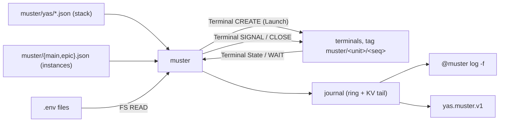

# RFC: Muster, a supervisor for units that run in terminals

- **Status:** Implemented — `extensions/muster`, with
  [its README](../../extensions/muster/README.md) as the operating manual. This
  document is the reasoning; where the two disagree the README is what runs.
- **Date:** 2026-08-19
- **Companion to:** [extensions.md](extensions.md), [term-journal.md](term-journal.md),
  [fs-watch.md](fs-watch.md), [fs-read.md](fs-read.md), [fs-write.md](fs-write.md),
  [kv.md](kv.md), [net.md](net.md), [../protocol.md](../protocol.md),
  [../systemd-user-units.md](../systemd-user-units.md)

## Summary

`muster` reads `~/.config/yas/instances/NAME/muster/` and supervises what it
finds: starts by declared dependency, restarts on crash or edit, and journals
every transition. Units run as ordinary YAS terminals, so _supervised_ and
_attachable_ are the same thing.
A subdirectory is a **stack** of templates; a top-level file can instantiate
one directly or derive an instance for each Git worktree, with distinct ports
and sockets.

No protocol changes are required. Muster selects the native Terminal, FS, Env,
KV, Net, Surface, and Channel families during HELLO. Terminal `CREATE` carries a
typed Launch with argv or shell command, cwd, and environment.



**Chosen over three things that exist.** `session` supervises desktop entries
from `$XDG_DATA_DIRS/*/applications` with a stamped Wayland socket — no cwd, no
ordering, no terminal. A nested `systemd --user` works
([../systemd-user-units.md](../systemd-user-units.md)) but wants a wrapper, a
private runtime dir and a delegated scope, its children are not terminals, and
its journal is unreadable where the server's user is in neither
`systemd-journal` nor `adm`. A separate local process supervisor cannot hand
you the terminal a process runs in from a browser, on another machine, after
the supervisor is replaced.

**Name.** To muster: to bring into service. A muster roll: the register of a
unit's members and the record of who answered. Collides with nothing in tree.

## Scope

Goals: one file per unit, no hidden enable-state; one stack many instances;
units are terminals; a checkable notion of _ready_; bounded jittered backoff;
argv + cwd + env, the same three knobs a process gets outside a terminal; a
journal that answers "why is this not running"; survive `yas ext update`.

| not doing                                  | because                                                                                                          |
| ------------------------------------------ | ---------------------------------------------------------------------------------------------------------------- |
| supervision outside terminals              | `PROCESS` gives raw stdout with no terminal semantics — right for a daemon, wrong for the thing you attach to    |
| socket/timer activation                    | a unit starts by intent, dependency, or hand                                                                     |
| cgroups, limits, isolation, user switching | units run as the server's user                                                                                   |
| implicit shell                             | `command` is argv, `shell` is a separate field: the model is written down, not inferred from word count          |
| expansion outside a stack                  | plain units and every env file are literal; substitution exists only in templates, only from declared parameters |
| systemd compatibility                      | vocabulary borrowed because it is in your fingers; semantics diverge where systemd's are a known trap            |
| pane placement                             | layout is workspace-session or device state; an extension can only make a terminal exist, named                  |

## Directory

```
~/.config/yas/instances/default/muster/
  postgres.json          a unit
  path.env               not JSON: a file some units read
  yas/                  a stack
    stack.json             parameter declarations (reserved name, not a unit)
    server.json            a template
    edge.json
  main.json              instance of yas → main/server, main/edge
  epic.json              instance of yas → epic/server, epic/edge
```

Resolved like `yas_config_dir()` (`$XDG_CONFIG_HOME`, else `$HOME/.config`),
then `yas/instances/NAME/muster/`; `NAME` defaults to `default` and
`YAS_MUSTER_DIR` overrides the whole path. Two server instances therefore do
not supervise the same units unless the operator explicitly points them at one
directory.

- **An entry's name is its basename without `.json`**, unique because the
  filesystem says so. One rule for units, stacks and instances.
- Top-level file = unit, unless it has `"stack"` (an instance of one) or
  `"include"` (a directory of units adopted as they are); both at once is
  refused. Subdirectory = stack. Leading `.` ignored (editor litter:
  `.#api.json`). Nothing below the first level is read.
- Schema one level up, so it is not itself a unit:
  `yas @muster schema > ~/.config/yas/muster.schema.json`.
- JSON because `"$schema"` makes every editor a validator — completion, enum
  values, a squiggle under a typo — before the supervisor sees the file. It also
  makes unit files, journal, channel and `--json` one syntax: `@muster cat api |
jq` composes both ways.
- `"$schema"` and `"//"` are accepted and ignored (JSON has no comments). Other
  unknown keys are a `doctor` warning — the editor is the fast path for typos,
  and a newer muster may know the key.

## Unit

```json
{
  "$schema": "../muster.schema.json",
  "description": "Postgres for the dev stack",
  "command": ["postgres", "-D", "/srv/pg"],
  "readyWhen": { "tcp": "127.0.0.1:5432" },
  "restartOnSuccess": true
}
```

| field              | type                | default      | meaning                                                                      |
| ------------------ | ------------------- | ------------ | ---------------------------------------------------------------------------- |
| `description`      | string              | unit name    | Shown by `list` and the panel.                                               |
| `autostart`        | bool                | `true`       | Start with the supervisor, and when the file appears.                        |
| `requires`         | [string]            | `[]`         | Must be **ready** first; this stops when one leaves ready. Implies ordering. |
| `wants`            | [string]            | `[]`         | Started alongside. Not waited for, not failed with, not ordered.             |
| `after`            | [string]            | `[]`         | Ordering only.                                                               |
| `command`          | [string]            | one of these | argv, exec'd directly. No shell, no rc files, no shell syntax.               |
| `shell`            | string              | one of these | Command line for the server's login shell. Excludes `command`.               |
| `cwd`              | string              | `~`          | Absolute or `~`; Terminal Launch otherwise inherits the server's cwd.        |
| `env`              | object              | `{}`         | Overrides `envFile`, and everything the server derives.                      |
| `envFile`          | string \| [entry]   | `[]`         | Read in order. Entry is a path or `{path, optional}`.                        |
| `type`             | `simple`\|`oneshot` | `simple`     | A `oneshot` is ready when it exits 0.                                        |
| `readyWhen`        | below               | `"spawn"`    | `simple` only.                                                               |
| `restartOnFailure` | bool                | `true`       | Retry a nonzero exit from a `simple` unit.                                   |
| `restartOnSuccess` | bool                | `false`      | Retry a clean exit too. Both false = never retry.                            |
| `restartOnChange`  | bool                | `true`       | Re-run on a change to this file, its template, or a watched `envFile`.       |
| `restartDelay`     | duration            | —            | Fixed delay, replacing the jittered backoff.                                 |
| `keep`             | number              | `1`          | Exited terminals retained from previous runs, oldest closed first.           |
| `timeoutStart`     | duration            | `30s`        | Budget for `readyWhen`.                                                      |
| `stopSignal`       | string              | `SIGTERM`    | Sent to the process group.                                                   |
| `timeoutStop`      | duration            | `10s`        | Grace before SIGKILL.                                                        |
| `startLimit`       | number              | `5`          | Consecutive failures before `failed`. `0` = no limit.                        |

Duration: `"250ms"`, `"30s"`, `"5m"`, or a bare number of milliseconds. Exactly
one of `command`/`shell`; Terminal Launch refuses both as `INVALID`, and so does
`doctor`.

The three `restartOn*` are the three reasons to re-run: a crash, a clean exit,
an edit. Two default on — a supervisor that watches a directory and ignores what
it sees is worse than none, and the alternative to restarting a crash is a
stopped unit nobody noticed. `restartOnSuccess` is off because a process that
exits 0 usually meant it, and disagreeing produces a loop rather than an outage.
A failed `oneshot` is the exception: it stays failed regardless of restart
flags, and an explicit start runs the task again after it has been fixed.
Once a `oneshot` has succeeded, re-running it is a staged replacement: existing
dependents keep using the prior result through an in-progress or failed run and
restart only after a replacement exits 0. This avoids turning a failed build or
migration into an outage. An initial run still gates dependents, and `stop`
still cascades immediately.

### `readyWhen`

| form                                  | ready when                                                                     |
| ------------------------------------- | ------------------------------------------------------------------------------ |
| `"spawn"`                             | Terminal `CREATE` succeeded and State reports the new live terminal            |
| `{"delay": "2s"}`                     | wall clock                                                                     |
| `{"path": "/run/my-service/ready"}`   | an FS `READ` metadata question says the path exists, polled every 250 ms       |
| `{"log": "listening on"}`             | Terminal `WAIT(OUTPUT)` finds the substring after the start cursor             |
| `{"tcp": "127.0.0.1:5432"}`           | Net `OPEN` succeeds, polled every 250 ms                                       |
| `{"http": "http://127.0.0.1:10001/"}` | `GET` answers below 500 — connect + status line, no TLS, no redirects, no body |
| `"manual"`                            | `yas @muster ready <unit>`, possibly from the unit itself                      |

`path` and `http` cover the development stack's socket, generated-file, and
HTTP readiness checks; `tcp` is a worse approximation for HTTP services, since
a port binds before the thing behind it serves. `log` takes its cursor with
Terminal `OUTPUT(PROBE)` at create — so the match is
text that arrives _after_ the unit started, not whatever was already on screen —
and then arms one Terminal `WAIT(OUTPUT)`, which the server holds until the needle appears
or `timeoutStart` runs out. Nothing about `log` polls, so there is no window in
which a ready line can be printed and evicted between reads. `path`, `tcp` and
`http` do poll, and stop when the unit leaves `activating`.

### `command` versus `shell`

`command` is the Terminal Launch `ARGV` variant, reaching `execve` untouched:
no quoting, no splitting, no `$`, no rc file. Default, because deciding between
two execution models by counting words in a string is the exact ambiguity `yas
terminal start` just removed.

`shell` is `$SHELL -lic` — the _login_ shell, fish on a host where `$SHELL` is
fish. Use it for a pipeline, a redirection, an `&&`, or the rc file's
environment. Use `["sh", "-c", "…"]` as a `command` for POSIX regardless of who
the server's user is.

## Stacks and instances

`stack.json` declares parameters:

```json
{
  "description": "The yas dev stack",
  "vars": {
    "PORTS": {
      "description": "base of a 4-port block",
      "kind": "ports",
      "span": 4,
      "start": 10000
    }
  }
}
```

An instance binds them:

```json
{
  "stack": "yas",
  "vars": { "PORTS": 10010 },
  "omit": ["website"],
  "autostart": false
}
```

| field       | meaning                                                                           |
| ----------- | --------------------------------------------------------------------------------- |
| `stack`     | subdirectory **or path** to instantiate; its presence makes this file an instance |
| `vars`      | one per declared parameter; undeclared or missing-required fails the instance     |
| `omit`      | templates to skip; anything `requires`-ing an omitted unit fails to load, by name |
| `autostart` | default `true`; `false` holds the whole instance                                  |

Units are `<instance>/<template>`, which reads as the path it is: the instance
groups, the template names. It sorts every unit of an instance together, and it
cannot collide with a plain unit, whose name is a filename and so carries no
separator. Inside a stack, `requires`/`wants`/`after` name templates
unqualified and always resolve within the same instance — a stack is
self-contained, with no syntax for reaching out of one.

### Definitions that live somewhere else

A dev stack belongs in the repository it starts, not in a copy under
`~/.config/yas` that drifts from it. So `stack` also accepts a path, and the
configuration directory holds a six-line pointer:

```json
// epic.json — instantiates a stack from a worktree
{ "stack": "/mnt/work/epic/.yas/muster", "vars": { "PORTS": 10010 } }

// work.json — adopts a directory of ordinary units
{ "include": "~/work/units" }
```

A bare word is a subdirectory; anything with a `/` or a leading `~` is a path.
There is no third syntax, and a subdirectory name containing a slash never meant
anything.

The two pointers differ in **naming**, which is the only thing that
distinguishes them and the reason both exist. An instance qualifies —
`epic/server` — which is what one stack running once per worktree wants. An
`include` does not: its units keep their own names, as though the files sat in
the configuration directory. Two includes offering one name is therefore
ambiguous rather than mergeable: first writer wins, `doctor` names both files,
and `omit` resolves it. An included directory holds units only; naming a stack
is what the other pointer is for.

`${STACK_DIR}` is the stack's own directory, and a relative `cwd` or `envFile`
in a template resolves against it. A stack at `<repo>/.yas/muster/` therefore
reaches its checkout with `"cwd": "../.."`; the stack location is the checkout
identity.

**Discovery never leaves the configuration directory.** Muster does not look for
`.yas/muster` in a repository, a cwd, or any ancestor: cloning a repository and
starting a server must not run its code. The pointer is an act someone took, and
it is the same act that already granted arbitrary execution — so this adds
reach, not privilege. What it does add is that **a branch switch changes what a
template says**, since the file is written by `git checkout` rather than by you,
and `restartOnChange` is on by default.

Each distinct external directory costs one FS `OPEN` plus `WATCH`, shared
between pointers naming the same one and closed when the last pointer goes away.
A root added mid-load is empty until its initial State arrives, which triggers
another load—so a new pointer costs one extra pass, not a missing stack.

### Worktree sources

One pointer can derive the repository-resident stack for the main checkout and
every linked Git worktree:

```json
{
  "worktrees": "/home/alice/code/yas",
  "stack": ".yas/muster",
  "vars": { "PORTS": "auto" }
}
```

`worktrees` is the explicit main checkout path — still a deliberate grant, not
cwd discovery. `stack` is relative to each worktree and may not escape it. The
source file's stem names the main instance; linked instances append Git's
administrative id. Thus `yas.json` produces `yas/server` for the main
checkout and `yas-epic/server` for `worktrees/epic/gitdir`.

Muster recursively watches `.git` through an exclusion filter that admits only
`worktrees/*/gitdir`; object storage, refs, indexes, and logs never enter the
watched filesystem State. The main checkout is explicit because Git does not
list it under `.git/worktrees`. Each `gitdir` file supplies that linked
worktree's actual path; it may be anywhere accessible to the server and need
not be beneath or beside the main checkout. Each discovered stack directory
then uses the same external stack watch as a manual instance.

An automatic port declaration adds `start` to `kind` and `span`. The main
worktree owns that exact block. Concrete linked-worktree leases are stored in
the durable kv record `ext/muster/worktree-ports/v1`; active leases survive set
reordering, and absent worktrees keep their reservations so returning does not
change their URLs. A source without kv support or without `start` fails rather
than deriving unstable ports.

Rejected: a `YAS_MUSTER_PATH` of search roots, and auto-discovery from a cwd.
The first needs a cross-root naming scheme and a server restart to change; the
second is the one shape that turns cloning a repository into running it.

### Substitution

Only in a stack's templates, only in string values (never keys), only these:

| form                      | meaning                                   |
| ------------------------- | ----------------------------------------- |
| `${NAME}`                 | the parameter's value                     |
| `${NAME+N}` / `${NAME-N}` | integer offset; `NAME` must be an integer |

`${INSTANCE}`, `${STACK}` and `${STACK_DIR}` are always defined. The standard
server also defines `${YAS_SOCKET}` from its canonical
`YAS_SOCKET_TEMPLATE`: the same secure automatic resolver that binds named
servers selects the owner-private runtime directory, with `{name}` replaced
only after the instance name passes the server-name grammar and socket-length
limit. A malformed or missing template leaves `YAS_SOCKET` unavailable rather
than treating it as shell or path text. Embedders must populate
`Config::automatic_ipc_template` with `default_ipc_path_template()` to preserve
this contract. Explicit per-server `YAS_SOCK` locations are deliberately not
predicted; pass one as a declared stack parameter instead. The stack directory
lets a repository-resident stack reach its checkout without the instance
restating a path it already named. Unknown
name, unclosed `${`, or
an offset on a non-integer fails **that instance** — naming file, JSON pointer
and variable — leaving other instances running. No empty-string fallback: a
parameter you forgot to bind should not silently produce `http://127.0.0.1:/`.

`${` is the only trigger, so a bare `$` is literal and a `shell` template can
still write `$YAS_SOCK` and mean the shell's variable.

Arithmetic exists because a port block is what actually varies in the yas
development stack: one integer, four ports at `BASE+0..3`, paths stamped with
the instance name.

### Port blocks

`kind: "ports"` + `span` buys two things; `start` supplies the stack's first
automatic block:

- `PORTS=auto` at `instantiate` scans every instance's block, takes the next free
  base, and **writes the number into the file**. `auto` is never stored or
  re-resolved — an instance always says which ports it took, and says the same
  tomorrow. The first instance uses `start`; without it the first block must be
  explicit.
- `doctor` reports overlapping blocks, which is the failure mode of several dev
  stacks and presents as `EADDRINUSE` in whichever one lost.

## Environment

Precedence, ascending: what the server derives → each `envFile` in order →
`env`. Files are read **at every start**, not at load. Relative `envFile` paths
resolve against `cwd`; a missing one fails the start unless `"optional": true`.

The merged map travels in Terminal Launch with `ENVIRONMENT_SERVER` as its base
and explicit set/remove entries applied last. It reaches `execve` as `envp`—
never a command line. So
nothing appears in `ps`, `/proc/<pid>/cmdline`, or on disk, and an `envFile`
secret is as safe as `EnvironmentFile=`. Env files are never substituted; a
per-instance env file is a path built with `${INSTANCE}`.

Format — `KEY=VALUE`, parsed, never executed:

- `KEY` matches `[A-Za-z_][A-Za-z0-9_]*`; leading `export ` stripped.
- `#` starts a comment **only at line start**, so `PASSWORD=hunter2#3` works.
- Unquoted values run to end of line, trimmed. `'single'` literal; `"double"`
  unescapes `\n \r \t \\ \"`. Neither spans lines.
- No `$` expansion, no command substitution. Duplicate key: last wins.

That is the intersection of what dotenv tools accept, minus every construct they
disagree about. `doctor` reports unparseable lines by file and line, without
printing values.

### `PATH` is the sharp edge

A `command` unit runs no rc file, so `PATH` is the **server process's** — fine
from a terminal, wrong under a systemd unit where it is often coreutils,
findutils, grep, sed and nothing else. No `cargo`, no `pnpm`, no `node`. Fixes,
in order:

1. Set `PATH` in `env` or a shared `envFile`. The server resolves `command[0]`
   **against the child's own environment**, so an override changes which binary
   runs. One `path.env` listed by every unit is the whole fix.
2. Absolute `command[0]`.
3. `shell`, which runs the rc file and inherits nix profile, direnv and the
   rest — at the cost of a shell in the tree and your login shell's syntax.

`doctor` resolves `command[0]` against the unit's _effective_ `PATH`.

## Example: the yas dev stack, once per worktree

The checked-in `.yas/muster` directory is the development stack installed by
`bin/install-in-muster`. Its graph, probes, and restart policies live beside
the code they supervise.

`yas/server.json` — the Muster instance name is also the local server name,
and the same process serves the browser. The name is the whole socket
configuration: `bin/dev-server` clears the supervising server's exported
`YAS_SOCK` and `TMPDIR`, points `XDG_RUNTIME_DIR` at the login user's runtime
directory, and lets `--name` resolve the path the way a packaged server does.
It also builds the binary it execs, so the unit owns its artifact:

```json
{
  "//": [
    "yas --on local:${INSTANCE} reaches this exact development server.",
    "The server's socket lock replaces an older attempt and removes stale sockets.",
    "--name locates the socket; an explicit YAS_SOCK only restated it.",
    "bin/dev-server builds the binary it execs, so no oneshot build unit.",
    "YAS_EDGE=1 serves the browser from this process, the way a deployed",
    "server does: one unit, and no socket between browser and terminals.",
    "Readiness is that listener, because the server's own FS STAT refuses a",
    "socket and a `path` probe at the named socket can never be satisfied.",
    "restartOnSuccess stays false: the flock-based replacement exits 0 on purpose",
    "and retrying that loops forever.",
    "timeoutStop 15s so AudioPipeline::drop can stop media processes in order."
  ],
  "description": "yas server and edge on :${PORTS+1} (${INSTANCE})",
  "command": ["direnv", "exec", "${STACK_DIR}", "dev-server"],
  "env": {
    "YAS_SERVER_NAME": "${INSTANCE}",
    "YAS_EDGE": "1",
    "YAS_ADDR": "127.0.0.1:${PORTS+1}",
    "YAS_CORS": "*",
    "YAS_FONT_EXPORT": "1"
  },
  "readyWhen": { "http": "http://127.0.0.1:${PORTS+1}/" },
  "restartDelay": "2s",
  "keep": 3,
  "timeoutStop": "15s"
}
```

There is no `yas/edge.json`. The stack used to run `bin/dev-edge` as a unit of
its own on the same port; the server hosts that listener now, which is what a
deployed one does, so the template went away rather than duplicating a
deployment shape the modules no longer use. `yas edge` is still a command, for
the fixed-home edge in front of a server that does not host its own.

Five templates in all. Every command points direnv at `${STACK_DIR}`. Direnv
finds the checkout's ancestor `.envrc`, changes to that checkout, and exposes
its `bin/` on `PATH`; neither Muster nor the templates infer a worktree root
from the stack's depth or from the main checkout. The JSON retains only graph,
variables, probes, and restart policy. There are no `oneshot`s left: a build
that exactly one unit consumes is a line in that unit's script, not a unit of
its own with a dependency edge pointing at it. With `server` above, an
installed checkout runs all five units.

A repository is registered with one command after muster is running:

```bash
./bin/install-in-muster
yas @muster list
```

The installer writes into the selected server instance's muster directory and
checks that the running extension understands worktree sources before changing
its configuration. It uses `YAS_SERVER_NAME` or `default`; `--name NAME`
selects one explicitly:

```bash
./bin/install-in-muster --name work
```

Extension queries use yas's effective target. When that is not the server
whose directory is being installed, select it with `--on TARGET`:

```bash
./bin/install-in-muster --on prod --force
```

The main worktree's UI is exactly `:10000` and its edge is `:10001`.
Linked worktrees receive durable blocks beginning at `10004`, their socket
includes the derived instance name, and their terminals appear as
`<instance>/server` and so on in every client's catalog.

Not everything wants a stack: a `postgres`/`migrate`/`api`/`stripe` set at top
level is four units, and nothing about them differs per instance.

## Phases

| phase        | meaning                                                                       |
| ------------ | ----------------------------------------------------------------------------- |
| `stopped`    | not running, nothing wanted                                                   |
| `waiting`    | wanted; a `requires` is not ready                                             |
| `activating` | terminal created, `readyWhen` unsatisfied                                     |
| `running`    | ready; dependents may proceed                                                 |
| `exited`     | `oneshot` finished 0; counts as ready                                         |
| `backoff`    | failed, retry armed                                                           |
| `failed`     | gave up: no `restartOn*` applied, `startLimit` exhausted, invalid file, cycle |
| `held`       | stopped by hand; ignores `autostart` until started or the supervisor restarts |

An instance has no phase — `list` shows a ready count, and a verb on it means
that verb on each unit in dependency order.

`activating` exists because "running" is false until both Terminal `CREATE` has
succeeded and the configured readiness condition holds. The correlated Result
reports a rejected Launch, and the Terminal State watch reports lifecycle and
the exact exit record for a child which starts and then exits.

| in           | event                                        | out                            | journal                      |
| ------------ | -------------------------------------------- | ------------------------------ | ---------------------------- |
| `stopped`    | autostart / `start` / a dependent needs it   | `waiting`                      | `start` + cause              |
| `waiting`    | all `requires` ready                         | `activating`                   | `spawn`                      |
| `waiting`    | a `requires` went `failed`                   | `failed`                       | `failed`, naming it          |
| `activating` | Terminal `CREATE` fails, or env unresolvable | `backoff`                      | `exit` + reason              |
| `activating` | `readyWhen` satisfied                        | `running`                      | `ready`                      |
| `activating` | `timeoutStart` elapsed                       | `backoff`                      | `failed` (`timeout`)         |
| `activating` | Terminal State is `EXITED`, `oneshot`, 0     | `exited`                       | `ready`                      |
| `running`    | Terminal State is `EXITED`                   | `backoff`\|`stopped`\|`failed` | `exit` + code + reason       |
| `running`    | a `requires` left `running`                  | `waiting`                      | `stop` (`dependency:<unit>`) |
| `backoff`    | deadline due                                 | `activating`                   | `restart` + attempt          |
| any          | `stop`                                       | `held`                         | `stop` (`command`)           |
| any          | file deleted                                 | `stopped`                      | `unloaded`                   |

## Running a unit

**Spawn.** Read each `envFile` through an FS root, merge it with `env`, and send
one Terminal `CREATE`. Its typed Launch carries cwd, the merged environment,
and argv or shell command. The resource-tag Launch extension carries
`muster/<unit>/<seq>`; `<unit>` is already `<instance>/<template>` for a stack
member, so the tag carries the qualified name unchanged. Argument, environment,
and Launch caps come from the selected Terminal family and are checked before
the server invokes `execve`.

A `cwd` that cannot be entered is no longer ignored: the child writes
`yas: cannot enter working directory: …` to the terminal and exits 1.

An unresolvable `command[0]` is **not** as precise, and an earlier draft of this
document was wrong about it. It claimed a refused create, reasoning that the
server resolves the program before forking. Measured, an absolute path that does
not exist produces a terminal that exits 1 having printed nothing: the resolver
passes an absolute path through unchecked, and the failure lands in the child.
A missing binary therefore looks exactly like a program that started and quit.
Only `@muster status`, which shows the run, and `doctor`, which resolves
`command[0]` itself, tell them apart.

**Terminal is negotiated, not probed.** Muster requires Terminal version 1 and
its dependency closure during native HELLO. If the family or required limits
are unavailable, bootstrap fails before any unit starts. There is no alternate
launch encoding: silently running something other than what the file requested
is worth refusing over.

**Stop.** Terminal `SIGNAL` sends `stopSignal` to the process group. `SIGNAL`
does not escalate, so Muster arms `timeoutStop` and sends `SIGNAL_KILL` itself.
Terminal `CLOSE` is not a stop verb—it removes the terminal, whose retained
scrollback is the reason the unit is stopped.

**Restart—always a new terminal.** Next `<seq>`, fresh Terminal `CREATE`. Muster
does not use Terminal `RESTART`: that operation retains the same handle and can
replay the prior Launch, so it cannot serve an edit-restart. Using it only for
crashes would make the two kinds behave
differently: one keeps your pane, the other swaps the terminal underneath it.
One always-true rule beats two half-true ones, and a client that follows the
unit rather than the terminal is correct in both.

**Retention** replaces the kept scrollback: `keep` exited terminals stay in the
session, oldest closed first past the limit. A crash loop leaves the last `keep`
runs side by side with their exit codes instead of one pane of concatenation,
and the run that broke is addressable—`yas terminal journal 17` reads the run
Muster renders as `17`, with no archaeology. Per unit, because
the units that want history are not the ones that churn: a server crashing twice
a day wants several, a watcher that exits on every save wants none.

**Backoff.** `BACKOFF_BASE = 1s`, doubling, `BACKOFF_MAX = 30s`, full jitter,
and `HEALTHY_AFTER = 60s` resets the failure count. The base is longer than the
server extension supervisor's because every muster retry creates a retained
terminal. `restartDelay` replaces the schedule with a fixed delay.

## Dependencies

Starting a unit starts the transitive closure of `requires` + `wants` in
topological order, within its instance. Independent units start concurrently:
one thread, but every wait is a deadline in one loop, so two instances never
wait on each other.

A `requires` dependent **stops when its dependency leaves `running`** and starts
again when it returns. Stronger than systemd's default, and what a dev stack
wants: recycle the database, everything above it recycles, in order, once.
`wants` and `after` never cascade. Stops walk the reverse order.

`requires` also implies ordering. systemd separating `Requires=` from `After=`
is the most common unit-file mistake there is; `wants` covers start-but-do-not-
wait and `after` covers order-without-requiring, so nothing is lost.

Cycles are refused at load — every member `failed`, a `cycle` event naming the
ring. A partially-started cycle is worse than a stopped one.

## Journal

Supervision events, not output: output is the terminal, and `yas terminal
journal <handle>` already reads it with exit records and sequence cursors.

```json
{ "seq": 42, "ts": 1755600000180, "unit": "epic/edge", "instance": "epic",
  "event": "spawn", "phase": "activating", "pty": "0000000000000007",
  "detail": "./target/profiling/yas edge",
  "envFiles": ["/mnt/work/epic/.env.local"], "envKeys": 9 }
{ "seq": 44, "ts": 1755600310114, "unit": "epic/edge", "event": "exit",
  "phase": "backoff", "pty": "0000000000000007", "exitCode": 101, "reason": "normal",
  "detail": "retry 1 in 750ms" }
```

| event                             | when                                                                          |
| --------------------------------- | ----------------------------------------------------------------------------- |
| `loaded` / `changed` / `unloaded` | a file appeared and parsed / parsed differently / went away                   |
| `invalid`                         | did not parse, or a parameter did not bind; last good version stays in effect |
| `cycle`                           | dependency cycle, members named                                               |
| `start`                           | intent recorded, before anything is spawned                                   |
| `spawn`                           | Terminal `CREATE` sent; handle, env files read, key count                     |
| `ready`                           | `readyWhen` satisfied, or a `oneshot` exited 0                                |
| `exit`                            | Terminal State exit record, code or signal and reason                         |
| `restart`                         | a backoff deadline came due                                                   |
| `reaped`                          | a retained terminal closed to stay within `keep`; handle and exit code        |
| `stop` / `failed`                 | signalled, with cause / gave up, with why                                     |
| `adopted`                         | a live terminal reclaimed after the supervisor restarted                      |

`cause` ∈ `autostart`, `dependency:<unit>`, `command`, `file`, `crash`,
`policy`, `adopt`. The question the journal answers is "who asked for this", and
free text does not answer it reliably. Records carry `instance`, so
`@muster log -u epic` is a filter, not a grep.

**Environment values never appear.** `spawn` names the files and counts keys —
enough to diagnose "it did not pick up my `.env`", not enough to leak.

Storage: an in-memory ring, plus a durable tail in KV under
`ext/muster/log/<seq:016x>`, counter at `ext/muster/seq`. Prefix isolation is
convention — KV is flat and server-wide, shared with `tabs/`, `roots/`,
`ext/session/`. The durable tail is why `@muster log` still says why something
is down after a server restart.

The ring is sized so it is never the answer to "why is that not in the log":
bringing up a hundred units emits some hundreds of records, so it holds many
cold starts. It is bounded at all only because a unit crash-looping at the
one-second base emits records for as long as the supervisor lives.

## Channel

`yas.muster.v1`, one JSON object per message. Read by `js/ui`'s **Muster** tab,
which draws the tree the CLI cannot: instance ▸ unit ▸ (terminal, windows).

```json
{ "type": "hello", "version": 1, "dir": "/home/…/.config/yas/instances/default/muster" }
{ "type": "state", "units": [ … ], "gone": ["epic/old"] }
{ "type": "state", "full": true, "dir": "…",
  "instances": [ { "name": "epic", "stack": "yas", "members": [ … ] } ],
  "units": [ { "name": "epic/edge", "instance": "epic", "phase": "running",
    "pty": "0000000000000007", "restarts": 1, "lastExit": 101, "autostart": true, "stale": false,
    "type": "simple", "requires": ["epic/build"],
    "surfaces": [ { "id": "0000000000000004", "title": "epic — dev", "width": 1920, "height": 1080 } ],
    "runs": [ { "pty": "0000000000000006", "exitCode": -15, "seq": 1 } ] } ] }
{ "type": "events", "records": [ … ] }
```

This document originally said **full state on every change, no deltas**,
justified by the state being small. Nesting surfaces under a hundred units is
what stopped that being true, and the property worth keeping was never "send
everything" — it was **a unit arrives whole**, so a reader that missed a frame
is correct after the next one and no reconciliation code exists at either end.
That survives: transitions mark units dirty and a flush 80 ms later carries only
those units, each entire. `full` marks the frames that redefine the table — a
new reader's first, and after `resync` — and those are the only ones where an
absent unit means a deleted unit; a partial frame names its removals in `gone`.

A new reader is also handed the journal tail, because it is the one thing a
state frame cannot say: what already happened.

Inbound is one bare line: `start|stop|restart <name>`, `rewatch`, `resync`.
Acked before acting, so a panel whose window is one command deep does not stall
waiting for the effect it asked for.

Flow control: a peer that cannot afford a frame is marked as owing a _full_ one,
and its next affordable frame carries everything rather than a diff against a
state it never saw. Only `dirty_since` arms a flush — deriving "something is
waiting" from the dirty set instead spins, because a peer with no credit leaves
that flag set through a flush that could not send and would ask to be woken
again immediately, forever. Credit returns with an ACK, so an ACK re-arms.

No listener token, so any client knowing the name can drive it — the same
posture as `yas.session.v1`, and as being able to open a terminal at all.

## CLI

```
yas @muster list                                   [--json]
yas @muster status NAME                            [--json]
yas @muster start|stop|restart NAME
yas @muster reload NAME
yas @muster rewatch
yas @muster ready UNIT
yas @muster log [-n N] [-u NAME] [--since SEQ] [-f] [--json]
yas @muster cat NAME
yas @muster env UNIT                               [--json] [--values]
yas @muster stacks                                 [--json]
yas @muster instantiate STACK INSTANCE [VAR=VALUE...] [--no-start] [--force]
yas @muster schema
yas @muster doctor                                 [--json]
```

`NAME` is a unit or an instance.

```
$ yas @muster list
NAME              PHASE     TERMINAL          SINCE  RESTARTS  DESCRIPTION
postgres          running   4                 3h     0         Postgres for the dev stack
main              —         -                 41m    1         yas, 8/8 ready
  main/server     running   6                 40m    1         yas server (main)
  main/edge       running   7                 40m    0         Edge on :10001 (main)
epic              —         -                 -      0         yas, 0/7 ready, held

$ yas @muster status epic/edge
unit         epic/edge
phase        backoff
terminal     19   started 4s ago
runs         18   exit 101   ran 5m12s   ended 4s ago
             17   exit 101   ran 5m08s   ended 5m16s ago
             16   exit 0     ran 2h01m   ended 10m24s ago
```

Muster human output renders terminal handles as unpadded decimal, so its IDs
can be passed directly to core Terminal CLI commands. JSON and channel payloads
use fixed-width lowercase 16-digit hex strings without a prefix to preserve the
full `u64` range. Terminal State renders an argv Launch shell-quoted rather than
blank, so a unit is identifiable in any client's catalogue without asking
Muster.

- `env UNIT` resolves the environment as a start would, printing key names and
  which file each came from — "which of my three `.env` files won", and "which
  `PATH` will `command[0]` resolve against". Names only; `--values` opts in.
- `cat` prints the file verbatim: `env` values (you wrote them there) and
  `envFile` paths (not their contents).
- `instantiate` writes through FS `STAGE_WRITE` and `COMMIT` on the root it already holds, resolving
  `auto` first, expanding the instance before writing so a file that would not
  load is never written, and refusing to overwrite without `--force`. It then
  loads and reconciles before answering, so what comes back is the phase each
  unit is _in_ rather than the one it was asked for — a stack for a new worktree
  is one command, not a write followed by a start.
- `reload NAME` runs a unit's `reloadCommand`, or restarts it if it has none.
  `rewatch` is a separate verb, not an argument-less `reload`: retrying a refused
  FS `OPEN`/`WATCH` and telling a unit to re-read its configuration share no subject and
  no effect, and one word for both would put the wrong one a forgotten argument
  away. There is no "re-read the directory" verb at all, because the directory is
  watched and an edit is loaded before a command about it could be typed.
- Human output is tab-separated; `--json` sends one `result` payload of
  `application/json` **instead of** the text — in plain mode the CLI writes a
  RESULT straight to stdout, so sending both prints the answer twice.
- `doctor` in one pass: parse errors with line and column, unknown keys, both
  `command` and `shell`, `requires` naming something absent or omitted, cycles, a
  `cwd` that is not a directory, a `command[0]` that does not resolve against the
  effective `PATH`, missing non-optional `envFile`s, unparseable env lines,
  unbound or undeclared parameters, and **overlapping port blocks**. Cheap enough
  to run on every load, which is what it does — the findings are computed there,
  not when you ask.

## Watching

Muster opens the configuration directory as an FS root and starts one recursive
`WATCH` with inline content and a 200 ms settle interval. Everything below the
second level is dropped on arrival; non-`*.json` and leading-`.` entries are
ignored.

`inline_max` is left at zero, which takes the server's own ceiling. Setting one
here would not mean "read at most this much" — it means a unit file larger than
it arrives with no content and is therefore `invalid`, which is a rule nobody
would guess. The same applies to the per-file cap on reading an `envFile` and to
the per-poll slice of Terminal `OUTPUT`; Muster names none of them, because the
server already has an answer and a second one can only disagree.

FS `WATCH` publishes state rather than an unstructured event log, which fits: a save
producing identical bytes is invisible and there is nothing to do. It also means
a half-written file can arrive — and JSON is unusually good at being obviously
incomplete, failing at the missing brace. **A file that does not parse never
displaces the one that did**: the unit keeps running, `invalid` carries the
error, `doctor` lists it. Never parsed at all = `failed`.

Editing a template re-resolves **every instance of that stack** — one save can
restart eight units across three worktrees. That is the sharp edge of
`restartOnChange` defaulting on, and two things keep it survivable: unparseable
files restart nothing, and the 200 ms settle window makes a save one event, not
one per keystroke. What remains is that a _valid_ edit acts immediately, which is
the point — a unit whose file no longer describes it is a lie. Set
`"restartOnChange": false` per unit to wait for `@muster restart` instead. An
edit-restart is a restart like any other: new terminal, previous one retained.

`envFile`s are **not** watched, which this document proposed and the
implementation did not do. They are read at every start instead, through FS
`READ`, so editing one and restarting is enough—and the alternative, an FS
`WATCH` per distinct path, buys an automatic restart at the cost
of a watch per file for a signal that is only ever consumed at spawn. Worth
revisiting if editing `.env` and forgetting to restart turns out to be the
common mistake; nothing else depends on the choice.

A directory whose FS `OPEN` or `WATCH` the server **refuses** is the one failure a watch
cannot report its way out of, because nothing is watching a directory that is
not being watched. The usual cause is a pointer written before its target
exists, which is the ordinary order of events when a stack lives in a worktree
about to be created. So it is the single thing here that polls: retried after
5 s, doubling to a minute, reset whenever any watch succeeds, and forced by
`@muster rewatch`. Without the retry a root that failed once stayed failed for
the life of the supervisor—`watch()` returns early for a path already in the
root list, and a refused request leaves it there with no subscription ID.

`~` is not expanded by the FS family. Muster uses Env `GET` to resolve the same
`HOME` and `XDG_CONFIG_HOME` inputs as `yas_config_dir()`, then expands `~` in
`cwd`, `envFile`, and `readyWhen: {path}` itself.

## Surviving its own replacement

After native HELLO, Muster starts Terminal `WATCH` with no resume cursor and
consumes its complete initial State before reconciliation. Every record carries
the terminal handle, generation, lifecycle, and resource tag; exited records
also carry the exact exit extension. That snapshot distinguishes a terminal
which died while nobody was supervising from one still running, so a corpse is
never adopted as the live run.

Per unit, tags sort by `<seq>`: the highest **not-exited** is the live run,
failure count 0, `started_at` now so it re-earns `HEALTHY_AFTER`. The rest are
history, trimmed to `keep`. All exited = `stopped` (or `exited`, for a `oneshot`
that succeeded), and the next start takes the next seq, so a corpse is never
mistaken for the live run. Tags naming a vanished unit or
instance are closed outright.

**Only a `readyWhen` that describes the present may be re-run on an adopted
unit**: `path`, `tcp` and `http` ask the world a question and get today's
answer. `log`, `delay` and `spawn` describe a past event, and the evidence for
one — a line in a bounded ring, a moment that has passed — may be gone. A live
terminal is the evidence for those, so they adopt straight to `running`.
Re-running a `log:` probe instead stalls a healthy unit for `timeoutStart` and
then replaces it, which is precisely the restart storm adoption exists to
prevent.

So `yas ext update muster` replaces the supervisor while every instance keeps
running, journaling `adopted` rather than a restart storm. No KV process
references, no boot generation—the resource tag on a live Terminal State record
is the truth.

## Cost and dependencies

Idle: nothing sent; the loop parks in `wait_until` on the nearest deadline.
Per start: one FS `READ` per `envFile`. Standing: one FS root and `WATCH` per
distinct configuration or external stack directory; env files are not watched.
`readyWhen` polling runs only during `activating`. A Terminal `OUTPUT` probe and
an FS metadata question are both O(1) server-side. Instances multiply units,
not watches—a stack's templates share one State subscription however often
instantiated.

Muster takes `serde_json` + `serde` derive, breaking the precedent that an
extension depends on `yas-guest` alone. Its JSON is nested, user-authored and
wrong often enough that the parse error is a feature: `doctor` saying _line 7,
column 3, expected string_ is the product, and a hand-rolled reader that says
that well is a worse copy of a crate that exists. The same dependency emits
every `--json` payload and the journal, so the escaper a hand-rolled emitter
would need is already linked in either way. Measured under `wasm-opt -Oz` the
whole extension is **410 KB, 137 KB brotli**, against `session`'s 187 KB / 68 KB
and `systemd`'s 116 KB / 45 KB. Roughly a doubling, on an object that is downloaded
once and pinned by digest. If that number ever stops being worth it, the
fallback is a hand-rolled parser and a worse `doctor`, not a worse format.

## Security

- Writing `~/.config/yas/instances/NAME/muster/` is arbitrary execution as the server's user —
  same as `~/.config/systemd/user`, same as opening a terminal. New: the yas
  protocol reaches that directory (FS `STAGE_WRITE` + `COMMIT`, or `APPLY`), which is also how
  `instantiate` works — and only there, at the top level: a stack directory
  outside the configuration directory is a repository muster was pointed at, and
  the rule that keeps discovery out of it keeps writes out of it too.
  `YAS_FS_WRITE=0` closes it, at the cost of `instantiate`.
- A pointer extends that reach to a directory outside, but not the privilege:
  writing the pointer is the same act, and only someone who could already run
  anything can perform it. What it does introduce is a **second writer** —
  `git checkout` — so a branch switch changes what a template says without
  anyone editing a file. Muster therefore never discovers a stack from a cwd or
  a repository layout; a pointer has to exist. Treat an external stack as code
  you have read, on the branches you run.
- Env files are expected to hold secrets. They reach the child as `envp` and
  nowhere else: not a command line, not `/proc/<pid>/cmdline`, not written to
  disk by muster, not journaled, not in `status`, not on the channel, not in
  `env` without `--values`.
- Env `GET` returns the server's environment verbatim, credentials included,
  with none of the `YAS_*` filtering Terminal Launch applies. Muster reads it
  for `HOME` and `XDG_CONFIG_HOME` and never echoes it.
- Off switch: do not run the extension. `YAS_MUSTER_DIR` moves it, which is also
  how tests stay out of a real configuration.

## Top risks

- **`PATH` is the server's, not yours.** Exec-by-default runs no rc file, so a
  stack that works by hand can fail to resolve `cargo` — especially under a
  systemd-started server. Fix is one `path.env`, diagnosis is `doctor`, failure
  is a refused create naming the program. Still a surprise when porting.
- **`shell` is the login shell.** Bash idiom fails where `$SHELL` is fish.
  `["sh","-c",…]` is the portable spelling.
- **A stack multiplies blast radius, and `restartOnChange` is on.** One valid
  template edit restarts every instance; each is a new terminal, so an attached
  client is left watching a readable corpse. The hazard is a _good_ edit — a bad
  one restarts nothing.
- **Retention costs scrollback.** `keep` × units × instances, each a buffer.
  Default 1 roughly doubles a stack at rest. `status` shows what is held.
- **`log:` readiness is armed once, not polled.** Terminal `WAIT(OUTPUT)` blocks
  server-side from a cursor taken at spawn, so there is no window in which a
  ready line can be printed and evicted between polls. Muster does not block on
  the reply — that would park its single loop for the whole of `timeoutStart` —
  so the answer arrives through the loop, guarded on the unit still being the
  run that armed it.
- **Cascade stops are stronger than systemd's** — bounded to one instance, which
  is what keeps it from being worse than it sounds.
- **Port blocks are allocated, not enforced.** `auto` picks a free base once;
  nothing stops a hand-edit colliding or a program binding outside its span.

## Landed since this was proposed

- **The browser panel on `yas.muster.v1`**, and the surface tracking that gives
  it something to nest. A run uses a Surface application endpoint whose handle
  is carried by a Terminal Launch extension. The handle is derived from the unit
  name by FNV-1a because a qualified name contains `/` and the Wayland socket
  path is capped at 108 bytes, so
  the _compositor_ says which window belongs to which unit rather than muster
  guessing at process trees. The id being derived means a replaced supervisor
  re-claims the windows it had, since the initial burst replays every live
  surface's origin.
- **Terminal `WAIT(OUTPUT)`**, in place of the `log:` poll—not
  `WAIT(COMMAND)`, which waits on a _command record_ that only exists for a
  terminal whose shell emits OSC 133, and a unit exec'd directly emits none.
  `WAIT(OUTPUT)` is the wait on text
  that `log:` actually needed ([term-journal.md](term-journal.md)). Chasing it
  also found the per-connection wait cap at 32 — a supervisor arms one per unit,
  so at a hundred units it would have served the first 32 — now 4096, which is
  bookkeeping the lifecycle loop already scans rather than the delivery tick.
- **`instantiate`**, so a stack for a new worktree is one command.
- **`stopCommand`, `reloadCommand`, `restartOnAbnormal`.** The last is separate
  from `restartOnFailure` because a signal is a nonzero status and the two were
  conflated: a process that returns 1 has decided something, one the OOM killer
  took has not.

## Future work

- Dependencies across stack boundaries. Omitted because a self-contained stack
  has no ambiguity, and a shared database between per-worktree stacks wants a
  decision about migrations first.
- Placing a unit's terminal in a pane. Frontend-only: the handle is already in the
  client's session list, and what is missing is a way for a layout tile to hand the
  workspace something to place — `ide/activeEditor.ts`'s registry pointed the
  other way.
- The durable journal tail in kv. The ring is in memory, so `@muster log` starts
  empty after the supervisor restarts.
- `@muster remove`, the other half of `instantiate`. Needs an FS `APPLY(REMOVE)`
  mutation, and unlike a write it destroys something.

## Deliberately not

- **`envFile` key subsets, or a `passEnv` list forwarding named server
  variables.** Both make what a unit sees depend on something other than its own
  file. The current answer — the file says everything, and `@muster env
--values` shows what it resolved to — is worth more than the convenience.
- **A stack fetched from a repository, pinned by digest like an extension
  module.** Discovery never leaves the configuration directory on purpose:
  cloning a repository must not be able to start running its code. A stack you
  point at by path is you naming it; a stack muster fetches is not.
