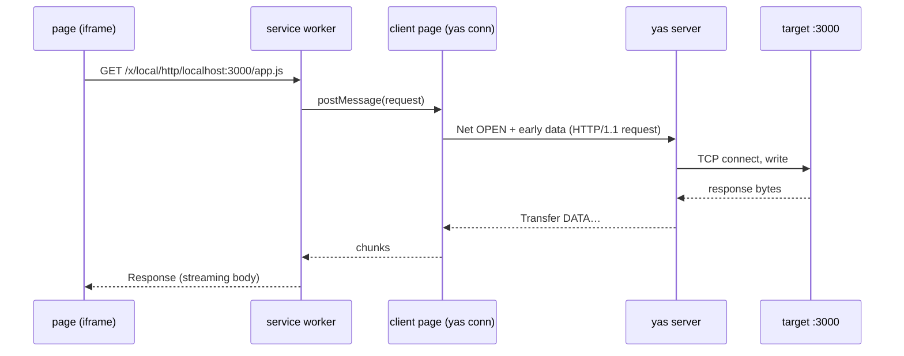

# RFC: Network endpoints and relay

- **Status:** Native YAS Net family v1 implemented; composite native-datagram
  release qualification remains open
- **Date:** 2026-07-28
- **Companion to:** [../protocol.md](../protocol.md),
  [../transports.md](../transports.md), [kv.md](kv.md), [../ide.md](../ide.md)

## Summary

A **raw, bidirectional socket relay** on the yas server: the client
names a host and port, the server opens a socket, and the two ends
shuttle payload. Two socket kinds, chosen per open:

- **TCP** — an ordered byte stream, with half-close and byte-window
  credit. The default, and everything below assumes it unless UDP is
  named.
- **UDP** — a datagram flow, message-preserving, unacked, and droppable.

That is the whole primitive. There is no HTTP in it. The server does
not parse requests, does not know what a header is, and never fetches
anything on its own initiative — it opens sockets where it is told and
copies payload. Everything protocol-shaped lives in the client, which
is what makes the family general: an HTTP dev-server preview, an SSE
stream, a WebSocket upgrade, a Postgres connection, a DNS resolver, and
`ssh -L` are all the same pair of native Requests plus Transfers or datagrams.

The first thing built on it is **port forwarding**, `yas forward`
([§ Client: `yas forward`](#client-yas-forward)) — TCP and UDP, plain,
with no TLS anywhere on that path. It is `ssh -L` over any yas
transport, plus the UDP case ssh has never had.

The motivating consumer is the browser: a **service worker** on the
edge's own origin intercepts `fetch` for a reserved path prefix,
speaks HTTP/1.1 over a relayed stream, and hands back a `Response`
whose body streams. That makes a dev server on the yas host — or on
anything the yas host can reach but the browser cannot — loadable in
the tab, subresources and all, over the connection that is already
open and already authenticated. The service worker is
[§ Client: service worker](#client-service-worker); it is deliberately
**phase 2**, because the same wire has a far simpler first consumer
([§ Client: `yas forward`](#client-yas-forward)) that validates every
part of it without touching a browser.

**TLS is opt-in and TCP-only.**
A service worker has no TLS stack and cannot get one, so reaching an
`https://` dev server from the tab requires the server to terminate —
with ALPN, so h2 is not walled off.
Leave the flag clear, as `tcp/` and `udp/` forwards always do, and the
relay is a pipe that has never heard of certificates: TLS the local
client speaks passes through end to end, opaque. Set it and the server
terminates, which `yas forward`'s `tls/` kind exposes for the case
worth having outside a browser — plaintext locally, TLS to the target.

## Non-goals

- **No server-side HTTP.** No request/response operation, no server-side
  `reqwest`. A request/response family would be smaller on the wire and
  would break every streaming case (SSE, chunked upload, WebSocket
  upgrade, gRPC), and it would put an HTTP client's attack surface in
  the server. A byte relay has neither problem.
- **No server-initiated streams.** Only clients open. A server that can
  dial into a client is a different, much larger security question, and
  nothing wants it yet.
- **No reverse tunnel.** Exposing a client-side port on the server
  (`ssh -R`) is a separate RFC; the wire below leaves the direction bit
  unspoken rather than reserving space for it. Dynamic forwarding
  (`ssh -D`) is not in that category and needs no wire at all: the
  target already arrives on every open, so it is one more local
  frontend ([§ Client: `yas socks`](#client-yas-socks)).
- **No h2 client in the server.** The wire negotiates ALPN and reports what it
  got; if a client asks for `h2` it owns HPACK and framing.
- **No DTLS, and no TLS on UDP.** The TLS flag is a TCP-only
  convenience for a client that cannot terminate for itself. A UDP
  client that wants DTLS or QUIC runs it end-to-end over the flow, and
  the relay stays ignorant — which is also the only arrangement in
  which its certificate checking means anything.
- **No reliability added to UDP.** Datagrams are relayed, dropped under
  pressure, and never retransmitted by the relay
  unless the caller explicitly selects the reliable-tunnel fallback. A tunnel
  that quietly makes UDP reliable
  is a tunnel that quietly breaks every protocol that chose UDP.

## Native YAS contract

Net is family `0x0041`, version 1. The canonical Requests, Events, endpoint
records, limits, and Transfer descriptors are generated from
[`protocol/yas/families/net.toml`](../../protocol/yas/families/net.toml); the
family contract is in [yas.md](yas.md#network-family).

`OPEN` carries a nonzero operation ID and one typed address: TCP, UDP, Unix
stream, Unix datagram, Unix seqpacket, or Windows named pipe. Unix filesystem
and abstract-namespace addresses are distinct raw-byte variants. Windows pipe
names are UTF-8 strings converted to native UTF-16. Unsupported platform kinds
settle with `UNSUPPORTED`; no generic string parser guesses an address kind.

Reliable byte and message endpoints return one sensitive Transfer descriptor.
TCP may include up to 16 KiB of early data and typed TLS client options (SNI,
ALPN, and strict or policy-approved insecure verification). Transfer CLOSE
retains half-close semantics; Net `CLOSE` aborts the complete flow under an
operation ID. HTTP, WebSocket, DNS, Postgres, and other application protocols
remain client code.

UDP and Unix datagram endpoints return a session-scoped flow handle and an exact
delivery selection: `NATIVE_DATAGRAM` or `RELIABLE_TUNNEL`. Each native payload
is one complete `DATAGRAM` Event, never split, coalesced, or retransmitted by the
family. Per-direction sequence numbers expose gaps, bounded queues use the
selected oldest/latest drop policy, and `DATAGRAM_STATS` publishes monotonic
delivered, oversized, congestive-drop, and transport-error counters. Payloads
over the negotiated maximum are dropped and counted.

A native-required, native-preferred, or reliable-tunnel preference makes the
semantic tradeoff explicit. WebTransport uses one Event per transport datagram;
WebRTC uses the negotiated unordered, zero-retransmit `yas.v1.datagram` channel.
Malformed, forbidden, and oversized transport datagrams are dropped without
closing the reliable YAS session. Composite WebTransport and WebRTC ingress
preserve message boundaries through a separate bounded local sideband; their
loss, ordering, congestion, MTU, and reliable-fallback behavior is covered by
the transport qualification tests.

## Server

### Target policy

**Unrestricted by default; `--allow-forward` restricts.** With no pattern the
relay reaches whatever the host reaches, which is the useful default for a
server you run on your own machines and the one this project ships. Give
`yas server --allow-forward <pattern>` (repeatable, or `YAS_ALLOW_FORWARD`)
and it becomes an allowlist — `host[:ports]`, where host is a name, a
`*.suffix` glob, an address, a CIDR block, or `*`, and ports is a
comma-separated list of `n` or `n-m` — with loopback still permitted so a dev
server always works.

An earlier revision defaulted to loopback-only, on the reasoning that an
unrestricted relay makes every authenticated client an arbitrary-egress proxy
positioned wherever the server sits. That reasoning is unchanged and still the
reason the flag exists; the default was inverted deliberately, because a relay
that refuses the internal hostname you actually wanted is a relay you fight
before you use. An operator exposing a server to clients they do not trust
should set patterns.

**Resolve once, check that address, connect to that address.** Never
re-resolve between the check and the connect: that gap is a DNS-rebinding
hole, and it is the only rebinding hole this design can actually close.

What it cannot close — and an earlier draft of this document wrongly
claimed it did — is a _name_ rule pointing somewhere unwelcome. Address
rules (literal, CIDR) match the resolved addresses; name globs match the
requested host, because there is nothing else for them to match. A name
glob therefore authorizes whatever that name currently resolves to,
which is precisely the grant an operator writing `*.svc.internal` is
asking for. An operator who wants the stricter thing writes a CIDR.
Both forms connect only to the address checked, so neither can be
switched under the relay mid-open.

`INSECURE` is gated by `--allow-forward-insecure` (or
`YAS_ALLOW_FORWARD_INSECURE=1`). A client that asks to skip verification
without the flag is **refused** rather than quietly given a verified
stream: told its stream is unchecked when it is checked, or the reverse,
is worse than a clear `UNAVAILABLE`.

A pattern that does not parse is dropped with a message on stderr — and if
_none_ of them parse, the relay reaches loopback only. An empty allowlist
that was asked for is not the same as no allowlist: an operator who
mistyped the flag should lose reachability, not gain the internet.

UDP is worth a sentence on **amplification**, mostly to say why the
usual alarm does not apply. Classic reflection needs a spoofed source:
the attacker asks a resolver a small question with the victim's address
on it, and the victim receives the large answer. This relay cannot do
that. It sends from the server's own address, its socket is
**connected** so it can never be aimed at a third party mid-flow, and
the reply travels back over the authenticated yas connection to
whoever asked. The amplified bytes land on the requester — which is the
definition of not a reflector.

What remains is ordinary egress: an authenticated client can make the
host emit UDP toward a permitted target. That is the same authority
`yas forward` grants over TCP, and the same allowlist bounds it. A
permitted-target list containing a public resolver is still a bad idea,
and `--allow-forward`'s documentation should say so.

The relay is reachable **only on an authenticated yas connection** —
the passphrase handshake in [../transports.md](../transports.md). No
HTTP endpoint on the edge may expose it: an unauthenticated
`GET /x/...` that the edge itself proxies would be an open relay,
and the service worker design ([§ Client: service worker](#client-service-worker))
is careful never to need one. An attenuated read-only HELLO does not select
Net; a client that may not type into a terminal must not be able to open
sockets from the host instead.

### Budgets

- The negotiated per-session flow limit bounds concurrent streams and datagram
  flows; further opens settle with `RESOURCE_EXHAUSTED`. Per-stream buffering is bounded by
  Transfer credit and per-flow datagrams by the queue.
- **10 s connect timeout, 10 s TLS handshake timeout.** Both are
  failures with a status, not hangs. A UDP open has neither — there is
  nothing to wait for.
- **No idle timeout by default on a TCP stream.** SSE and WebSocket
  streams are idle by design and killing them is a bug, not hygiene;
  `--forward-idle-timeout` exists for operators who want one.
- **60 s idle timeout on a UDP flow, always on.** Without reliable EOF,
  inactivity or explicit Net `CLOSE` are the only terminal signals.
  `--forward-udp-idle-timeout` adjusts it; zero is refused.
- **No datagram rate cap.** The bounded queue is the only brake, and it
  is the right one: a flow that outruns the connection drops, which is
  what the protocol expects. A rate limit on top would add a second,
  slower way to lose datagrams, a constant nobody can pick correctly for
  both DNS and a packet capture, and — since this relay cannot reflect
  (§ Target policy) — no security the allowlist does not already give.
- **Early data** is capped at 16 KiB, is written only after a successful open,
  and is discarded on failure.

TLS uses the versions already pinned in-tree — `rustls` 0.23 with
`ring`, `tokio-rustls` 0.26, `rustls-native-certs` 0.8 (see `cli` and
`webrtc-forwarder`). The `server` crate takes its first
TLS dependency here; nothing new enters the workspace.

## Client: `yas forward`

Phase 1, no browser in sight, and no TLS on this path at all — a
forwarded port carries whatever the local client sends, TLS included,
end-to-end and opaque to the relay.

```bash
yas forward 8080:localhost:3000                  # one TCP forward
yas forward 8080:localhost:3000 \
             5432:db.internal:5432 \
             udp/5353:resolver.internal:53        # a list, mixed kinds
yas --on prod forward 0:db.internal:5432         # ephemeral local port
```

**Specs are a list, and each element says what it is.** The grammar is
ssh's with a kind prefix:

```text
[kind/][bind_address:]local_port:host:host_port     kind ∈ {tcp, udp}, default tcp
```

A per-spec prefix rather than a global `--udp` flag, because one
invocation should be able to carry both kinds, and because the same
string has to work in a config file where a global flag has nowhere to
live. One grammar, one parser, both places.

**TCP:** a local listener, one stream per accepted connection, copy
both ways, half-close mapped to half-close and an abnormal close mapped
to a reset. That is `ssh -L` over
**any** yas transport, including the WebRTC and uplink paths where
there is no SSH connection to hang a tunnel on
([../transports.md](../transports.md), [../uplink.md](../uplink.md)).

**UDP:** a local bound socket, and one flow **per distinct local source
address**, created on that source's first datagram and torn down by the
idle timeout — the NAT model, because it is the only one that
demultiplexes replies back to the right sender. `recv_from` gives the
source, the flow gives the reply path, `send_to` closes the loop. ssh
has no equivalent to this; `-w` needs TUN devices and root on both
ends. Local flows count against the same 256-socket budget, so a local
listener sprayed by many sources sheds the excess rather than the
server doing it.

Both exercise the whole wire — pipelined opens, half-close, credit,
drops, policy denials — under `nc`, `curl`, `psql`, and `dig`, where
failures are legible. Every phase-2 bug that is really a wire bug gets
found here instead of inside a service worker's console.

### Many forwards, one connection

Every spec in the list rides **one authenticated yas connection**,
sharing the 256-socket budget and the aggregate window (§ Budgets).
That is the structural advantage over N `ssh -L` processes: one
handshake, one credential, one place where backpressure is accounted,
and one thing to restart when the link drops. Reconnect re-establishes
every forward at once; the listeners never went away, so a client that
was mid-connection sees a reset rather than a refused connect.

**Bind to loopback by default.** A forward listener is unauthenticated
by construction — whatever can reach the socket gets the relay's reach,
with no passphrase in the way. Binding `0.0.0.0` therefore converts
yas's authenticated relay into an open one for everyone on the LAN and
quietly undoes § Target policy from the other end. The default is
`127.0.0.1`; widening it takes an explicit `bind_address` in the spec,
which is the sort of thing that should appear in a shell history.

**Bind everything before serving anything.** All listeners come up
first; if any bind fails — port in use, permission denied — nothing
runs and the exit code is nonzero. A set of five forwards where the
third silently did not come up is worse than a clean failure, because
it is discovered later, by something else, at a distance.

Target-policy denials cannot be caught that way: the server evaluates
them per Net `OPEN`, so a spec naming a target the server will refuse
binds fine and fails on first use. That surfaces as an `UNAVAILABLE`
diagnostic on stderr and closes that one connection — the other
forwards are unaffected. Probing every target at startup would mean
connecting to every target at startup, which is worse.

**Forwards cannot outlive their client.** Everything else in yas lives
on the server and clients are views ([../server.md](../server.md)) —
terminals survive a closed tab because the PTY is server-side. A
forward is the exception, and structurally so: its listening socket is
on the _client_ machine, so `Ctrl-C` ends it and there is nothing to
reattach to. A forward that survives its client is a server-side
listener, which is the reverse tunnel this RFC declines (§ Non-goals).
Worth saying plainly, because every other `yas` verb sets the opposite
expectation.

### A named list: `yas.forwards`

The same shape as `yas.remotes` ([../README.md](../../README.md),
[crates/webserver/src/config.rs](../../crates/webserver/src/config.rs)):
its own ordered file at `~/.config/yas/yas.forwards`, `name = spec`
per line, `#`-prefixed lines meaning **disabled but preserved**, mode 0600. `yas.conf` is a flat key→value map and cannot hold an ordered
list of anything, which is precisely why `yas.remotes` exists; forwards
have the same shape and get the same treatment rather than a second
convention.

```text
web   = 8080:localhost:3000
db    = 5432:db.internal:5432
dns   = udp/5353:resolver.internal:53
# old = 9090:localhost:9090
```

```bash
yas forward add web 8080:localhost:3000
yas forward list
yas forward rm web
yas forward --all          # start every enabled entry
```

Mirroring `yas remote add|list|set-default` keeps one mental model for
"named things yas remembers". Entries are per-target where it matters:
a forward is meaningless without knowing which server it resolves
against, so an entry may carry `--on`'s value as a prefix
(`prod:5432:db.internal:5432`) and otherwise uses the default target.

Deliberately **not** wired into `yas open`. Opening a browser and
opening listening sockets on the machine are different authorities, and
bundling them means a user who wanted a UI gets ports bound they never
asked for.

## Client: `yas socks`

`ssh -D`. A local SOCKS5 listener (RFC 1928) that opens one stream per
accepted connection, with the target taken from the CONNECT request
instead of from a spec:

```bash
yas socks 1080
yas socks 0.0.0.0:1080
yas --on prod socks 1080
curl -x socks5h://localhost:1080 http://api.internal/
```

**No new family operation or server subsystem.** Net `OPEN` already carries its
own `host`/`port` and the server pins nothing per connection
([§ Target policy](#target-policy)), so a dynamic proxy is the same
primitive `yas forward` uses with a different string per stream. That
is worth stating because it is the reason this is a small feature: had
the wire negotiated a target at open time, or resolved names on the
client, `ssh -D` would have needed its own protocol.

**A separate verb, not a `socks/` spec kind.** A forward's grammar is
`port:host:hostport` and a SOCKS listener has no target to put in the
last two fields, so a fourth kind would be a spec with two fields that
must be empty. `yas.forwards` entries stay meaningful for the same
reason ([§ A named list](#a-named-list-yasforwards)) — nothing to
remember here but a port.

**Names are not resolved locally.** `ATYP=DOMAINNAME` becomes the
`host` string verbatim, so `socks5h://` (curl) or "proxy DNS" (a
browser) reaches names that only the server can look up. A client that
resolves for itself and sends `ATYP=IPV4` still works and still gets
the server's route, but loses that. The distinction is the whole reason
to point a browser at this rather than at a forward.

**CONNECT only.** BIND and UDP ASSOCIATE both ask the proxy to open a
listener or an unconnected socket on the client's behalf; the first is
the reverse tunnel this RFC declines (§ Non-goals) and the second wants
one relay flow per `(client, target)` pair against the same
the negotiated flow limit budget, for a command almost nothing sends. Both are
answered with their own reply code rather than dropped.

**No authentication.** Only the no-auth method is offered. The listener
binds loopback for the same reason a forward's does, and a passphrase
in front of a loopback socket is a passphrase stored in whatever
pointed the client at it — see § Many forwards, one connection, whose
argument is sharper here: a forward grants one target, a proxy grants
everything the server can reach. An operator who cares wants
`--allow-forward` set, not a password on the proxy.

### Statuses become reply codes

SOCKS distinguishes the same common statuses as Net Results, so the mapping is
direct and a client sees
the real reason rather than a blanket failure:

| Net Result status | SOCKS `REP`               |
| ----------------- | ------------------------- |
| `OK`              | `0x00` succeeded          |
| `NOT_FOUND`       | `0x04` host unreachable   |
| `IO` or `TIMEOUT` | `0x05` connection refused |
| `UNAVAILABLE`     | `0x02` not allowed        |
| everything else   | `0x01` general failure    |

Keeping `NOT_FOUND` apart from `IO` on the wire is what makes this
possible; a relay that flattened them would flatten `curl`'s diagnosis
too. `RESOURCE_EXHAUSTED` — including the client-side case where the proxy is out
of stream ids — has no SOCKS code and becomes `0x01`; SOCKS has no way
to say "the proxy, not the target".

`BND.ADDR`/`BND.PORT` are all-zero IPv4. The real value is the address
the _server_ used to reach the target, which the Net endpoint Result does not
carry and no CONNECT client reads.

### One round trip that a forward does not pay

A forward includes the local client's bounded first bytes in Net `OPEN` as
early data.
SOCKS cannot, because its client sends nothing until the CONNECT is
answered and the answer carries the status. So the proxy waits for
the Net endpoint Result, replies, and only then relays. This is inherent to SOCKS,
not to this wire, and the alternative — answering `0x00` optimistically
and closing on failure — throws away the status mapping above to save
one RTT.

The pump still reads the local socket from the first moment, so nothing
special happens for a client that sends early: there is nothing to
send.

### Concurrency makes the window the server's to report

A reliable flow reserves explicit Transfer credit before it starts. Later
credit is granted as the local consumer drains bytes; failure to reserve the
minimum settles `OPEN` with `RESOURCE_EXHAUSTED`.

It bites a proxy harder than a forward: a proxy's socket count is its
client's business — one browser tab is dozens — so it sits in the range
where the share is well under the 1 MiB ceiling. Against a server that
reports its grant, both commands need no more than the shared pump's rule
(start at the floor, raise to the granted figure on the accept). Against
one too old to report, the difference reappears and the two commands part
ways: `yas forward` reads silence as the ceiling, `yas socks` as the
floor (`relay::Unreported`), because for a proxy that guess is the
difference between a slower stream and a closed one.

the negotiated flow limit (256) is a real ceiling for a proxy in a way it is
not for a forward. Past it the proxy answers `0x01` rather than hanging.

## Client: service worker

Phase 2. A `fetch` handler on the edge's own origin, translating
intercepted requests into HTTP/1.1 over relayed streams.

A plain `Worker` cannot do this — it has `fetch`, but nothing routes
the page's requests through it. Only a service worker's `fetch` event
sees subresources: `<script>`, ``, CSS `url()`, iframe
navigations. Interception, not fetching, is the capability.



**Prefix.** `/x/{dest}/{http|https}/{host}:{port}/{path…}`. `dest` is
the edge destination name, already the routing key for multi-server
edges ([../transports.md](../transports.md)) — without
it, "localhost:3000" is ambiguous the moment two servers are attached.
`https` sets the `TLS` flag with ALPN `http/1.1`.

### Clean paths inside an iframe

The prefix is only needed to _identify_ a target. Inside an iframe the
worker can identify it another way, and then the previewed app gets the
root of the origin: `/`, `/assets/app.js`, `/api/things` — the URLs it
actually emits, unrewritten. That removes the whole class of path-proxy
breakage (absolute URLs, root-relative assets, redirects to `/`).

The mechanism is per-client binding, and it scopes cleanly to iframes
because the worker can tell one:

- **`Client.frameType`** is `"nested"` for an iframe (the four values are
  `"auxiliary"`, `"top-level"`, `"nested"`, `"none"`). Clean-path
  resolution applies only to nested clients; a `"top-level"` request for
  `/` still serves the yas UI, which is non-negotiable.
- **`FetchEvent.clientId`** is the requesting client for subresources, so
  `clients.get(event.clientId)` yields the iframe and its binding.
- **`FetchEvent.resultingClientId`** is set on a navigation and empty for
  subresources, which is how a frame's own navigations resolve — a
  navigation has no `clientId`, being the client that is about to exist.

**The frame's URL is `/?yas-preview=…`, and the query is not laziness.**
Two constraints rule out anything tidier, both learned the hard way:

- A navigation's `Window.location` is the **request** URL. The HTML spec
  keeps it even across redirects, so a worker cannot answer a prefixed
  bootstrap navigation with a redirect to `/` and have the frame end up
  there. It ends up at the prefix, and an SPA router reads the prefix as
  its route.
- A frame whose URL **equals an ancestor's** is refused as recursive
  nesting. The yas UI is served at `/`, so a frame pointed at `/` never
  loads at all — it sits at `about:blank` with no error anywhere.

A query satisfies both: it differs from the parent's URL, so the frame
loads, and `pathname` is `/`, which is what client-side routers read. The
target is bound from that first request and every later one resolves by
client, so the query appears once and the app's own paths are clean from
then on. An app that reads unexpected query parameters is the residue;
that is a much smaller surface than one that routes on `pathname`.

Bindings are persisted (IndexedDB, keyed by client id) because a worker
may be killed at any time and the frame's URL no longer says what it is
bound to. **No request waits on that storage** — the read is raced
against a short timeout, since a hung `respondWith` on a navigation is a
frame stuck at `about:blank`, the least debuggable failure in the system.
A binding that is genuinely lost yields a plain-text frame saying so.

Two things this does not get for free, both worth building deliberately:

- **Cookies get worse, not better.** Under the prefix, a `Set-Cookie` with
  `Path=/x/local/http/localhost:3000/` was partitioned by path from the
  next target's. With clean paths every target's cookies are `Path=/` on
  one origin, so target A's cookies would be sent to target B. The worker
  synthesizes the upstream request anyway, so it owns a per-binding cookie
  jar and never forwards the browser's `Cookie` header. Skipping that
  silently is a data leak between previews. The jar tracks `HttpOnly` and
  **withholds those entries from the injected `document.cookie` shim**,
  which sends them upstream all the same: exposing them would give the
  previewed app a weaker cookie contract inside the preview than it has at
  its real origin, which is the one property the attribute exists for.
  Cookie writes the shim reports are attributed to the **sender's own**
  binding rather than to a target named in the message, so one preview
  cannot write into another's jar.
- **Non-window clients have no frame.** A worker started by the previewed
  app is a client with `frameType` `"none"`, and nothing walks from it to
  the iframe that owns it. Its binding is recorded when its _script_ is
  fetched — that request does come from the iframe's client.
- **Same-origin says nothing about who sent a message.** A previewed page
  runs on this origin too, so the worker checks that a `yas-passphrase`
  came from the app itself and not from a preview frame. Without that a
  hostile page could post a bogus one, which closes and clears the whole
  connection pool while leaving the pool authenticated — so no re-auth is
  ever requested and every preview 502s until the app is reloaded.
- **A previewed page cannot own a service worker**, and is told so: the
  frame reports no `navigator.serviceWorker`, so the usual
  `"serviceWorker" in navigator` guard is false and an app skips
  registration instead of failing at it. Its registration would reach
  _this_ origin rather than its dev server — a service-worker script fetch
  bypasses the controlling worker by spec, so it is never relayed — and
  `/sw.js` here is yas's own preview worker, which the app would then
  register at scope `/`. The shims keep a handle taken before the API is
  hidden, so hiding it from the page cannot cut them off from the worker
  they need.

And one thing that is not a caveat but a limit: **a same-origin iframe can
script its parent.** The previewed app sits on the edge's origin, so it
can reach the yas UI's DOM, its `localStorage` — where the passphrase
lives ([js/ui/src/passphrase-storage.ts](../../js/ui/src/passphrase-storage.ts))
— and its connection. `sandbox` without `allow-same-origin` would fix that
by giving the iframe an opaque origin, but an opaque-origin client is not
controlled by the service worker, so the preview stops working entirely.
There is no arrangement of this design that previews untrusted content
safely; it previews _your own_ dev server. Untrusted content needs the
subdomain-per-target scheme and its wildcard DNS and TLS.

### Where the connection lives

Nothing can literally be shared: no transport yas uses — `WebSocket`,
`WebTransport`, `RTCDataChannel` — is transferable between a page and a
service worker. So "share the yas stream" is really a choice between
proxying over a message port and opening a second connection.

**Bridge (page owns the socket).** The worker picks a page client with
`clients.matchAll()`, sends the request over a per-request
`MessageChannel`, and streams chunks back. One credential, one socket,
one set of credit accounting — but the postMessage hop needs **its own
backpressure**, because the consumer's pull signal in the worker does
not reach the page. That is Transfer credit implemented a second time, in
JavaScript, on a hop that did not need to exist. It also inherits the
page's lifecycle: no live client is a `503`, a frozen background tab
stalls the pump, and a client dying mid-response must be retried
against another.

**Second connection (worker owns a socket).** Cheaper than it looks here: the
native [`YasConnection`](../../js/core/src/yas/session.ts) is DOM-free.
Clipboard integration lives in the browser-only
[`YasTerminalSurface`](../../js/core/src/YasTerminalSurface.ts), and the
WebSocket transport does not touch `window` or `document`, so a worker bundle
can import core and connect as-is. Flow control stays where the RFC puts it,
and there is no second protocol to debug.

Its cost is the credential and the lifetime. The passphrase lives in
`localStorage` under `yas-passphrase`
([js/ui/src/passphrase-storage.ts](../../js/ui/src/passphrase-storage.ts)),
which a service worker cannot read. Rather than migrate the secret to
IndexedDB — where it would be worker-reachable forever — the page
`postMessage`s it to the worker on registration and on every load: held
in worker memory only, so a worker that outlives every page fails
closed and waits for the next one. The edge's auth throttle counts
failures and caps concurrent unauthenticated attempts
([crates/webserver/src/config.rs:42](../../crates/webserver/src/config.rs)),
so ordinary reconnects are unpenalized, but a worker that is repeatedly
killed and restarted must back off rather than reconnect per `fetch`.

**Recommendation: second connection.** The deciding factor is that the
bridge duplicates flow control while the second connection does not;
both share the "no page has loaded yet" failure, and neither escapes
the worker's lifetime. Whichever ships, Transfer data on the wire is
identical — the choice is confined to the worker and one page module.

### Rejected: a worker owns the app's only connection

The tempting inversion — move _the_ connection into a worker and let
the whole app talk through it, so nothing is duplicated — does not
survive either candidate worker.

A **service worker** cannot hold it. Its lifetime is defined by event
handling: the spec lets a user agent terminate one that
"[h]as no event to handle", and nothing outside extendable events and
`waitUntil` extends that. An open WebSocket carrying terminal traffic
is not an event source in that sense, so the app's only connection
would be torn down at the user agent's discretion and re-established on
the next wake, behind a worker cold start. YAS survives reconnects by
design — state is server-side and clients are views
([../server.md](../server.md)) — but paying a full resync of every
subscribed surface on an idle timer, with keystroke echo queued behind
worker startup, is a worse tradeoff than any duplication it avoids.

A **shared worker** is the right owner in principle: persistent while
any page holds it, and shared across tabs. It cannot serve the service
worker, though — the HTML standard exposes the constructor as
`[Exposed=(Window,DedicatedWorker,SharedWorker)]`, with no service
worker scope on the list, so the relay would route worker → page →
shared worker: the bridge, plus a hop. It is also Baseline "newly
available" as of May 2026, which is not a floor yas can assume.

And most of the consolidation is already banked. The native Relay family
carries every selected route as a nested YAS link over one home connection
([../transports.md](../transports.md)), so "one home connection per tab" is
already true. What a worker would add is _cross-tab_ sharing, and because YAS
keeps its state on the server, N tabs are N cheap connections the server already
fans out. Relay does not need that problem solved to ship.

**Reserve the prefix server-side.** `root_handler` currently answers
every non-WebSocket, non-font path with the SPA HTML
([crates/edge/src/lib.rs:762](../../crates/edge/src/lib.rs)), so
today a `/x/…` request that misses the worker renders the yas UI
inside the iframe. That failure mode is unreadable. The edge must
answer `/x/` with a plain-text `503` explaining that the worker is not
installed. The worker script itself needs a route too — served at the
origin root with `Service-Worker-Allowed`, so its scope covers the
whole origin rather than a subdirectory.

That route is not free. Production `js/ui` builds through
`vite-plugin-singlefile` ([js/ui/vite.config.ts](../../js/ui/vite.config.ts)),
inlining everything into the one HTML blob the edge serves as
`INDEX_HTML_BR`. A service worker cannot be inlined — it must be a
separate script at its own URL, with a JavaScript MIME type — so phase 2
adds a second Vite entry that is _not_ single-file and a second embedded
asset in the edge alongside the index.

**Request translation.** `Host` is the target's, not the edge's.
Response `Location` and `Set-Cookie` (`Path`, `Domain`) need rewriting
into the prefix. A `Location` naming the target — absolute, or the
protocol-relative `//host/path` form, which is an authority and not the
clean path it resembles — becomes a path, so the frame stays in the
preview. One naming anywhere else is **delivered unchanged** and the frame
follows it out of the relay, deliberately: a dev server that bounces you
to an identity provider should still get you there. The trade is worth
stating, because it is invisible — the browser resolves that redirect
itself, so a _remote_ target answering `Location: //localhost:9000`
reaches the viewer's own machine, not the server's. Streams are pooled per
`(dest, scheme, host, port)` and kept alive, so the connect and
handshake amortize across a page's worth of subresources instead of
being paid per request.

### What this cannot do

Worth stating plainly, because each one is a support question:

- **Foreign origins are not interceptable.** `http://host:3000/` typed
  into the address bar goes nowhere near the worker; yas does not
  serve that origin and cannot install anything on it. Everything must
  be rewritten onto the prefix, which means apps emitting absolute URLs
  break in the usual path-proxy ways. A subdomain-per-target scheme
  fixes that properly and needs wildcard DNS plus TLS — which is a
  different product than "nothing to configure".
- **Secure context required.** `http://localhost` and `127.0.0.1`
  qualify; HTTPS edges qualify; a plain-HTTP LAN edge at
  `http://192.168.1.5:8080` does not, and no amount of client work
  changes that.
- **Origins collapse.** Every proxied target shares the edge's
  origin, so their cookies, `localStorage`, and CORS boundaries merge.
  Acceptable for a dev preview panel. Not a browser.
- **Not on a shared relay origin.** A relay may serve many tenants from one
  origin. Proxying arbitrary content there would put all of them in the same
  storage partition. The worker registers on edges the user controls; on a
  shared relay origin, the feature is off.

## Implementation status

The native migration is complete across:

1. `protocol/yas/families/net.toml` and generated Rust/TypeScript constants,
   with typed endpoints, Transfers, native datagrams, limits, validators, and
   golden vectors.
2. `crates/server/src/net.rs`, which owns semantic flow state, address policy,
   DNS pinning, TLS/ALPN, Unix and Windows endpoints, bounded datagram queues,
   statistics, and cleanup.
3. `YasNetClient`, `yas forward`, and `yas socks`, using Transfer byte/message
   streams or explicit datagram Events rather than a compatibility stream ID.
4. The browser edge and preview service worker, which carry HTTP over native Net
   flows without exposing an unauthenticated forwarding endpoint.
5. WebTransport and WebRTC native datagram paths, including malformed, forbidden,
   oversized, loss, duplication, reordering, and reliable-fallback tests.

The server's target allowlist and insecure-TLS gate remain deployment policy;
they do not change the selected family schema.
