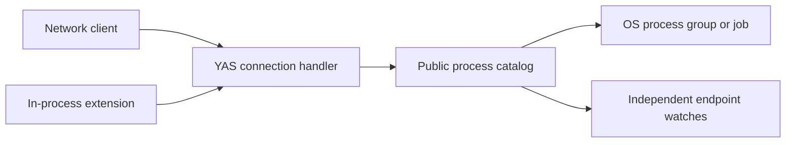

# RFC: Native non-PTY processes

- **Status:** Implemented as native YAS Process family v1, including `yas run`
- **Date:** 2026-08-05

## Summary

The native YAS Process family starts non-PTY child processes, writes
stdin, receiving binary stdout and stderr, listing server-visible children,
watching their streams, and controlling their complete lifecycle. The protocol
is available to every logical session. A network client and an in-process
extension use the same selected family and framing.

Every successfully started child receives a public, server-boot-scoped
`process_handle`. Any process-capable session can list children and concurrently
attach to one. There is deliberately no
cross-client capability or confidentiality boundary inside this family.

Ordinary processes remain owned by their creating endpoint and are terminated
when it disappears. An opt-in detachable process instead survives with zero or
more watchers and remains discoverable by `process_handle`. Both forms are
flow-controlled and independent of Wasmi, extensions, or native channels.

## Goals

- Preserve arbitrary stdin, stdout, stderr, argument, and environment bytes
  where the host platform permits them.
- Give every client the same native family API and lifecycle behavior.
- Give every process-capable client server-global discovery, observation, and
  control of native children.
- Let an explicitly detachable process survive a client reconnect or extension
  attempt restart without replaying unbounded output.
- Bound process counts, watches, queued stream payload, Transfer messages,
  arguments, environment data, and catalog replies.
- Make endpoint close reliably terminate and reap ordinary owned children.
- Support Unix process groups and Windows jobs without hiding platform-specific
  signaling behavior.

## Non-goals

- **No implicit shell.** The server executes `argv[0]` directly.
- **No terminal emulation.** Programs needing a controlling terminal continue
  to use Terminal `CREATE` with an explicit launch specification.
- **No server-restart persistence.** The catalog and its references never
  survive a restart. Orderly shutdown terminates tracked children; an unclean
  server death can leave OS processes behind unless the deployment supplies
  cgroups, jobs, parent-death signaling, or equivalent containment.
- **No output replay.** Output produced before a watch begins, or while no
  endpoint watches a process, is drained and discarded. Lifetime offsets expose
  the exact gap but do not recover its bytes.
- **No per-client process privacy or control boundary.** Discovery, streams,
  the stdin-writer role, and lifecycle controls are available to every endpoint
  allowed to use the family. The single-writer rule coordinates byte offsets;
  it is not authorization.
- **No privilege boundary.** Children run as the YAS server OS identity.
- `yas run` provides attached spawn and standard-stream forwarding; catalogue,
  detached execution, watching, and control also remain available through the
  native library surface.
- **No dependency on extensions.** Extension support is one consumer, not an
  implementation prerequisite.

## Native YAS contract

Process is family `0x0040`, version 1. The canonical Requests, Events, records,
limits, and Transfer descriptors are generated from
[`protocol/yas/families/process.toml`](../../protocol/yas/families/process.toml);
the family contract is in [yas.md](yas.md#process-family).

`SPAWN` carries a nonzero operation ID, exact argv/environment byte strings, an
explicit cwd source, stream policy, and initial stdout/stderr credit. It executes
`argv[0]` directly without an implicit shell. A successful Result returns a
boot-scoped `process_handle`, current lifetime offsets, and sensitive BYTE
Transfer descriptors for stdin, stdout, and (unless merged) stderr. The operation
ID prevents a lost Result from spawning a second child.

`WATCH` subscribes to the public process catalogue. Complete ProcessRecord state
contains lifecycle, generation, owner session, detachable flag, argv0, native
PID for diagnostics, stream offsets, exit data, and retention deadline. `ATTACH`
returns fresh output Transfers starting at current lifetime offsets; earlier
output is an explicit gap and is not replayed. Any number of sessions may
observe output, while at most one attachment owns stdin.

`CONTROL` provides typed signal, terminate, kill, and detach actions under
nonzero operation IDs. `WAIT` returns the final portable exit record or
`TIMEOUT`. Closing stdin half-closes the child stream. An ordinary child belongs
to its spawning session and is terminated when it disappears; a detachable
child remains discoverable until its retained final record expires.

Arguments and environment values preserve arbitrary bytes on Unix and use exact
UTF-8-to-native conversion on Windows. The cwd union is server default, native
path bytes, a Terminal handle, or an FS root plus component-vector path. Public
process handles are identity, not authorization; every session with the selected
family shares the same process authority.

## Capacity and backpressure

Process family limits are selected in HELLO. Canonical hard maxima include
1,024 arguments, 1 MiB of argument bytes, 256 environment entries, 1 MiB of
environment bytes, 16 processes per session, 64 process generations
server-wide, 8 pending spawns, 8 MiB of buffered stream data, and five minutes
of detached-result retention. Server policy may advertise smaller values.

Each session additionally admits at most 16 completion-held `ATTACH`/`CONTROL`
operations and 32 pending `WAIT`s. Cancellation may settle the wire request,
but it does not recycle admission while committed or uncancellable backend work
is still running. One generation can arm only one terminate-escalation timer.
Ordinary exit replies remain retryable in a 64-record per-session FIFO; older
terminal records are evicted deterministically rather than growing with process
churn.

Admission reserves the process generation, session/global count, and required
Transfer receive budgets before invoking the OS. Failure settles with
`RESOURCE_EXHAUSTED`
and creates nothing. Transfer credit provides byte backpressure independently
for stdin, stdout, and stderr; MESSAGE/frame counts are bounded by the common
Transfer limits. A slow attachment cannot force unbounded process-wide output
retention.

Catalogue State is coalesced under its subscription credit. Output offsets are
lifetime counters, so a later `ATTACH` reports the exact skipped prefix rather
than pretending to replay bytes that were not retained. A detachable final
record retains only bounded metadata until its deadline; terminal attachments do
not extend that deadline.

Kernel pipe buffers, child memory, descendant count, and address space are
outside protocol accounting. Deployments requiring hard containment must wrap
the server in jobs, cgroups, rlimits, or an equivalent OS policy.

## Cleanup and shutdown

Each session owns its pending spawns, ordinary children, Transfer endpoints, and
attachments; the server owns the public process catalogue. Session cleanup
stops admission, cancels queued spawns, closes Transfers, and releases stdin
ownership. Ordinary children are terminated as a group or job and force-killed
after the configured grace. Detachable children lose only that session's
attachments.

Spawn tasks are registered before they can create an OS child. If a spawn
finishes after its session disappears, a detachable child enters the catalogue
without an attachment; an ordinary child is immediately terminated and reaped.
Every path releases its reserved counts and credits.

On Unix, ownership is registered before the process can race the server's
reaper, and exact wait status is consumed once. On Windows, kill-on-close job
ownership contains the process tree. Server shutdown first refuses new work,
then runs the same session cleanup, terminates detachable generations, and
discards retained finals.

## Security and deployment

`SPAWN` is remote command execution as the YAS server OS user, at authority
parity with Terminal `CREATE` using an exact launch specification. It is not a
sandbox. Every session allowed to select Process may list process records,
observe future output, claim vacant stdin, and send lifecycle controls. Process
handles are stable identity within one server boot, not capabilities.

Catalogue records omit environment values and arguments after argv0 to reduce
accidental disclosure, not to create a confidentiality boundary. Children may
inherit server credentials. Mutually untrusted tenants require separate servers
or external containment.

`YAS_PROCESS=0` or `--no-processes` leaves Process unavailable during HELLO. A
session cannot send family Requests which were not selected. Selected versions,
required limits, reserved fields, common status, and sensitive framing are
validated before spawn admission. Relay, edge, proxy, and transports forward
native frames without translating Process semantics. A changed server `boot_id`
invalidates every cached process handle.

## Implementation status

The native migration is complete across:

1. `protocol/yas/families/process.toml` and generated Rust/TypeScript constants,
   with schema validation, packed-record validators, and golden vectors.
2. `crates/server/src/process.rs`, which owns native semantic process records,
   spawn admission, concurrent pipe I/O, Transfer endpoints, catalogue State,
   lifecycle, reaping, groups/jobs, detachable retention, and cleanup.
3. `crates/server` native Process dispatch and `js/core/src/yas/process.ts`,
   without a retired-wire compatibility dispatcher.
4. `yas run`, which forwards stdin/stdout/stderr and propagates the portable exit
   result over the same native Process family available to extensions.

Tests cover binary streams, credit, duplicate operation IDs, cancellation,
cross-session catalogue state, concurrent attachments, stdin ownership and EOF,
merged stderr, spawn failures, inherited environments, descriptor hygiene,
bounded overflow, shutdown, Unix groups, and Windows jobs. Platform-specific
signal and containment tests remain part of CI.
