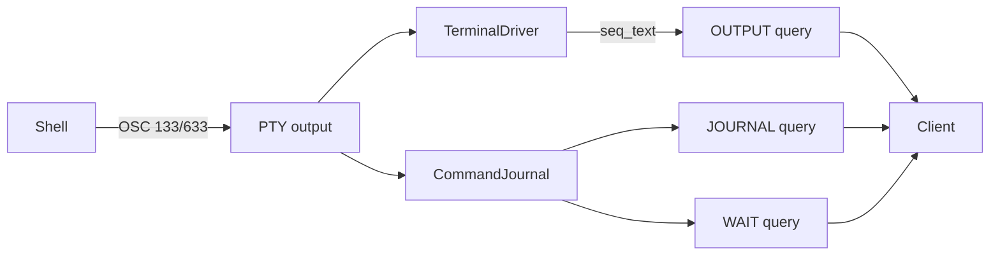

# RFC: Per-command terminal journal

- **Status:** Implemented in native YAS Terminal family v1
- **Date:** 2026-08-18
- **Companion to:** [../protocol.md](../protocol.md),
  [../shell-integration.md](../shell-integration.md)

## Summary

A long-lived shell PTY has no command boundary of its own. An agent that types
`make` into one today waits on a regex, sleeps, or dumps the whole scrollback,
and `terminal wait --pattern` used to match text that was already on screen
before the wait began.

A shell that emits OSC 133 (FinalTerm semantic prompts) or OSC 633 (VS Code's
superset) already tells the terminal where each command starts, where its
output starts, and how it ended. This family turns that into a bounded ring of
records per PTY, addresses output by a monotonic sequence rather than a grid
row, and lets a client:

- list the commands a terminal has run
- fetch one command's output
- read everything appended since a cursor
- block server-side until a command finishes



## Goals

- Give an agent a command index and an output cursor that survive scrollback
  eviction, rather than grid coordinates that move under it.
- Bound every reply with `max_bytes` and a truncation flag, so omitting a
  limit cannot dump the default 10 000-line scrollback.
- Make `wait --pattern` match only output produced after the wait began.
- Cost nothing on a PTY whose shell emits no markers: no records, no extra
  buffer, a scan that returns immediately on the first non-OSC byte.
- Keep command parsing optional at runtime without creating a second Terminal
  protocol or changing frame layout.

## Non-goals

- **No auto-injected shell integration.** Spawning a PTY with `ENV` /
  `BASH_ENV` / `ZDOTDIR` clobbers user rc files and fights starship, oh-my-zsh,
  and anything else that already emits OSC 133. The hooks live in
  [shell-integration.md](../shell-integration.md) and are opt-in. A terminal
  whose shell emits nothing keeps an empty journal; `yas terminal journal`
  says so on stderr.
- **No `yas exec`.** Native non-PTY processes remain [processes.md](processes.md).
  This family is for a shell the user (or an agent) is already typing into.
- **No apply of LSP edits, git writes, or batched fs mutations.**
- **No byte-range paging of a single grid row.** `seq_text` never splits a
  row, so `max_bytes` is a soft cap that overshoots by at most one row. That
  keeps paging monotonic.
- **No privilege boundary.** The journal is visible to every client that can
  already `READ` the PTY.

## Sequences

A sequence is `rotated_lines + row`: the absolute index of a grid line since
the PTY was created. It names the same text for as long as that text is
retained. When scrollback evicts, `oldest_seq` rises and a read that started
below it comes back flagged `OUTPUT_EVICTED` with the surviving tail.

`(seq, col)` together are a byte-exact cursor. An `OUTPUT` query with the
`PROBE` cursor kind reports the current cursor and returns no text — that is
how a client starts following without first pulling everything already on
screen.

The alternate screen does not advance sequences. A read taken while the PTY
is on it comes back flagged `OUTPUT_ALT_SCREEN` and the cursor does not move;
full-screen programs are not command output.

## Resize

A sequence is `rotated_lines + row`. `row` is alacritty's `cursor.point.line`
(0 at the top of the viewport, negative in the history). A height change
moves lines between history and viewport, and alacritty updates `line`
accordingly: shrinking pushes viewport rows into history (`history_len`
grows, `cursor.line` falls); growing pulls them back (`grow_lines` does
`cursor.line += from_history`, `history_len` shrinks).

`rotated_lines` follows the **signed** history-length delta so those two
moves cancel. Shrink increments it; grow decrements it. `saturating_sub`
would miss the grow direction, and every already-captured record plus the
live cursor would then name text `from_history` rows away.

A column change rewraps, so a sequence no longer names the same bytes. Height
identity is the only correspondence resize preserves.

## OSC 133 state machine

Four markers, and a fifth that only OSC 633 speaks:

| Marker  | Meaning                                                       |
| ------- | ------------------------------------------------------------- |
| `A`     | A prompt is being drawn.                                      |
| `B`     | The prompt is done; what follows is what the user types.      |
| `C`     | The command is about to run; what follows is its output.      |
| `D`     | The command finished. An optional `;status` is the exit code. |
| `633;E` | The command line, given verbatim (escapes: `\xHH`, `\\`).     |

`133;P`, `133;L`, and `633;P` are ignored and left for the emulator, which
drops them as it always has. A marker whose letter is followed by anything
other than end-of-payload or `;` is not ours (`133;Abc` is not `A`).

The machine is total. Every transition either opens, closes, or ignores; there
is no input that leaves it stuck.

| In                    | Event   | Out                 | Record                                                                                                                                                                                    |
| --------------------- | ------- | ------------------- | ----------------------------------------------------------------------------------------------------------------------------------------------------------------------------------------- |
| Idle / Prompt / Input | `A`     | Prompt              | Running command, if any, closed `INCOMPLETE` (Ctrl-C, a shell that only emits `A`, a reset).                                                                                              |
| \*                    | `B`     | Input, cursor saved | —                                                                                                                                                                                         |
| \*                    | `C`     | Running             | Previous running command closed `INCOMPLETE`. New record opened. Command line is `633;E` if seen, else the grid text between the saved `B` cursor and here. Empty command ⇒ `NO_COMMAND`. |
| Running               | `D`     | Idle                | Record closed. `HAS_EXIT` only when `D` carried a status; a bare `D` is common and is not invented as zero.                                                                               |
| Idle                  | `D`     | Idle                | Dropped: a status for a command that was never announced.                                                                                                                                 |
| \*                    | `633;E` | unchanged           | Held until the next `C`.                                                                                                                                                                  |

A PTY whose process exits while a command is running closes that command
`INCOMPLETE | PTY_EXITED`. A restarted PTY resets the journal: indices keep
climbing (`oldest_index = next_index`) so a client holding an old index sees
`NOT_FOUND` rather than the successor's output.

Dialects latch. The first `A`/`B`/`C`/`D` a PTY sees chooses OSC 133 or OSC
633 for the rest of its life, so a shell that emits both is not counted twice.
`633;E` is additive and always taken — it only ever supplies text the other
dialect lacks.

An unterminated OSC that straddles two PTY reads is held across the boundary,
capped at 512 bytes so a stream that opens an OSC and never closes it cannot
grow without bound.

## Records

Each record carries:

- `index` — monotonic per PTY, never reused
- `flags` — `RUNNING`, `HAS_EXIT`, `NO_COMMAND`, `INCOMPLETE`, `EVICTED`,
  `PTY_EXITED`
- `exit_code` — meaningful only under `HAS_EXIT`
- `[start_seq, end_seq)` — the output region. While the command runs,
  `end_seq` is the live cursor and moves; once it completes it is frozen
- `started_ms` / `ended_ms` — Unix epoch milliseconds; `ended_ms` is 0 while
  running
- `command` — recovered text, truncated to `YAS_TERM_JOURNAL_CMD_MAX`
  (default 4096)

The ring holds at most `YAS_TERM_JOURNAL_MAX` records (default 256). Eviction
drops the oldest and advances `oldest_index`. A record whose `start_seq` has
fallen below `oldest_seq` is flagged `EVICTED` on snapshot; fetching it
returns the surviving tail.

## Native YAS contract

The journal is part of Terminal family `0x0010`, version 1. `JOURNAL`, `OUTPUT`,
and `WAIT` are correlated Terminal Requests; their canonical layouts, cursor
variants, records, flags, and limits are generated from
[`protocol/yas/families/terminal.toml`](../../protocol/yas/families/terminal.toml)
and specified in [yas.md](yas.md#queries).

`JOURNAL` pages command records by absolute index or tail distance. Each record
contains generation, lifecycle flags, portable exit code, output sequence range,
start/end times, and bounded command text. `OUTPUT` selects an exact command,
the latest command, an absolute sequence cursor, or a probe of the current
cursor. Every returned next cursor is normalized to `(sequence, column)`.

`WAIT` has typed modes for output, a command index, or the latest/next command.
Output waits require a nonempty bounded needle and return an OutputResult; command
waits return exactly one JournalResult record. Timeouts and byte limits are
explicit and nonzero. A completed PTY settles immediately because no more output
can arrive.

Successful query data is inline up to 32 KiB and otherwise uses a sensitive BYTE
Transfer under initial receive credit. Results distinguish `TRUNCATED`,
`EVICTED`, `ALT_SCREEN`, and `MATCHED`, include the state revision which
satisfied a wait, and never overload an empty payload as failure. There are no
magic maximum-integer cursors, separate feature bit, or universal fragment
wrapper. `YAS_TERM_JOURNAL=0` skips OSC scanning, so `JOURNAL` is empty and
command-index waits cannot satisfy; ordinary `READ`, `OUTPUT`, and output waits
remain available.

## CLI

```
yas terminal journal ID [--from INDEX] [--limit N] [--json]
yas terminal output ID [INDEX] [--wait SECONDS] [--max-bytes N] [--json]
yas terminal history ID --since CURSOR [--max-bytes N] [--json]
```

`journal` prints the newest 20 records by default. `output` defaults to the
newest command; `--wait` blocks server-side and exits with that command's
status (124 on timeout). `history --since` takes `SEQ`, `SEQ:COL`, `now`, or
`start`; the reply prints the next cursor so it can be fed back in. Default
`--max-bytes` is 256 KiB.

`wait --pattern` probes the cursor first and then matches only subsequent
`OUTPUT` text. The native client requires the selected Terminal v1 contract;
there is no grid-scanning compatibility fallback.

## `wait --pattern`

The documented contract was "lines produced after the wait began". The
implementation re-scanned the whole grid on every `UPDATE`, so a pattern that
was already on screen returned immediately.

The cursor is taken _before_ the subscription. Output that races between the
probe and the subscribe is recovered with one immediate `OUTPUT`; after
that, `UPDATE` is only the signal that there is something to read. Matching
runs against a pending buffer of new text, including a partial last line, so
a prompt that never ends in a newline (`Continue? [y/N]`) can still satisfy
the wait.

## Security

Reaching the socket is still equivalent to an interactive login as the server
user; this family grants no new authority. Command lines are whatever the
shell wrote to the PTY, including secrets typed at a prompt — the same
exposure `READ` already has. `YAS_TERM_JOURNAL=0` is an ops kill switch, not
a privilege boundary.

## Future work

- Auto-inject the hooks for a PTY whose `$SHELL` is bash/zsh/fish, behind an
  env flag, once the opt-in snippets have been lived with.
- OSC 133 `P` (prompt shown) / `L` (continuation) if a consumer appears.
- Add a journal State dataset if a consumer needs unsolicited command-catalogue
  updates. Waiting is already server-side; this would only save the listing
  round trip.
