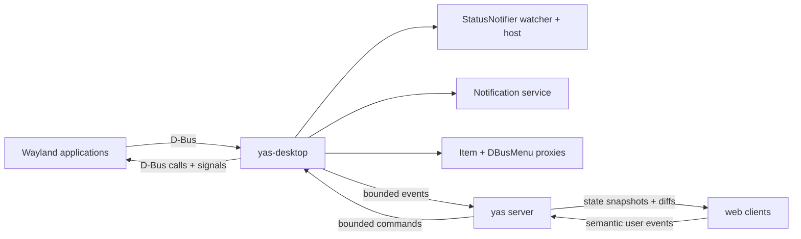

# Tray Icons and Desktop Notifications

- **Status:** Implemented as native YAS Desktop family v1
- **Date:** 2026-08-14

## Summary

Applications running on yas's headless Wayland compositor already inherit a
private D-Bus session. They can create windows and may activate installed
desktop-portal services in the compositor environment, but yas does not yet
provide a compositor-aware portal backend. Two ordinary desktop facilities also
had nobody listening on that bus before this RFC:

- StatusNotifierItem tray icons have no watcher or host, so they never appear.
- `org.freedesktop.Notifications` has no owner, so notification calls fail.

YAS owns both services inside the compositor-scoped D-Bus session,
normalize their state in the server, and expose it to web clients through the
native YAS Desktop family. The full UI renders tray icons in the status bar and
notifications as in-app toasts or browser/OS notifications. User interaction
travels back to the original application as StatusNotifierItem, DBusMenu, or
notification signals.

The server is the authority. A browser reconnect receives a snapshot of the
current tray and active notifications; it never connects to D-Bus, reads a
remote icon path, parses arbitrary variants, or tries to reconstruct state from
events. This is the same server-does-more/client-does-less choice as terminal
frames and filesystem sync.

## Implementation status

The RFC is implemented as of 2026-08-14:

- `yas-desktop` owns the notification service, both watcher interfaces, and a
  valid compositor-local host name on the existing private bus.
- Notifications support bounded normalized text/actions, replacement,
  revision-checked actions, dismissal, close reasons, and server-owned expiry.
- KDE and freedesktop StatusNotifier items register by unique owner, disappear
  on owner loss, refresh on item/property signals, and normalize theme, path,
  pixmap, attention, and overlay icons to bounded PNG.
- DBusMenu layouts and icons are normalized to revisioned bounded trees;
  stale clicks refresh instead of activating a reused application menu ID.
- Notification application icons and content-image hints are resolved and
  decoded off the async task, and `icon-static` is advertised.
- Rust and TypeScript codecs, staged snapshots, reconnect replay suppression,
  per-client subscriptions, and the `DesktopStore` API are wired end to end.
- The WebRTC read-only gate permits state subscription while rejecting tray and
  notification input.
- Per-owner rate limiting runs before image decoding. The bounded event queue
  coalesces pending upserts by identity, preserves delete/create boundaries,
  and applies backpressure rather than dropping a required transition.
- The full UI presents tray items, accessible menus, active-notification cards,
  foreground toasts, and opt-in browser notifications. Its service worker
  accepts desktop requests only from an unbound top-level yas client.

Selection of Desktop family v1 means the normalized service, State bridge,
codecs, and snapshot plumbing are live. Presentation remains an embedding
policy: the full UI renders it, while embedding packages expose the core API
without prompting or adding chrome.

This RFC implements the
[Desktop Notifications specification](https://specifications.freedesktop.org/notification/latest-single/),
the
[Status Notifier Item specification](https://specifications.freedesktop.org/status-notifier-item/latest-single/),
the menu subset exported through
[`com.canonical.dbusmenu`](https://sources.debian.org/src/libdbusmenu/18.10.20180917~bzr492%2Brepack1-2/libdbusmenu-glib/dbus-menu.xml),
and remote icon lookup according to the
[Icon Theme specification](https://specifications.freedesktop.org/icon-theme/latest/).

## Goals

- Make tray icons and notifications from streamed Linux GUI applications
  visible and actionable in the yas web UI.
- Preserve notification replacement, expiry, close reasons, and action
  callbacks.
- Preserve StatusNotifier activation, secondary activation, scrolling,
  attention state, tooltips, overlays, and DBusMenu menus.
- Give late and reconnecting clients a coherent snapshot without replaying old
  notifications as new popups.
- Work with multiple yas connections and multiple viewers without ambiguous
  IDs or stale actions.
- Bound D-Bus input, image decoding, menu expansion, retained state, and wire
  size.
- Add no required host daemon beyond the private `dbus-daemon` yas already
  starts for the compositor.

## Non-goals

- A host-system tray icon for yas itself. This RFC presents tray items from
  applications inside yas's compositor.
- Forwarding the viewer's host notification service or session bus into the
  remote session. The two trust domains stay separate.
- XEmbed/system-tray compatibility. YAS is Wayland-only and does not run
  XWayland; StatusNotifierItem is the supported tray protocol.
- Portals, MPRIS media controls, global application menus, badges, or app-launch
  desktop files. Portals and MPRIS are specified separately in
  [Viewer Media Devices, MPRIS, and Compositor Portals](media-devices-portals.md).
- Notification history across server restarts. V1 retains active notifications
  in memory only.
- Rendering notification HTML, hyperlinks, inline body images, sounds, or
  arbitrary SVG in the browser.
- macOS or Windows application notifications. The compositor and its private
  desktop bus currently exist only on Linux.

## Architecture

The private bus remains compositor-scoped. A new Linux-only `yas-desktop`
crate uses `zbus` to connect to the address printed by `dbus-daemon` and runs
three roles in one bounded asynchronous service runtime:



`DesktopBus` owns both the existing `dbus-daemon` child and the desktop-service
task. Its address is still the value placed in PTY environments. The desktop
task communicates with the server through bounded channels; D-Bus handlers
never write a client transport or hold the server session lock.

State belongs to the shared compositor, not a PTY and not a viewer. Closing the
terminal which launched an application does not remove its tray item while the
application remains alive. Every subscribed viewer of that compositor sees the
same state.

If `dbus-daemon` is unavailable, applications keep the current behavior: no
desktop bus is exported and the Desktop family is unavailable. If the daemon dies
after startup, the server publishes RESET followed by an empty staged snapshot,
clears both mirrors, and stops the desktop task. The old bus address cannot be repaired for
already-running applications, so yas does not silently create a second
session bus inside the same compositor.

## D-Bus services

### StatusNotifier watcher and host

Real StatusNotifier implementations use both the historical KDE namespace and
the freedesktop namespace. YAS owns these well-known names when available:

```text
org.kde.StatusNotifierWatcher
org.freedesktop.StatusNotifierWatcher
org.freedesktop.StatusNotifierHost.yas.p<pid>
```

Both watcher interfaces are exported at `/StatusNotifierWatcher` and share one
registry. `IsStatusNotifierHostRegistered` is true for the lifetime of the
service, and `ProtocolVersion` is `0`. Registering the host tells applications
to use StatusNotifierItem instead of attempting an X11 tray fallback that yas
cannot display. `RegisterStatusNotifierHost` is still implemented and tracks
external host owners, although yas's own host means the property remains true.

`RegisterStatusNotifierItem(service)` accepts the two forms used in the field:

- a bus name, with the object at `/StatusNotifierItem`; or
- an object path, with the calling message's unique bus name as the service.

The registry immediately resolves every well-known name to its unique owner
and keys an item by `(unique owner, object path)`. `NameOwnerChanged` removes
all items owned by a departed connection. A later process claiming the same
well-known name is a new item, never a continuation of the old proxy.

For each item the host reads `org.kde.StatusNotifierItem` first and the
freedesktop interface as a compatibility fallback. It consumes both the
specified `NewIcon`, `NewStatus`, `NewTitle`, `NewToolTip`, and related signals
and ordinary `org.freedesktop.DBus.Properties.PropertiesChanged`. A signal is
only an invalidation: the host re-reads the affected property and publishes
the resulting state. Malformed or missing optional properties take their
specified defaults; a missing required identity/status interface removes the
item.

Each backend registration receives a monotonically increasing internal
`tray_id: u32`, not reused during the desktop-service process. The native bridge
maps it to a stable boot-scoped `tray_handle:u64`; each visible state change
increments its revision. State exposes neither bus names nor object paths.

### Tray interaction

The server maps browser input to the item as follows:

| Browser input   | D-Bus behavior                                                     |
| --------------- | ------------------------------------------------------------------ |
| Primary click   | `Activate(0, 0)`, unless `ItemIsMenu`, in which case open the menu |
| Secondary click | `SecondaryActivate(0, 0)`                                          |
| Context click   | Open `Menu` through DBusMenu, or fall back to `ContextMenu(0, 0)`  |
| Wheel/trackpad  | `Scroll(delta, "vertical")` or `Scroll(delta, "horizontal")`       |
| Menu item       | `Event(id, "clicked", empty variant, monotonic_timestamp)`         |

The StatusNotifier coordinates are screen-position hints. A tray icon rendered
in browser chrome has no meaningful coordinate in the headless Wayland output,
so yas deliberately sends `(0, 0)`. Applications must not depend on the hint.
A window created or activated in response follows the existing Surface State
and activation path.

### DBusMenu

When an item advertises a `Menu` object path, yas renders the menu in browser
chrome; it does not ask the application to create a Wayland popup with no
Wayland anchor.

Opening the root calls `AboutToShow(0)`, then `GetLayout(0, -1, properties)`.
Opening a submenu calls `AboutToShow(id)` and refreshes the layout if requested.
`LayoutUpdated` and `ItemsPropertiesUpdated` invalidate the cached revision.
V1 supports the standard properties needed for a tray menu:

- `type` (`standard` or `separator`), `label`, `enabled`, and `visible`;
- `children-display=submenu`;
- `toggle-type` and `toggle-state` for checks and radio items;
- `icon-name` and `icon-data`.

Labels lose DBusMenu's mnemonic underscore while preserving doubled literal
underscores. Unsupported vendor properties are ignored. The server flattens
the returned tree to parent/position records, assigns a local menu revision,
and sends a complete bounded layout. Complete layouts are preferable here:
menus are small, while applying partial invalidations from an application that
changes a subtree during `AboutToShow` is easy to get wrong.

A menu click carries the revision the user saw. The server drops a click for a
stale revision and sends the fresh layout. This prevents a slow viewer from
activating a newly reused numeric menu ID whose label and effect no longer
match the row it displayed.

### Desktop notifications

YAS owns `org.freedesktop.Notifications` at
`/org/freedesktop/Notifications` and implements specification version 1.3:

- `GetCapabilities`
- `Notify`
- `CloseNotification`
- `GetServerInformation`
- `NotificationClosed`
- `ActionInvoked`

V1 reports these capabilities:

```text
actions
body
icon-static
```

It does not advertise `body-markup`, `body-hyperlinks`, `body-images`,
`action-icons`, `persistence`, `sound`, or activation tokens. The server strips
the notification specification's allowed markup to plain text before it
enters the mirror. URI-bearing markup never becomes a clickable browser link.

`Notify` allocates a nonzero `notification_id: u32`. A nonzero `replaces_id`
atomically replaces that ID and returns it when it names an active notification
created by the same D-Bus connection. An unknown, stale, or foreign ID is
treated as a new notification and receives a new ID. The specification defines
replacement in terms of the caller's previous notification; constraining it to
the owning connection prevents an untrusted bus peer from guessing an ID and
replacing or closing another application's notification. Every creation or
replacement increments a separate `revision: u32`, so an action from a toast
built before a replacement cannot target the new action list by accident.

The server, not the browser, owns expiry. Positive application timeouts are
clamped to the configured bounds. `-1` uses yas's default (10 seconds for low
and normal urgency, no automatic expiry for critical); `0` never expires.
Expiry continues with zero viewers and emits `NotificationClosed(id, 1)`.
`CloseNotification` emits reason `3`; an explicit user dismissal emits reason
`2`.

Invoking an action emits `ActionInvoked(id, action_key)`. Clicking the body
uses the conventional `default` key when the application supplied it. An
unknown key or stale revision is ignored. Unless the `resident` hint is true,
the notification is then removed and closed with reason `2`. A resident action
leaves it active. `transient` is retained as presentation metadata but does not
alter the active-state protocol because v1 has no durable history.

The optional 1.3 `ActivationToken` signal is omitted. Browser chrome does not
produce a Wayland seat serial, so it cannot mint a valid xdg-activation token.
Pretending otherwise would weaken activation semantics. Existing surface
activation requests still work normally.

## Icons and images

Remote paths and theme names are resolved on the server. The browser receives
only dimensions and a decoded/re-encoded PNG; it never fetches `file://` URLs
from its own machine.

For a tray item, the server selects the attention icon while status is
`NeedsAttention`, otherwise the normal icon. It resolves a usable icon name
according to the Icon Theme specification, falling back to the best pixmap by
distance from the 64 px target. `OverlayIcon*` is composited at the lower-right
of the base icon. `YAS_ICON_THEME` chooses the theme; the default is
`hicolor`, whose lookup is required as the final fallback. `IconThemePath` is
considered only for its owning item.

StatusNotifier pixmaps are `a(iiay)` ARGB32 in network byte order. The server
validates dimensions and byte count before conversion. Theme PNG and SVG files
are decoded in a non-scriptable image pipeline and re-encoded as PNG; SVG text
is never sent to the browser. XPM is a best-effort legacy fallback, after PNG
and SVG.

Notifications can carry both an application icon and a content image. The
server preserves both:

- application icon: `app_icon`, resolved as a theme name or local path;
- content image, in specification priority order: `image-data`, `image-path`,
  then deprecated `icon_data`.

Invalid images remove only that image, not the item or notification. Decoding
runs off the server tick loop. Source results are cached by canonical path,
mtime, and target size. Overlay composition is intentionally cheap and is
recomputed from those normalized sources when an item property changes.

## Native YAS contract

Desktop is family `0x0022`, version 1. The canonical Requests, State records,
limits, menu tree, asset delivery, and action layouts are generated from
[`protocol/yas/families/desktop.toml`](../../protocol/yas/families/desktop.toml);
the family contract is in [yas.md](yas.md#desktop-family).

`WATCH` selects tray items, active notifications, or both and returns a State
subscription. Complete records have stable boot-scoped handles and revisions;
RESET and staged snapshots recover a restarted desktop service without replaying
old notifications as new toasts. Icons and notification images are content
addressed, inline when small, and otherwise fetched through a sensitive BYTE
Transfer.

`GET_MENU` names the tray handle, tray revision, and menu revision and returns a
typed bounded tree inline or by Transfer. `TRAY_ACTION` distinguishes activate,
secondary activate, scroll, and menu-item action under a nonzero operation ID.
Opening a menu is a query, not an action. Revision checks turn a stale click into
`CONFLICT` instead of activating a reused application menu ID.

`NOTIFICATION_ACTION` distinguishes default, named action, and dismiss. Named
actions use stable nonzero handles; reply text is valid only for an action which
advertised a reply field. Notification state preserves replacement, progress,
reply metadata, resident/transient behavior, and exact close reason.

Required family limits cap tray items, notifications, menu nodes, notification
actions, inline menu bytes, and inline asset bytes. The family is selected only
when the compositor-scoped desktop service is live; absence is a missing family,
not an empty compatibility stream.

## Client model and API

`@yas-run/core` adds one `DesktopStore` per `YasConnection`. It contains two
maps, snapshot staging, reducers, and methods for the three client messages.
It exposes immutable views and `onTrayChange`, `onNotificationChange`, and
`onNotificationRaised` callbacks. The last callback fires only for live Add or
Replace State records, never snapshot replay.

The public IDs used by `YasWorkspace` are namespaced tuples:

```text
(connectionId, tray_handle)
(connectionId, notification_handle, revision)
```

Numeric IDs from two remotes are never compared directly. Native notification
tags also include the connection ID and `boot_id`, preventing a handle
reused after a server restart from replacing a notification belonging to the
previous process.

Embedding packages expose the state and callbacks but do not prompt for host
notification permission or render chrome. Those are policy decisions for the
embedding application.

## Full web UI

### Tray

Active and needs-attention items form a compact icon group in the right end of
`StatusBar`. Passive items are hidden from the bar but remain available in the
overflow menu. Needs-attention items receive the theme's warning treatment;
there is no server-driven animation. The existing measured status-bar
compaction folds the tray icon set into its overflow control when title space
is scarce. The notification bell remains a separate stable target.

With multiple connections, each menu row includes the connection label and
icons are grouped by connection. Stable order is `(connection order,
category, tray_handle)`; property changes do not make icons jump.

Hover uses the sanitized tooltip title/body. Primary, secondary, context, and
wheel input map to native `TRAY_ACTION` Requests. A DBusMenu menu is rendered as an accessible
DOM menu with nested submenus, disabled rows, separators, and native check/radio
semantics. It never injects application markup.

### Notifications

A live notification Add or Replace State record uses this policy:

1. If the yas page is visible, show an in-app toast with all actions.
2. If it is hidden and notification permission was granted, use the existing
   `/sw.js` registration to call `showNotification` with a namespaced tag.
3. Otherwise retain the active card behind a status-bar bell without raising
   a permission prompt.

The bell menu contains active notifications and an explicit **Enable system
notifications** action. Only that user gesture calls
`Notification.requestPermission()`. A denial is remembered by the browser and
does not degrade in-app toasts.

The service worker accepts show requests only from an unbound top-level yas
client, never from a same-origin preview frame. Clicking a host notification
focuses an existing top-level yas window and invokes the `default` action only
if the same `(connection, boot_id, handle, revision)` is still active. If
no yas window exists, the click opens yas but does not invoke a guest action;
opening a remote application is safe, guessing a stale action is not. Named
action buttons remain in the in-app toast/menu in v1.

Replacement updates the existing toast/card/native tag in place. A server
Remove State record closes any matching toast and native notification. A browser-generated
native `close` event is not sent back as a D-Bus dismissal because browsers do
not reliably distinguish user dismissal from platform timeout or programmatic
closure. The explicit in-app dismiss button does send kind `2`.

## Multiple viewers and authorization

Every subscribed viewer receives the same canonical state and may present its
own host notification. This is intentional: a laptop and a phone attached to
the same remote are separate notification endpoints. YAS does not elect a
single delivery owner.

State revisions make races deterministic. For a non-resident notification,
the first valid action/dismiss removes it; a later viewer's event is stale and
does nothing. Resident actions may be invoked more than once, as permitted by
the application contract. Tray activation is naturally repeatable.

Read-only clients may subscribe and view the desktop state but may not send
`TRAY_ACTION` or `NOTIFICATION_ACTION`. The existing read-only command gate
classifies both as input/control, not passive state traffic. Deployments which
do not want notification text exposed to viewers can set `YAS_DESKTOP=0`,
which suppresses the services and Desktop family entirely.

## Bounds and failure handling

D-Bus peers are applications, not trusted parsers. The following defaults are
hard limits, configurable downward but not silently expanded by a client:

| Resource                               |                        Limit | Behavior at limit                                                             |
| -------------------------------------- | ---------------------------: | ----------------------------------------------------------------------------- |
| Registered tray items                  |           128 per compositor | Reject further registration                                                   |
| Active notifications                   |           256 per compositor | Close oldest non-critical item with reason 4; reject only if all are critical |
| Actions per notification               |                           32 | Ignore extras                                                                 |
| Menu nodes / depth                     |                   2,048 / 16 | Return menu status 2                                                          |
| D-Bus string before sanitation         |                       64 KiB | Clip at a UTF-8 boundary; body keeps up to 64 KiB, labels/titles less         |
| Source image                           |  512 x 512 and 4 MiB decoded | Drop image                                                                    |
| Final tray icon                        |              64 x 64 maximum | Downscale and re-encode PNG                                                   |
| Final notification image               | 512 x 512 maximum, 1 MiB PNG | Downscale or drop                                                             |
| One desktop update after decompression |                       16 MiB | Chunk snapshot; reject a live record which cannot fit                         |
| D-Bus property/menu call               |                    2 seconds | Keep prior state; remove after repeated identity failures                     |

Notification rate is token-bucketed per unique D-Bus owner (20 immediate, 2
per second refill). Replacement of an existing ID costs less than creation so
progress notifications remain useful. Rate-limited calls receive a D-Bus
limits error and allocate no ID.

The desktop task catches item-specific D-Bus errors. One broken icon, menu, or
application cannot terminate the watcher. The bounded event queue coalesces tray
property invalidations by item and notification replacements by ID. Deletes
are never coalesced past a later create.

Image and text input is data, not browser content:

- decode and re-encode images; never pass remote SVG/XML through;
- strip notification and tooltip markup to text;
- do not expose remote file paths, bus names, or object paths;
- never interpret menu labels, action keys, app names, or categories as HTML;
- apply the existing URL-security policy if a future version adds links.

## Configuration

| Variable                          | Default                                  | Meaning                                                      |
| --------------------------------- | ---------------------------------------- | ------------------------------------------------------------ |
| `YAS_DESKTOP`                     | `1` when the Linux compositor is enabled | Set `0` to disable watcher, tray, and notifications          |
| `YAS_ICON_THEME`                  | `hicolor`                                | Remote icon theme before required hicolor fallback           |
| `YAS_NOTIFICATION_TIMEOUT_MS`     | `10000`                                  | Default timeout for low/normal notifications requesting `-1` |
| `YAS_NOTIFICATION_TIMEOUT_MIN_MS` | `1000`                                   | Lower clamp for positive application timeouts                |
| `YAS_NOTIFICATION_TIMEOUT_MAX_MS` | `86400000`                               | Upper clamp for positive application timeouts                |

Browser notification permission is device-local and browser-managed; it does
not belong in server `yas.conf` and does not roam to other viewers.

## Implementation status

The native migration is complete across:

1. `crates/desktop`, which owns bounded semantic tray, menu, notification, image,
   action, and close-reason models over the compositor-private D-Bus.
2. `protocol/yas/families/desktop.toml` and generated Rust/TypeScript codecs,
   State record validators, limits, assets, and golden vectors.
3. `crates/server`, which maps desktop-bus events into native Desktop State and
   action Requests directly, with read-only policy enforcement.
4. `YasDesktopClient`/`YasDesktopCatalog` and the full UI tray, accessible menu,
   toast, active-notification, and opt-in browser notification surfaces.

Desktop is selected only after the notification service, watcher, codecs, and
State plumbing are live. Optional record capabilities remain absent until their
backend is usable; in particular, a tray record never advertises a menu before
DBusMenu export exists. Embedders may consume the native client API without
shipping YAS chrome.

## Testing

- Unit-test all D-Bus value validation, ARGB conversion, markup stripping,
  theme lookup, rate limits, timeouts, and revision checks.
- Run a private `dbus-daemon` in integration tests with mock KDE/freedesktop
  StatusNotifier items, owner loss, property signals, lazy DBusMenu submenus,
  notification replacement, action, dismissal, and expiry.
- Add golden wire tests for every record and malformed length, plus staged
  snapshot reducer tests and unknown-record skipping.
- Test two viewers racing one notification action and two remotes reusing the
  same numeric IDs.
- Test read-only subscriptions can observe but cannot invoke.
- Test foreground toast, hidden-page host notification, denied permission,
  replacement tags, server deletion, worker messages from preview frames, and
  reconnect snapshots which do not toast.
- Add a Linux end-to-end smoke test using `notify-send` and a tiny
  StatusNotifier/DBusMenu fixture inside a yas PTY.

## Rejected alternatives

### Run a conventional panel and notification daemon

A panel has no useful place in yas's headless compositor output: the browser
owns layout and each viewer has a different viewport. A conventional daemon
would render notification surfaces into the video stream, making text less
accessible, interactions higher-latency, and notifications invisible while no
surface pane is open. It also adds runtime dependencies. Implementing the
small D-Bus service side and presenting native web chrome matches yas's
architecture better.

### Forward raw D-Bus to the browser

This makes every client implement D-Bus authentication, type signatures,
watcher ownership, icon themes, filesystem access, NameOwnerChanged, and menu
invalidation. It also exposes a general control plane far wider than tray and
notifications. Normalized state and semantic commands are smaller and safer.

### Put the bridge in an edge

An edge may be on a different machine and relay several routes. It
does not own the compositor's private bus or application lifecycle. The yas
server is the only component that is always adjacent to the applications and
can preserve state with zero viewers.

### Treat notifications as fire-and-forget events

Events lose replacement state, make reconnect replay ambiguous, and leave
multiple viewers to race their own expiry clocks. Active notification state
plus revisioned actions is only slightly larger and has one answer after every
disconnect or replacement.

### Web Push

Web Push solves delivery from an internet service to a browser. These
notifications originate on a private D-Bus beside a running yas server, and
introducing push subscriptions, public endpoints, and browser-vendor delivery
would expand the trust boundary without helping tray state or application
callbacks.
