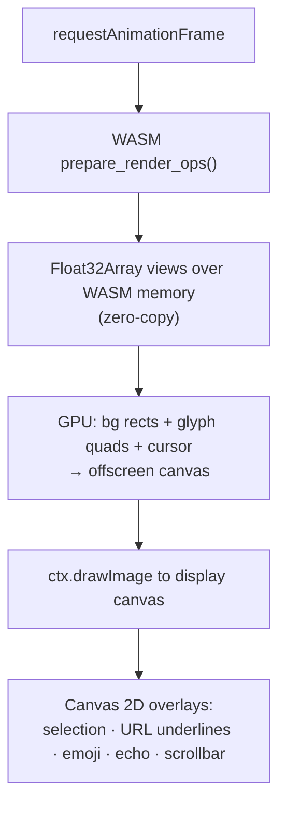
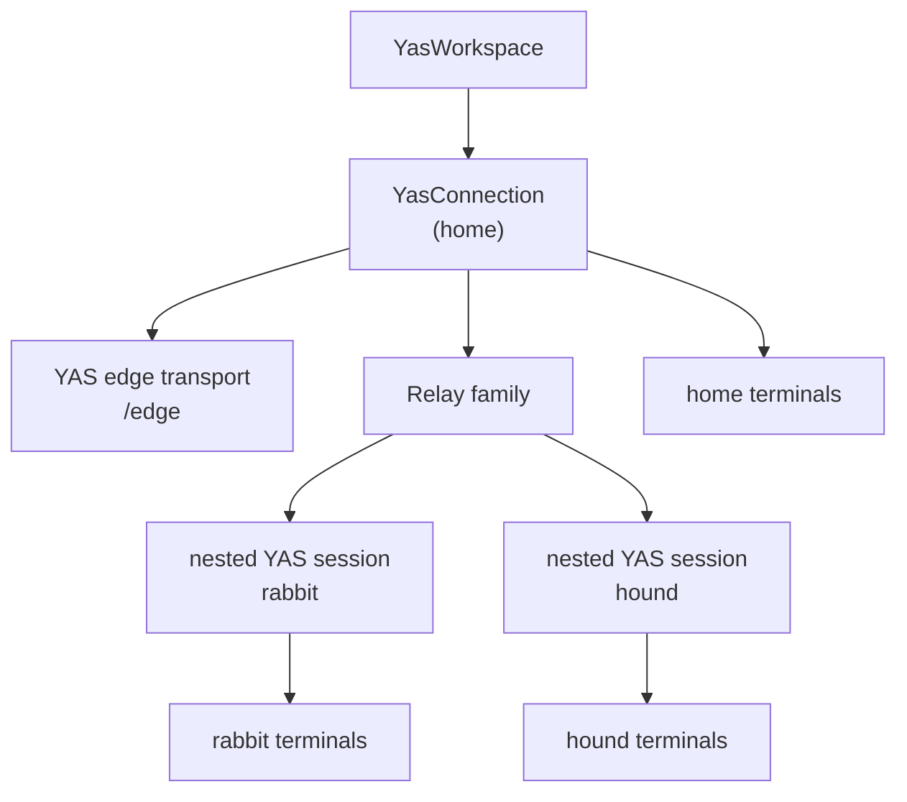

# Frontend

The browser side of YAS consists of a TypeScript native YAS session
(`@yas-run/core`), a Rust WASM renderer (`yas-browser`), and GPU backends
(WebGPU with WebGL2 and Canvas 2D fallbacks). TypeScript negotiates families,
validates native frames, and owns workspace and input state. WASM consumes a
private renderer snapshot and produces GPU-ready vertex data.

## Render pipeline overview

```mermaid
graph LR
    T["WebSocket / WebTransport / WebRTC"] --> NATIVE["@yas-run/core\nnative YAS session"]
    NATIVE -->|validate + apply\nterminal-grid/1| GRID["semantic terminal grid"]
    GRID -->|private compressed\nrenderer snapshot| WASM["yas-browser\n(WASM)"]
    WASM -->|vertex buffers\n(zero-copy)| GL["GPU renderer\n(WebGPU / WebGL2)"]
    GL -->|bg rects + glyphs| OC["offscreen canvas"]
    OC -->|drawImage| DC["display canvas"]
    DC -->|2D overlays| OUT["screen"]
```

## WASM runtime (`yas-browser`)

`yas-browser` compiles to `wasm32-unknown-unknown`. `@yas-run/core` first
decodes and applies the negotiated native `yas.terminal.grid/1` logical frame,
including its sequence and base-state rules. It then calls
`encodeBrowserTerminalGrid()` to serialize one complete semantic grid through
the private JS-to-WASM renderer boundary. The WASM `TerminalState` accepts that
LZ4-compressed snapshot through `feed_compressed()`; no YAS frame, family ID,
resource handle, or retired directional message tag enters the renderer codec.

When `prepare_render_ops()` is called for a render pass:

1. Iterates all cells in the grid.
2. Resolves foreground/background colors through the current palette (indexed colors, default colors, and bold/dim modifiers).
3. Coalesces adjacent cells with identical background color into merged rectangle operations.
4. For each cell with visible content, creates a `GlyphKey` (UTF-8 bytes + bold/italic/underline/wide flags), ensures the glyph exists in the atlas, and emits 6 vertices (2 triangles) with atlas texture coordinates.
5. Exposes vertex buffers to JavaScript via zero-copy WASM linear memory pointers (`bg_verts_ptr/len`, `glyph_verts_ptr/len`).

## Glyph atlas

The atlas is a **Canvas 2D `HTMLCanvasElement`**, not a GPU texture. It uses row-based bin packing to allocate glyph slots.

When a new glyph is needed:

1. A slot is allocated in the atlas canvas (power-of-two size, 2048–8192 px).
2. The Canvas 2D context sets font style (`"bold italic Npx family"`) and calls `fillText()` to render the codepoint in white.
3. Underlines are drawn with `ctx.stroke()` when the underline attribute is set.
4. The slot coordinates are cached in an `FxHashMap<GlyphKey, GlyphSlot>`.

The atlas canvas is uploaded to a WebGL texture once per frame (skipped if unchanged). The GL shader tints white glyphs with the per-vertex foreground color; color glyphs (emoji) pass through untinted.

## GPU renderer

The browser renderer has three backends, tried in order:

1. **WebGPU** — preferred when available (Chrome 113+, Edge 113+, Firefox Nightly). Async initialisation via `navigator.gpu.requestAdapter()`.
2. **WebGL2** — synchronous fallback, used while the WebGPU probe is in-flight or if WebGPU is unavailable.
3. **Canvas 2D** — software fallback when neither GPU API is available (e.g. headless environments).

All three implement the same `GlRenderer` interface and consume the same vertex buffers produced by the WASM module. `TerminalStore` kicks off the WebGPU probe eagerly in its constructor and transparently promotes the renderer once the probe resolves; frames rendered before that use the WebGL2 fallback.

### WebGPU renderer

Two WGSL render pipelines:

**RECT pipeline** — colored rectangles for cell backgrounds and the cursor.

- Vertex layout: `pos` (float32x2), `color` (float32x4) — 24-byte stride.
- Single draw call per frame (no batching needed; vertex buffer grows on demand).

**GLYPH pipeline** — textured atlas quads with per-vertex coloring.

- Vertex layout: `pos` (float32x2), `uv` (float32x2), `color` (float32x4) — 32-byte stride.
- Fragment shader uses the same gray-detection tinting as WebGL2 (grayscale → tinted, color → passthrough).
- Atlas uploaded via `copyExternalImageToTexture` with premultiplied alpha.

Both pipelines use premultiplied-alpha blending (`src: one, dst: one-minus-src-alpha`).

### WebGL2 renderer

Two shader programs handle all drawing:

**RECT shader** — colored rectangles for cell backgrounds and the cursor.

- Vertex attributes: `position` (vec2), `color` (vec4).
- Uses premultiplied alpha blending.

**GLYPH shader** — textured quads from the atlas.

- Vertex attributes: `position` (vec2), `uv` (vec2), `color` (vec4).
- Fragment shader: grayscale glyphs are tinted with the vertex color; color glyphs (emoji) render directly.

Both programs batch up to 65,532 vertices per draw call.

### Render loop (`YasTerminalSurface`)

Demand-driven via `requestAnimationFrame`:



Terminal panes publish their first nonzero container measurement immediately.
Unmeasured or hidden boxes never submit a provisional 1×1 grid, and reconnect
resends wait until the pane has a valid measurement.

## Input handling

### Keyboard

Input is captured via a hidden `<textarea>` element. `keyToBytes()` converts `KeyboardEvent` to terminal escape sequences:

| Key             | Sequence                                                          |
| --------------- | ----------------------------------------------------------------- |
| Ctrl+letter     | Control code (e.g. Ctrl+C → `0x03`)                               |
| Arrow keys      | `\x1b[A`–`\x1b[D` (normal) or `\x1bOA`–`\x1bOD` (app cursor mode) |
| Function keys   | `\x1b[15~`–`\x1b[24~`                                             |
| Modifier combos | `\x1b[1;{mod}X` format                                            |
| Alt+key         | `\x1b` prefix                                                     |

IME/composition input is handled via `compositionend` to capture multi-codepoint sequences as a single input event.

### Mouse

Mouse events use the native Terminal `MOUSE` Event. The server generates the
correct escape sequence based on the PTY's current mouse mode and encoding
(X10, VT200, SGR, pixel). Client-side text selection (word/line granularity,
drag) and clipboard copy are handled independently of terminal mouse mode —
the browser intercepts the selection before it reaches the terminal emulator.

### Copy

On macOS, surface `Cmd+C`/`Cmd+X` is translated to the Linux application's
`Ctrl+C`/`Ctrl+X`. The same trusted keydown reserves a host clipboard write
with a promised `ClipboardItem`; its text resolves after the application
publishes the resulting Wayland selection. This ordering keeps Chromium and
Brave's transient clipboard authorization while allowing for the server round
trip.

Wayland-owned selections are published in the native Selection catalogue with
their full MIME offer. Content remains in the owning application and is fetched
through Selection `GET` only when a terminal, editor, or host clipboard bridge
requests a representation. If the browser rejects the host write, the
catalogued selection remains available inside yas.

### Paste

Pasting into a Wayland surface is not a keystroke, it is a keystroke with a
prerequisite: the app reads the selection the instant it sees Ctrl+V, so
`YasSurfaceCanvas` holds the V press back until the clipboard has been stored
through the native Selection family, then releases press, V release and Ctrl
release in order. Clipboard reads and focus loss settle the chord; a failed
read gives up rather than delivering V with a stale selection behind it.

A paste event and async clipboard reads can supply the content, because neither
path is reliable alone. `navigator.clipboard.readText()` may be denied without
permission in Chromium and Brave, while browsers may not fire `paste` at a
focused non-editable canvas (hence the focus shuffle through the hidden
textarea).
`clipboardImage()` takes the best `image/*` item on the event and forwards its
bytes under their own MIME type, preferring PNG. On a Ctrl chord that does not
produce a paste event (notably Ctrl+V on macOS), `navigator.clipboard.read()` is
also started synchronously in the keydown handler so it retains the event's
transient user activation. Its image result is only consumed after
`readText()` returns empty or is denied, preserving text preference.

An image only wins when the clipboard has no plain text: rich sources put
several representations on one clipboard, and the text is what pasting a
spreadsheet range is expected to produce. This browser action stores the one
chosen representation; the Selection family itself can describe multiple
items and MIME representations.

An image over the browser's 8 MiB paste limit — or a blob that will not read —
takes the stand-down path rather than the flush's: warn, stand the chord down,
no V. Values within that browser limit use Selection's bounded inline or
Transfer delivery and are never truncated. Pressing V after refusing the new
value would paste whatever the selection held _before_, which is not what was
copied. An empty clipboard is the one case that still presses V without
sending, and deliberately: nothing
was withheld, so the selection the app reads is whichever Wayland client owns
it — copy in one surface, paste into another, browser never in the middle.
The copy/cut keydown marks that ownership locally before the Selection snapshot
can complete its server round trip, so an immediate switch to another surface
cannot import a stale host clipboard in the gap.

Every listener on the event's path (canvas, hidden textarea, and the
document-level capture listener that catches what the canvas misses) runs the
same handler, so the first to see an event marks it; without that a screenshot
would go out once per listener.

Terminal paste observes the same clipboard authority. While a Wayland client
owns the selection, `YasTerminalSurface` takes text from the connection's
in-memory mirror instead of `navigator.clipboard`; if the eager content did not
reach this web client, it watches the Selection catalogue and uses Selection
`GET` to fetch it from the compositor. This keeps surface-to-terminal copy working when the browser
rejects the unsolicited host-clipboard write. A live Wayland selection with
no text representation does not fall through to stale host clipboard text.

### Hyperlinks

Two sources feed one code path in `YasTerminalSurface`:

- **OSC 8** — the application declared the target explicitly. `Terminal.link_at()` resolves the URI at a cell and `Terminal.link_segments()` returns the link's full extent as `[row, startCol, endCol]` triples, one per screen row. A link that runs past the right edge continues on the next row, so a wrapped link yields several triples and is underlined as one continuous span.
- **Regex fallback** — `https?://…` matched against the visible row text, for applications that emit no OSC 8. Single-row only; its target is its own text.

OSC 8 wins where both apply. Because it lets the target differ from the displayed text, every target is classified by `assessUrl()` (`js/core/src/urlSecurity.ts`) before it can be opened:

| Verdict   | Applies to                                                                         | Behaviour                                 |
| --------- | ---------------------------------------------------------------------------------- | ----------------------------------------- |
| `allow`   | `http`, `https`, `mailto` with nothing deceptive                                   | opens directly                            |
| `confirm` | custom schemes, local `file:`, embedded credentials, punycode/non-ASCII hosts      | prompts, showing the real target          |
| `deny`    | `javascript:`/`data:`/`blob:`/`view-source:`…, remote `file://`, hidden characters | refused; drawn dashed red, not underlined |

The hidden-character check runs _before_ the scheme check, since a leading control byte is exactly what slips a dangerous scheme past a check built on `new URL()`. Scheme extraction never uses `URL` for the same reason. `assessment.display` escapes invisible and text-reordering codepoints to `<U+XXXX>` — render that, never `assessment.raw`.

Embedders hook `surface.onLinkHover()` for a preview and `surface.setLinkActivateHandler()` to replace the default `window.confirm` with an in-app dialog; a custom handler receives the assessment and must honour its verdict.

### Predicted echo

When the PTY is in echo + canonical mode (mode bits 9 and 10), the browser shows typed characters immediately before the server confirms them. This makes typing feel instantaneous over high-latency connections. Predicted characters are displayed with a distinct style and replaced with server-confirmed output on receipt.

## Workspace and connection model



`YasWorkspace` manages the home connection and the nested native sessions
opened through its Relay catalogue. Each server has its own opaque handle
namespace; stable UI references pair the route identity with the server's
opaque handle.

The durable UI around those live processes is a **workspace**. The
home server stores each session in YAS KV; it contains the selected remote
route names, pane layout and stable pane assignments, focus, and semantic
panel state. Attaching is browser-local and does not keep a stale server-side
presence bit. Shared browser URLs use `#workspace=<id>`; legacy
`#session=<id>` links remain accepted. Layout and
panel mutations use bounded CAS retries against the backend record. See
[Backend workspaces](design/workspace-sessions.md) for the record and
lifecycle contract.

## Surface video decoding

GUI app surfaces (see [server.md § Headless Wayland compositor](server.md#headless-wayland-compositor)) are decoded in the browser via the **WebCodecs `VideoDecoder` API**:

- Codec is selected by native Surface view negotiation and carried as the `codec_version` on each Surface `FRAME`; frame flags identify keyframes, codec configuration, and discardable frames.
- `optimizeForLatency: true` is set on the decoder to minimize decode delay.
- Decoded `VideoFrame`s are rendered to a canvas by `YasSurfaceView` (React/Solid component).
- Live canvases present each frame's logical extent at their own display scale and zoom. At default zoom, one application logical pixel occupies one CSS pixel, even when another viewer has higher DPI and smaller logical bounds. Geometry stays paired with the decoded frame through adaptive downscaling and queued presentation; new catalogue records and viewport requests cannot stretch an older frame.
- Before a live pane's first measurement, its stream uses the surface's physical composite dimensions as its encoder limit and its canvas uses the frame's logical extent at the local display DPI. Servers without per-frame logical metadata fall back to the latest catalogue geometry.
- The sidebar waits for saved pane assignments to resolve before treating surfaces or terminals as parked. An intermediate empty layout during reload must not open thumbnail streams that the restored main panes would inherit from the shared frame cache.
- Mouse and keyboard events from the surface canvas use native Surface `KEY`, `TEXT`, `POINTER`, and `AXIS` Events.
- Surface cursor metadata drives the canvas CSS cursor. Withdrawing that metadata, removing a surface, or resetting the store restores the default cursor on mounted canvases. A moving host mouse over guest Brave gets a local default cursor while Brave still reports hidden, covering Chromium/Wayland wake-up misses and hidden state cached across guest page reloads without changing the shared cursor state; Brave's next cursor update takes over.
- Mounted surface canvases follow connection instances as well as IDs. When HMR or Relay replaces a connection under the same ID, they release the old view and rebind cursor, frame, and input state to the replacement. Server-side view removal also retires its pointer focus, covering disconnects that cannot send a pointer leave.
- Surface views accept `touchMode="pointer" | "direct"`. Direct mode is the default and forwards each event's contact changes as Surface `TOUCH` for native Wayland multitouch. Pointer mode is the explicit fallback and maps touch to tap, finger scroll, long-press right-click, and hold-drag. The UI exposes this as **Media → Touch input**.
- Fresh Wayland text-input enables may open the mobile on-screen keyboard by default. Users can opt out with **Media → On-screen keyboard → Manual only**, leaving the status-bar keyboard control available.
- IME candidates anchor to the app's reported caret, mapped from composited surface pixels to the displayed canvas. Zero-width carets retain their position and line height. Refocusing a surface restores the anchor immediately, even without a new caret update or video frame.

### Presentation scheduling

`SurfaceStore` does not draw a frame the moment it decodes. Each surface has a presenter that paints at vsync (`requestAnimationFrame`) in one of two modes:

- **Newest-wins** while the surface is idle or interactive: paint the freshest frame, close the rest. Minimum time-to-pixel, because a repaint there is a response to input and any hold reads as lag.
- **PTS-scheduled** once the surface has delivered `SMOOTHING_ENGAGE_FRAMES` (8) consecutive frames without a gap: each frame is painted on the refresh its capture-time PTS maps to, and frames not yet due stay queued.

The PTS is the Surface `FRAME.presentation_ns` value, or `capture_ns` when no
distinct presentation time is supplied. It is stamped before encode and
transport, so replaying against it cancels the jitter both add. Encode runs
fire-and-forget off the server's tick loop, so per-frame encode latency varies;
without scheduling that variance lands directly on screen as an uneven 2-0-1-2
cadence at a nominally perfect frame rate.

Presentation uses the late end of the `arrival − pts` offsets seen over the last `OFFSET_WINDOW_MS` (1 s) of stream, ignoring one isolated high sample. The low `FAST_QUANTILE` (p2), plus its matching decoder delay, is the fast-path baseline. Added headroom is hard-capped at the smaller of one source-frame interval and 8 ms; a same-host path identified by a protocol RTT of at most 2 ms bypasses scheduling entirely.

Both ends come from **one** distribution, which is what makes this robust in both directions without special-case rules. A burst frame — captured later but shipped immediately behind its predecessor, so genuinely faster in transit — is a low outlier; a frame delayed by a stall is a high outlier; a quantile ignores each for the same reason. An earlier design tracked the baseline as a running minimum with an upward leak and a clamped downward step, which needed two constants and still froze the surface for the length of any abrupt path improvement, because the baseline could only descend a few ms per frame while the true offset had already dropped.

A quantile rather than a peak-tracking average, because a peak tracker spends the entire latency budget on outliers it cannot cover anyway: one frame 200 ms late took the old estimator from 0 to 100 in a single sample, pinned the margin at the ceiling, and then decayed at 0.98/frame — about 55 frames, nearly a second at 60 Hz, of maximum latency bought by one event. The quantile sizes to the jitter that recurs and lets the tail fall through to skip-to-newest, which is the correct handling for an outlier regardless. The window is expressed in time, not frames, so the horizon is the same at 24 and 240 fps.

The presentation offset grows to a measured target immediately and sheds excess headroom by a small fraction of one source interval per frame. Moving it _is_ a latency change — every future due time shifts with it — so the downward slew avoids injecting a second visible discontinuity after the path recovers.

A **PTS** gap over `STREAM_GAP_MS` (250 ms), a backwards PTS (the server's u32 ms counter wrapping), or the tab going hidden all reset the presenter to newest-wins. A frame without a finite PTS never engages scheduling.

The reset keys on capture time, never on arrival time, because the two mean
opposite things. A source that went idle stops advancing PTS, and its next frame
answers input — that one must paint immediately. A stalled transport kept
producing all along; those frames retain continuous PTS even when they arrive
late. The reliable path preserves codec order. When an eligible discardable
Surface frame uses WebTransport or WebRTC datagrams, its explicit sequence and
base sequence drive loss and reordering recovery; keyframes and codec
configuration remain on the reliable path.

The queue depth is derived, not fixed: the frames a margin legitimately spans is `margin / frame_interval`, plus two frames of scheduling slack, and the frame interval is learned from PTS deltas rather than assumed. With the one-frame headroom ceiling this remains small even at 240 Hz. Learning the interval from PTS also means the depth follows the rate the encoder _actually_ sustains, not the rate that was requested.

**Measured on loopback** (`yas surface record --timing`, mpv at 1280×720 into a local server, 471 frames): the capture clock is a clean grid — PTS deltas mean 16.69 ms, p95 19 ms, one 38 ms outlier — and delivery jitter is tiny, p95 − p2 of **2.5 ms**. That is below half a refresh, so on a local link the scheduler cannot hold a frame and is a no-op by construction. Its value is entirely on links with real jitter, which is also the only place it carries risk. The recorder acknowledges each native Surface frame immediately and does not configure a display-rate ceiling, so these numbers are capture + encode + transport jitter — exactly the input the margin absorbs — and say nothing about pacing under backlog.

**Limits.** Jitter beyond one source frame is deliberately not absorbed. Hiding
a 70 ms reliable-stream recovery requires imposing roughly 70 ms of permanent
input latency, and still fails on the next larger outlier. The presenter instead
skips stale decoded frames after they arrive. Reliable transport loss can still
stall newer encoded frames until retransmission. Optional datagrams avoid that
head-of-line delay only for frames the Surface family marks discardable; their
sequence/base metadata and keyframe recovery prevent unordered decoder
submission from corrupting inter-frame references. The refresh period is
learned from plausible rAF deltas; longer intervals are treated as
main-thread/background stalls rather than display cadence.

## Font serving

The home server owns the native YAS Font family. `yas-fonts` discovers every
face in configured system directories, extracts its family/style/weight,
monospace and variable/color metadata, metrics, OS/2 embedding policy, byte
length, and BLAKE3 content hash. LIST and DESCRIBE expose metadata without
filesystem paths; FETCH returns the exact standalone face bytes only when
`YAS_FONT_EXPORT=1` and the face's embedding bits permit it. The edge does not
inspect or serve fonts.

The browser watches the selected server's Font catalogue, describes only the
families it needs, and creates `FontFace` objects from fetched bytes. It derives
the terminal advance ratio from the server-provided metrics. Face bytes are
cached globally in IndexedDB under their content hash only after the browser
recomputes and verifies that hash, so identical faces can be reused safely
across home and relayed servers. Catalogue and face requests are tied to the
active YAS session; a stale response cannot replace the selected server's
fonts.

There are no HTTP font routes. Font metadata and bytes use only the native YAS
Font family and its negotiated limits and export policy.
