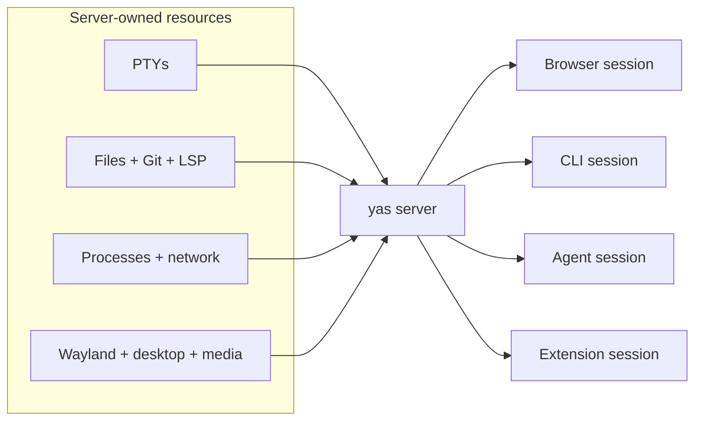

# The server owns the useful state

```mermaid
flowchart LR
  subgraph RESOURCES[Server-owned resources]
    direction TB
    PTY[PTYs]
    FS[Files + Git + LSP]
    PROC[Processes + network]
    WL[Wayland + desktop + media]
  end
  PTY --> YAS[yas server]
  FS --> YAS
  PROC --> YAS
  WL --> YAS
  YAS --> BROWSER[Browser session]
  YAS --> CLI[CLI session]
  YAS --> AGENT[Agent session]
  YAS --> EXT[Extension session]
```

Every `HELLO` creates an independent session. Edges authenticate and adapt transport framing; terminals, routes, fonts, and workspace state remain server-owned.
