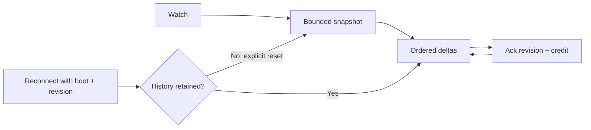

# Reconnect is a state transition

- Resume every watch from an explicit revision or cursor.
- Coalesce or replay while history exists; send an explicit reset and fresh snapshot when it does not.
- Retry a mutation by ID without accidentally performing it twice.
