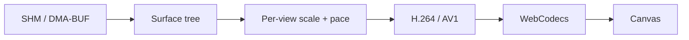

# Every viewer gets a different video stream

- **Accept real app buffers:** SHM/DMA-BUF; ARGB/XRGB/ABGR/XBGR; reuse damage; Vulkan with CPU fallback.
- **Tune every view:** extent, DPR, FPS, latency, decoder capacity, quality, chroma, GOP, keys.
- **Use the best encoder:** H.264/AV1, 4:2:0/4:4:4; NVENC → VA-API → Vulkan Video → software.
- **Stay current:** latest-biased frames, reliable config/dependencies/EOS, ACK credit, newest-wins then PTS smoothing.
- **Capture what matters:** PNG/AVIF stills; raw Annex B/OBU recordings with codec, size, FPS, timing controls.
