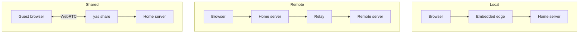

# The path changes. The session does not.

- A proxy keeps remote routes warm, ready for the next action; an integrated `server --share` can remove the separate share process.
- The session remembers routes, panes, focus, and panel state in KV.
- Every resource handle stays scoped to the server that owns it.
